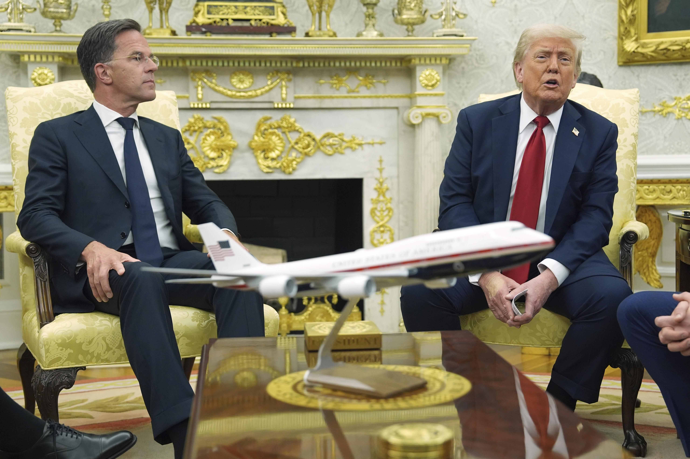

## Claim
Claim: "After Donald Trump won the US presidential election in 2024, NATO Secretary General Mark Rutte said that ‘If Trump surrenders Ukraine to Putin, he will personally expel the United States from the alliance’."

## Actions
```
image_search("Mark Rutte Trump Ukraine Putin NATO")
```

## Evidence
### Evidence from `image_search`
The search results include an image of Mark Rutte and Donald Trump from [NPR](https://www.npr.org/2025/07/14/nx-s1-5467272/russia-ukraine-war-trump-nato-weapons-tariffs)  and an image of Donald Trump from [ABC News](https://abcnews.go.com/International/russia-launches-136-drones-ukraine-ahead-expected-trump/story?id=123729140) .


## Elaboration
The search results provide images of Mark Rutte and Donald Trump, but they do not contain any information about Rutte's alleged statement regarding Trump, Ukraine, and NATO.

I need more information to verify the claim. Specifically, I need a source that quotes Mark Rutte making the statement.


## Actions
```
image_search("Mark Rutte statement Trump Ukraine Putin NATO")
```

## Evidence
### Evidence from `image_search`
From [Source](https://abcnews.go.com/International/trump-ukraine-weapons-putin-reaction-analysis/story?id=123759522): 
Content: The search result from ABC News includes an image of Mark Rutte and Donald Trump .


## Elaboration
The search results continue to provide images of Mark Rutte and Donald Trump but do not contain any information about the alleged statement.

I still need a source that quotes Mark Rutte making the statement to verify the claim.


## Actions
```
image_search("Mark Rutte quote Trump Ukraine Putin NATO")
```

## Evidence
### Evidence from `image_search`
The search results include images of Mark Rutte and Donald Trump from [Politico](https://subscriber.politicopro.com/article/2025/07/trump-sends-weapons-ukraine-pro-00451109)  and [Reuters](https://www.reuters.com/world/europe/davos-nato-chief-rutte-reaffirms-need-step-up-support-ukraine-2025-01-23/) . The Reuters article, published on January 23, 2025, discusses Rutte's reaffirmation of the need to support Ukraine.


## Elaboration
The evidence does not contain any information about the alleged statement by Mark Rutte. The search results provide images of Rutte and Trump, but they do not include the quote in question. Therefore, I cannot verify the claim.


## Final Judgement
The search results did not provide any evidence to support the claim that Mark Rutte made the statement attributed to him. The search results included images of Rutte and Trump, but no quotes or articles confirming the statement.

`false`


### Verdict: FALSE

### Justification
The provided search results, including images from sources like [NPR](https://www.npr.org/2025/07/14/nx-s1-5467272/russia-ukraine-war-trump-nato-weapons-tariffs), [ABC News](https://abcnews.go.com/International/russia-launches-136-drones-ukraine-ahead-expected-trump/story?id=123729140), [Politico](https://subscriber.politicopro.com/article/2025/07/trump-sends-weapons-ukraine-pro-00451109), and [Reuters](https://www.reuters.com/world/europe/davos-nato-chief-rutte-reaffirms-need-step-up-support-ukraine-2025-01-23/), do not contain any evidence to support the claim that Mark Rutte made the specific statement about Donald Trump, Ukraine, and NATO.
