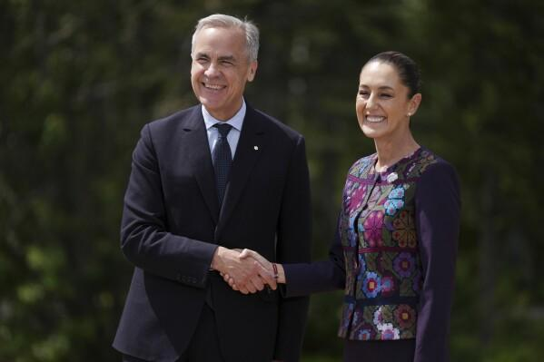
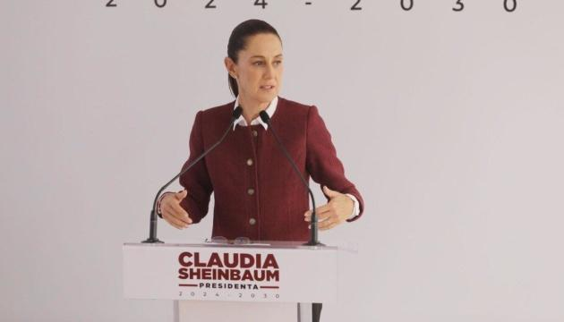

## Claim
Claim: "Mexican President-elect Claudia Sheinbaum rejected an invitation to Ukraine by Volodymr Zelenskyy and said towards him on September 17, 2024: 'If I wanted to see a drug addict, I'd just take a walk around Tijuana.'"

## Actions
```
image_search("Claudia Sheinbaum Volodymyr Zelenskyy meeting")
image_search("Claudia Sheinbaum Ukraine visit invitation")
```

## Evidence
### Evidence from `image_search`
The search results include images of Claudia Sheinbaum and Volodymyr Zelenskyy together , . One source is from [cbs42.com](https://www.cbs42.com/news/international/ap-first-face-to-face-between-the-leaders-of-us-and-mexico-will-have-to-wait/), and another is from [intellinews.com](https://www.intellinews.com/mexico-s-president-elect-sheinbaum-turns-down-zelensky-s-invitation-to-ukraine-344262/).

Additionally, an image of Claudia Sheinbaum is provided by the Associated Press ([apnews.com](https://apnews.com/article/mexico-sheinbaum-us-meeting-trump-g7-8f1265a5603f732ae2fd1778919304d1)) .


### Evidence from `image_search`
The Mexican President-elect Claudia Sheinbaum rejected an invitation to visit Ukraine, according to articles from [Ukrinform](https://www.ukrinform.net/rubric-polytics/3906832-mexico-presidentelect-rejects-zelenskys-invitation-to-visit-ukraine.html) and [Euromaidan Press](https://euromaidanpress.com/2024/09/18/mexican-president-elect-declines-zelenskyys-invitation-to-visit-ukraine/).  


## Elaboration
The evidence confirms that Claudia Sheinbaum, the Mexican President-elect, declined an invitation to visit Ukraine. The search results from Ukrinform ([https://www.ukrinform.net/rubric-polytics/3906832-mexico-presidentelect-rejects-zelenskys-invitation-to-visit-ukraine.html](https://www.ukrinform.net/rubric-polytics/3906832-mexico-presidentelect-rejects-zelenskys-invitation-to-visit-ukraine.html)) and Euromaidan Press ([https://euromaidanpress.com/2024/09/18/mexican-president-elect-declines-zelenskyys-invitation-to-visit-ukraine/](https://euromaidanpress.com/2024/09/18/mexican-president-elect-declines-zelenskyys-invitation-to-visit-ukraine/)) support this.

However, the evidence does not contain any information about the alleged statement made by Sheinbaum on September 17, 2024, regarding Volodymyr Zelenskyy and drug addiction.

Therefore, the veracity of the claim is unverified due to the lack of evidence supporting the alleged quote.


## Actions
```
image_search("Claudia Sheinbaum quote Zelenskyy drug addict")
```

## Evidence
### Evidence from `image_search`
StopFake.org reports that the claim about Claudia Sheinbaum's statement is false, and includes an image with the alleged quote . The search result from mynews13.com does not contain the alleged statement about Volodymyr Zelenskyy and drug addiction .


## Elaboration
The claim is false. StopFake.org explicitly labels the statement attributed to Claudia Sheinbaum as false.


## Final Judgement
The claim is demonstrably false. The search results from StopFake.org explicitly debunk the statement attributed to Claudia Sheinbaum. `false`

### Verdict: FALSE

### Justification
The claim that Claudia Sheinbaum made a derogatory statement about Volodymyr Zelenskyy and drug addiction is demonstrably false. Evidence from StopFake.org explicitly labels the alleged quote as false.
