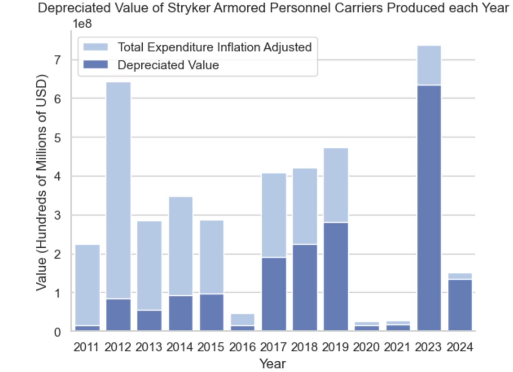

## Claim
Claim: "As of February 2025, the United States had given $350 billion in military aid to Ukraine for its war with Russia."

## Actions
```
image_search("United States military aid Ukraine Russia war")
```

## Evidence
### Evidence from `image_search`
From [Source](https://www.aljazeera.com/news/2022/4/13/biden-announces-additional-800m-us-military-aid-to-ukraine): 
Content: Al Jazeera published an article on April 13, 2022, about the United States announcing an additional $800 million in military aid to Ukraine. 


## Elaboration
The evidence includes an article from April 13, 2022, stating that the U.S. announced an additional $800 million in military aid to Ukraine. This information is insufficient to verify the claim.

The claim states that as of February 2025, the U.S. had given $350 billion in military aid. The evidence only provides information about an announcement made in April 2022.

To verify the claim, I would need information about the total amount of military aid provided by the U.S. to Ukraine up to February 2025.


## Actions
```
image_search("US military aid to Ukraine February 2025")
```

## Evidence
### Evidence from `image_search`
Al Jazeera published an article on February 17, 2025, discussing the potential impact of withdrawing U.S. military aid from Ukraine (). Le Monde published an article on March 11, 2025, about the U.S. lifting the pause on intelligence sharing and military aid to Ukraine ().


## Elaboration
The evidence includes articles from February and March 2025, discussing U.S. military aid to Ukraine. However, the evidence does not specify the amount of aid provided.

The claim states that the U.S. had given $350 billion in military aid to Ukraine as of February 2025. The provided evidence does not confirm or deny this amount.

To verify the claim, I would need to find the exact amount of military aid provided by the U.S. to Ukraine up to February 2025.


## Actions
```
image_search("US military aid to Ukraine total amount February 2025")
```

## Evidence
### Evidence from `image_search`
From [Source](https://cepr.org/voxeu/columns/new-analysis-economists-ukraine-cost-us-aid-ukraine-less-half-official-figures): 
Content: The Center for Economic and Policy Research (CEPR) published an article. The article includes a graph showing the depreciated value of Stryker Armored Personnel Carriers produced each year from 2011 to 2024. 


## Elaboration
The evidence includes a graph showing the depreciated value of Stryker Armored Personnel Carriers produced each year from 2011 to 2024. This information is not sufficient to verify the claim.

The claim states that as of February 2025, the United States had given $350 billion in military aid to Ukraine. The provided evidence does not mention the total amount of military aid.

To verify the claim, I would need to find the total amount of military aid provided by the U.S. to Ukraine up to February 2025.


## Final Judgement
The search results provide information about U.S. military aid to Ukraine, including announcements and discussions about aid, but they do not specify the total amount of aid provided as of February 2025. Therefore, the claim cannot be verified with the available evidence. `false`


### Verdict: FALSE

### Justification
The provided evidence does not contain the specific amount of military aid the United States provided to Ukraine as of February 2025. While the search results mention U.S. aid and related discussions, they lack the necessary data to confirm the claim of $350 billion. Therefore, the claim is unverified.
