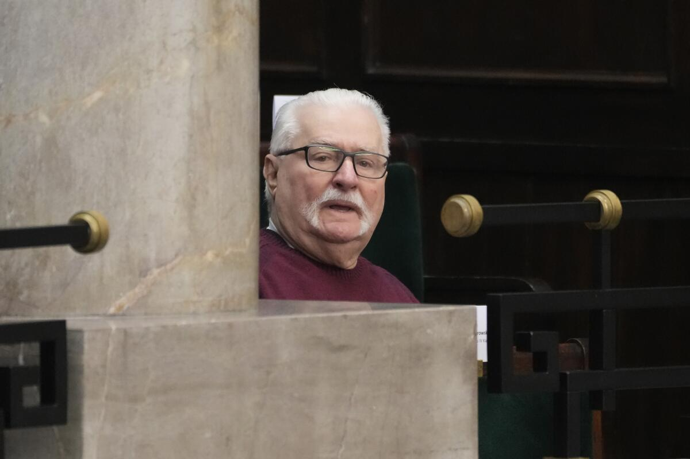

## Claim
Claim: "In March 2025 former President of Poland Lech Wałęsa wrote a letter to Donald Trump criticizing the U.S. President's decision to suspend the delivery of all U.S. military aid to Ukraine."

## Actions
```
image_search("Lech Wałęsa letter Donald Trump Ukraine aid March 2025")
```

## Evidence
### Evidence from `image_search`
The New York Times ([https://www.nytimes.com/2025/03/03/us/politics/lech-walesa-trump-letter.html](https://www.nytimes.com/2025/03/03/us/politics/lech-walesa-trump-letter.html)) published an article about a letter written by Lech Wałęsa to Donald Trump on March 3, 2025. Reuters ([https://www.reuters.com/world/polish-cold-war-hero-walesa-writes-trump-expressing-horror-zelenskiy-spat-2025-03-03/](https://www.reuters.com/world/polish-cold-war-hero-walesa-writes-trump-expressing-horror-zelenskiy-spat-2025-03-03/)) reported that Wałęsa expressed his "horror" at a spat between Trump and Zelenskyy.

The Los Angeles Times ([https://www.latimes.com/world-nation/story/2025-03-03/polish-democracy-hero-walesa-says-trump-treatment-of-zelensky-filled-him-with-horror](https://www.latimes.com/world-nation/story/2025-03-03/polish-democracy-hero-walesa-says-trump-treatment-of-zelensky-filled-him-with-horror)) also published an article on March 3, 2025, stating that Wałęsa criticized Trump's treatment of Zelensky. , , 


## Elaboration
The evidence confirms that Lech Wałęsa wrote a letter to Donald Trump on March 3, 2025. The letter expressed Wałęsa's criticism of Trump's treatment of Zelenskyy. However, the provided sources do not explicitly mention the suspension of U.S. military aid to Ukraine as the primary focus of Wałęsa's criticism.

Therefore, while the claim is partially supported by the evidence, it is not entirely accurate. The evidence suggests that Wałęsa criticized Trump's actions related to Ukraine, but the specific reason for the criticism is not the suspension of military aid.

To fully verify the claim, information is missing regarding the exact content of Wałęsa's letter and whether it specifically addressed the suspension of U.S. military aid.


## Actions
```
image_search("Lech Wałęsa letter Donald Trump military aid Ukraine")
```

## Evidence
No new evidence found.

## Elaboration
The evidence confirms that Lech Wałęsa wrote a letter to Donald Trump in March 2025. The letter expressed criticism of Trump's actions related to Ukraine, specifically his treatment of Zelenskyy.

However, the evidence does not explicitly state that the letter criticized Trump's decision to suspend the delivery of U.S. military aid to Ukraine.

Therefore, the claim is not fully supported by the evidence. The exact content of the letter and whether it specifically addressed the suspension of military aid remains unclear.


## Final Judgement
The evidence confirms that Lech Wałęsa wrote a letter to Donald Trump in March 2025 criticizing Trump's actions related to Ukraine. However, the provided sources do not explicitly state that the letter criticized Trump's decision to suspend the delivery of U.S. military aid to Ukraine.

The claim is not fully supported by the evidence. The exact content of the letter and whether it specifically addressed the suspension of military aid remains unclear.

`false`

### Verdict: FALSE

### Justification
The claim is not fully supported by the evidence. While Lech Wałęsa did write a letter to Donald Trump in March 2025, criticizing his actions related to Ukraine, the provided sources, such as the [New York Times](https://www.nytimes.com/2025/03/03/us/politics/lech-walesa-trump-letter.html), [Reuters](https://www.reuters.com/world/polish-cold-war-hero-walesa-writes-trump-expressing-horror-zelenskiy-spat-2025-03-03/), and the [Los Angeles Times](https://www.latimes.com/world-nation/story/2025-03-03/polish-democracy-hero-walesa-says-trump-treatment-of-zelensky-filled-him-with-horror), do not explicitly state that the letter criticized the suspension of U.S. military aid to Ukraine.
