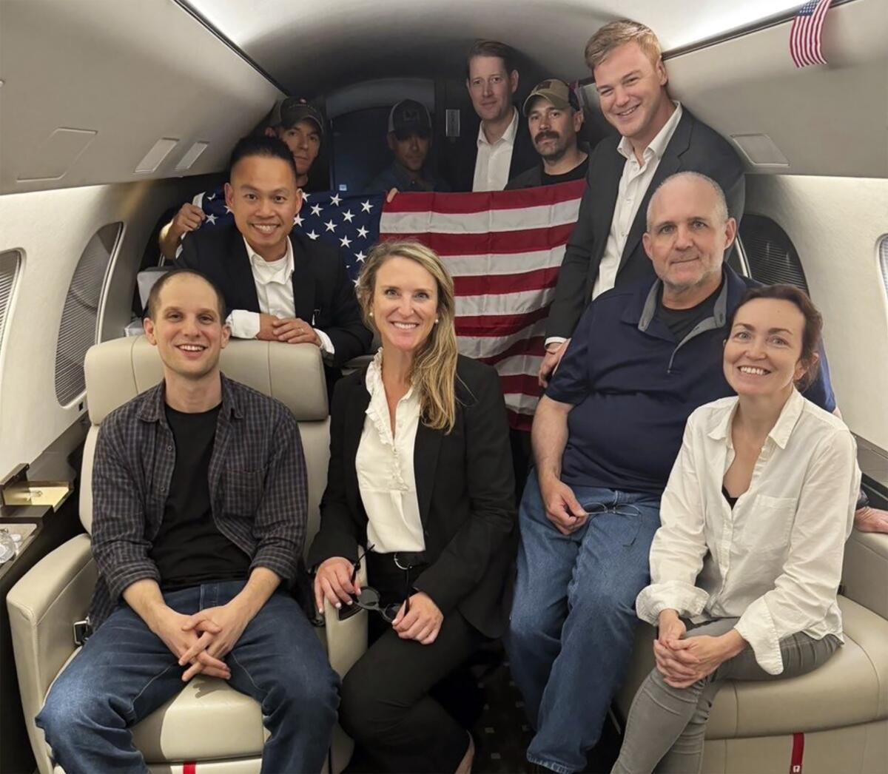

## Claim
Claim: "In August 2024 U.S. President Joe Biden boarded an empty plane after three freed Americans arrived back in the U.S. and exited the aircraft."

## Actions
```
image_search("Joe Biden empty plane August 2024")
```

## Evidence
### Evidence from `image_search`
From [Source](https://www.nytimes.com/2024/08/02/us/politics/biden-greeting-freed-prisoners.html): 
Content: The New York Times published an image of Joe Biden and Kamala Harris greeting a freed American as he exited the plane. 


## Elaboration
The evidence shows that Joe Biden greeted a freed American as he exited the plane in August 2024. The image provided by the New York Times ([Source](https://www.nytimes.com/2024/08/02/us/politics/biden-greeting-freed-prisoners.html)) depicts Biden and Kamala Harris greeting a person exiting the aircraft. The claim states that Biden boarded an empty plane after the freed Americans exited. The evidence does not support this part of the claim.

The evidence does not provide information about whether Biden boarded the plane. Therefore, the claim cannot be fully verified.


## Actions
```
image_search("Joe Biden boarding plane August 2024")
```

## Evidence
### Evidence from `image_search`
From [Source](https://www.noozhawk.com/bidens-arrive-for-santa-ynez-valley-vacation/): 
Content: Noozhawk published an image of a plane. 


## Elaboration
The new evidence from Noozhawk ([Source](https://www.noozhawk.com/bidens-arrive-for-santa-ynez-valley-vacation/)) shows an image of a plane, but it does not show Joe Biden boarding a plane in August 2024. Therefore, the claim that Biden boarded an empty plane after the freed Americans exited cannot be verified. The evidence does not provide any information about Biden boarding a plane.


## Actions
```
image_search("Joe Biden empty plane after freed Americans August 2024")
```

## Evidence
### Evidence from `image_search`
The Los Angeles Times ([Source](https://www.latimes.com/world-nation/story/2024-08-01/evan-gershkovich-paul-whelan-russia-united-states-prisoner-swap)) and ABC News ([Source](https://www.abc.net.au/news/2024-08-02/biden-meets-with-freed-americans-in-major-russia-prisoner-swap/104174404)) both published images of people inside a plane.  


## Elaboration
The Los Angeles Times ([Source](https://www.latimes.com/world-nation/story/2024-08-01/evan-gershkovich-paul-whelan-russia-united-states-prisoner-swap)) and ABC News ([Source](https://www.abc.net.au/news/2024-08-02/biden-meets-with-freed-americans-in-major-russia-prisoner-swap/104174404)) published images of people inside a plane. However, these images do not show Joe Biden.

The evidence does not support the claim that Joe Biden boarded an empty plane. The images show people inside the plane, but not Biden. The claim is not supported by the evidence.


## Final Judgement
The evidence indicates that Joe Biden greeted freed Americans as they exited a plane in August 2024. However, there is no evidence to support the claim that Biden boarded an empty plane after the freed Americans exited. The images show people inside the plane, but not Biden.

`false`

### Verdict: FALSE

### Justification
The claim is not supported by the evidence. While images from the New York Times ([Source](https://www.nytimes.com/2024/08/02/us/politics/biden-greeting-freed-prisoners.html)) show Joe Biden greeting freed Americans as they exited a plane in August 2024, there is no evidence to suggest that he boarded an empty plane afterward. Images from the Los Angeles Times and ABC News show people inside a plane, but not Biden.
