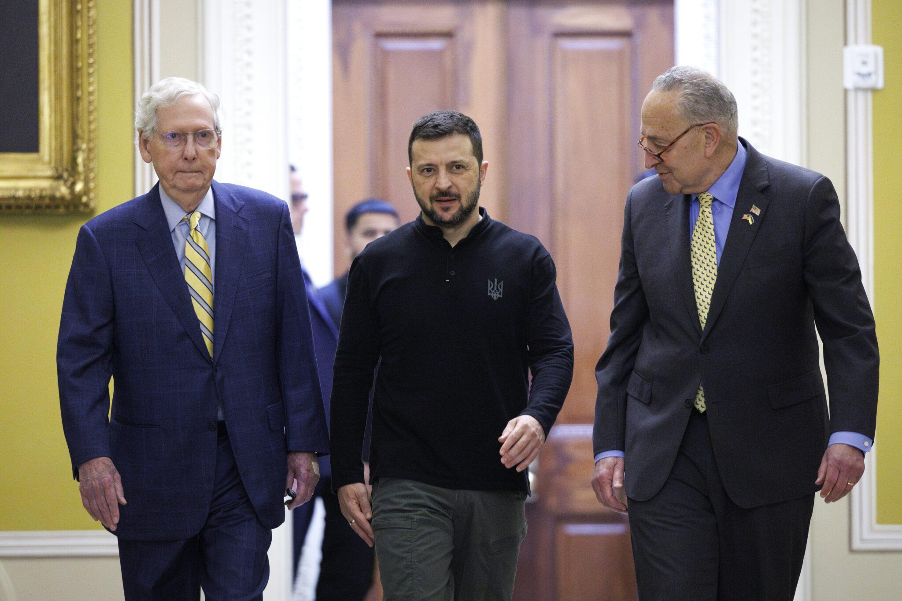

## Claim
Claim: "Ukrainian President Volodymyr Zelenskyy engaged in election interference by campaigning in Pennsylvania for Kamala Harris ahead of the US presidential election in 2024."

## Actions
```
image_search("Volodymyr Zelenskyy Kamala Harris Pennsylvania 2024")
```

## Evidence
### Evidence from `image_search`
NBC News ([https://www.nbcnews.com/politics/2024-election/zelenskyys-meeting-harris-spat-trump-reveal-growing-partisan-divide-uk-rcna172648](https://www.nbcnews.com/politics/2024-election/zelenskyys-meeting-harris-spat-trump-reveal-growing-partisan-divide-uk-rcna172648)) provides an image of Volodymyr Zelenskyy and Kamala Harris shaking hands . ABC News ([https://abcnews.go.com/Politics/harris-standing-zelenskyy-indirectly-jabs-trump-vance-ukraine/story?id=114219628](https://abcnews.go.com/Politics/harris-standing-zelenskyy-indirectly-jabs-trump-vance-ukraine/story?id=114219628)) also contains an image of Volodymyr Zelenskyy and Kamala Harris .

AP News ([https://apnews.com/article/zelenskyy-joe-biden-kamala-harris-trump-229804fd42332c584dfbe05224634e44](https://apnews.com/article/zelenskyy-joe-biden-kamala-harris-trump-229804fd42332c584dfbe05224634e44)) contains an image of Volodymyr Zelenskyy and Kamala Harris shaking hands .


## Elaboration
The evidence shows that Volodymyr Zelenskyy and Kamala Harris have met. However, the provided images do not indicate that Zelenskyy campaigned in Pennsylvania for Harris. The evidence is insufficient to verify the claim.


## Actions
```
image_search("Volodymyr Zelenskyy Pennsylvania Kamala Harris 2024 campaign")
```

## Evidence
### Evidence from `image_search`
MSN ([https://www.msn.com/en-in/news/world/did-zelenskyy-campaign-for-kamala-harris-in-pennsylvania-truth-behind-trump-s-claim/ar-AA1A0SvA](https://www.msn.com/en-in/news/world/did-zelenskyy-campaign-for-kamala-harris-in-pennsylvania-truth-behind-trump-s-claim/ar-AA1A0SvA)) provides an image of Volodymyr Zelenskyy and Kamala Harris . The Boston Herald ([https://www.bostonherald.com/2024/09/26/zelenskyy-washington-ukraine-war/](https://www.bostonherald.com/2024/09/26/zelenskyy-washington-ukraine-war/)) provides an image of Volodymyr Zelenskyy and Kamala Harris shaking hands .


## Elaboration
The new evidence continues to show meetings between Zelenskyy and Harris. However, there is still no evidence that Zelenskyy campaigned in Pennsylvania for Harris. The claim remains unverified.


## Actions
```
image_search("Volodymyr Zelenskyy Pennsylvania campaign 2024")
```

## Evidence
### Evidence from `image_search`
The Guardian ([https://www.theguardian.com/us-news/2024/sep/25/trump-zelenskyy-ukraine-feud-republicans-election-interference](https://www.theguardian.com/us-news/2024/sep/25/trump-zelenskyy-ukraine-feud-republicans-election-interference)) published an article that includes an image of Volodymyr Zelenskyy . CNN ([https://www.cnn.com/2024/09/23/europe/ukraine-zelensky-pennsylvania-us-visit-intl-hnk](https://www.cnn.com/2024/09/23/europe/ukraine-zelensky-pennsylvania-us-visit-intl-hnk)) provides an image of Volodymyr Zelenskyy in Pennsylvania . Utah News Dispatch ([https://utahnewsdispatch.com/2024/09/27/zelenskyy-washington-meets-us-leaders-beef-up-support-ukraine/](https://utahnewsdispatch.com/2024/09/27/zelenskyy-washington-meets-us-leaders-beef-up-support-ukraine/)) contains an image of Volodymyr Zelenskyy with Mitch McConnell and Chuck Schumer .


## Elaboration
The evidence shows that Zelenskyy visited Pennsylvania and met with U.S. leaders. However, there is no evidence that he campaigned for Kamala Harris. The claim remains unverified.


## Final Judgement
The search results show that Zelenskyy has met with Kamala Harris and visited Pennsylvania. However, there is no evidence to suggest that Zelenskyy campaigned in Pennsylvania for Kamala Harris. Therefore, the claim cannot be verified.

`false`


### Verdict: FALSE

### Justification
The fact-check reveals that while Volodymyr Zelenskyy has met with Kamala Harris and visited Pennsylvania, there is no evidence to support the claim that he campaigned for her in Pennsylvania ahead of the 2024 US presidential election. Therefore, the claim is unverified.
