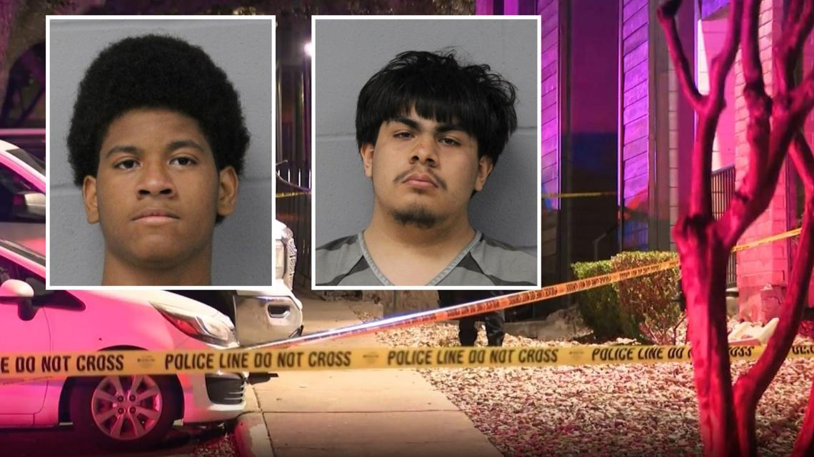
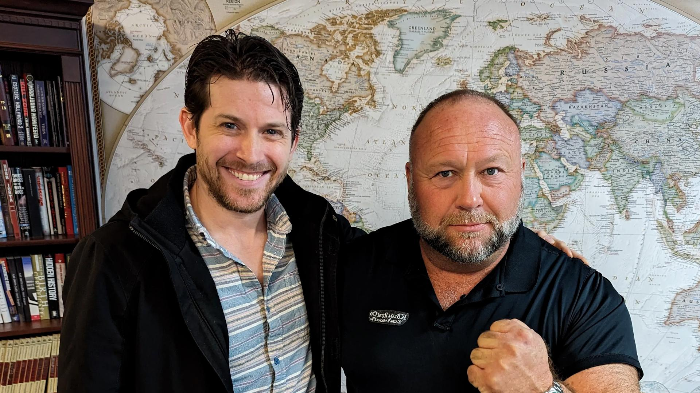

## Claim
Claim: "After InfoWars reporter Jamie White was shot dead on March 10, 2025 in Austin, Texas, it was revelaed that he was on a Ukranian enemies hit list."

## Actions
```
image_search("Jamie White InfoWars shot Austin Texas")
```

## Evidence
### Evidence from `image_search`
The search results from KVUE.com ([https://www.kvue.com/article/news/crime/jamie-white-murder-arrests-infowars/269-aa20c169-085c-4827-8e8c-ce8755a4b715](https://www.kvue.com/article/news/crime/jamie-white-murder-arrests-infowars/269-aa20c169-085c-4827-8e8c-ce8755a4b715)) contain images related to the murder investigation . Global News ([https://globalnews.ca/video/11078554/infowars-reporter-jamie-white-shot-dead-in-texas-parking-lot](https://globalnews.ca/video/11078554/infowars-reporter-jamie-white-shot-dead-in-texas-parking-lot)) has an image of Jamie White .

Fox 7 Austin ([https://www.fox7austin.com/news/infowars-writer-shooting-austin-police-jamie-white](https://www.fox7austin.com/news/infowars-writer-shooting-austin-police-jamie-white)) also has an image of Jamie White and images of two suspects .


## Elaboration
The evidence confirms that Jamie White, an InfoWars reporter, was shot dead in Austin, Texas. However, the provided search results do not contain any information about White being on a Ukrainian enemies hit list.

Therefore, the claim's veracity cannot be determined based on the available evidence. Additional information is needed to verify the second part of the claim.


## Actions
```
image_search("Jamie White Ukrainian enemies hit list")
```

## Evidence
No new evidence found.

## Elaboration
The evidence confirms that Jamie White, an InfoWars reporter, was shot dead in Austin, Texas. However, the search results do not contain any information about White being on a Ukrainian enemies hit list.

Since no evidence supports the second part of the claim, it cannot be verified.


## Final Judgement
The search results confirm that Jamie White was shot dead in Austin, Texas. However, there is no evidence to support the claim that he was on a Ukrainian enemies hit list. Therefore, the claim is not fully supported by the available information.

`false`

### Verdict: FALSE

### Justification
The claim that Jamie White was shot dead in Austin, Texas is supported by evidence from multiple news sources, including KVUE.com, Global News, and Fox 7 Austin. However, there is no evidence from the search results to support the assertion that he was on a Ukrainian enemies hit list.
