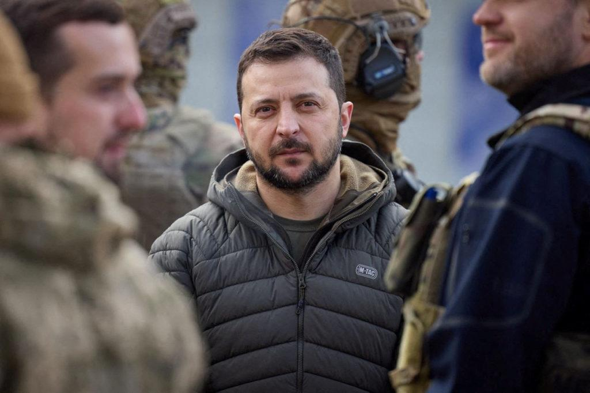
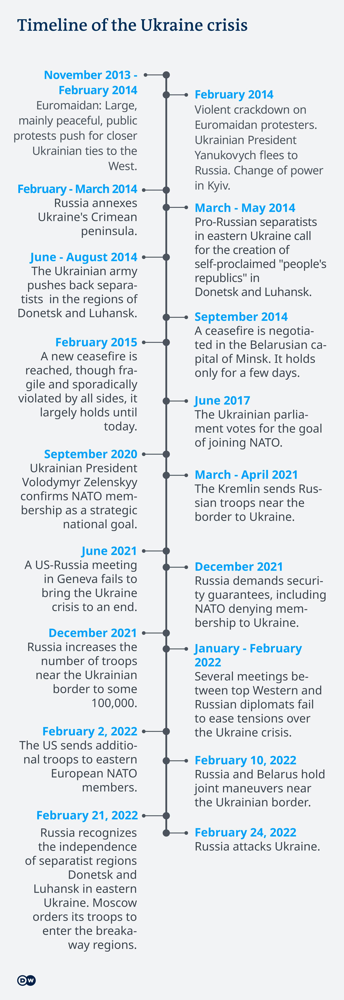

## Claim
Claim: "Ukrainian President Volodymyr Zelenskyy started the 2022 war in Ukraine with Russia."

## Actions
```
image_search("Volodymyr Zelenskyy Russia war 2022")
image_search("Russia Ukraine war timeline")
```

## Evidence
### Evidence from `image_search`
The PBS article discusses Volodymyr Zelenskyy's visit amid the Russian war. () The Al Jazeera article from March 22, 2022, covers Zelenskyy renewing an offer of talks with Putin. ()

The NBC News article contains an image of Volodymyr Zelenskyy. ()


### Evidence from `image_search`
Al Jazeera published a timeline of the Russia-Ukraine war, including a map showing areas under Russian control as of August 24, 2022. [] The timeline is available at [Source](https://www.aljazeera.com/news/2022/8/24/timeline-six-months-of-russias-war-in-ukraine).

DW.com provides a timeline of the Ukraine crisis, noting that Ukrainian President Volodymyr Zelenskyy confirmed NATO membership as a strategic national goal in September 2020, and that Russia attacked Ukraine on February 24, 2022. [] The timeline can be found at [Source](https://www.dw.com/en/how-the-ukraine-russia-crisis-reached-a-tipping-point/a-60802626). Eurojust's response to the war in Ukraine is presented in a timeline that begins in February 2022. [] The timeline is available at [Source](https://www.eurojust.europa.eu/publication/one-year-timeline-eurojusts-response-war-ukraine).


## Elaboration
The evidence indicates that Russia attacked Ukraine on February 24, 2022. The timeline from DW.com shows that Zelenskyy confirmed NATO membership as a strategic national goal in September 2020. The Al Jazeera article from March 22, 2022, shows Zelenskyy renewing an offer of talks with Putin. There is no evidence to support the claim that Zelenskyy started the war.


## Final Judgement
The evidence provided, including timelines and news articles, indicates that Russia initiated the war in Ukraine in February 2022. There is no evidence to suggest that Ukrainian President Volodymyr Zelenskyy started the war.

`false`


### Verdict: FALSE

### Justification
The evidence, including timelines from sources like DW.com and Al Jazeera, indicates that Russia initiated the war in Ukraine on February 24, 2022, while Volodymyr Zelenskyy offered talks with Putin in March 2022. There is no evidence to support the claim that Zelenskyy started the war.
