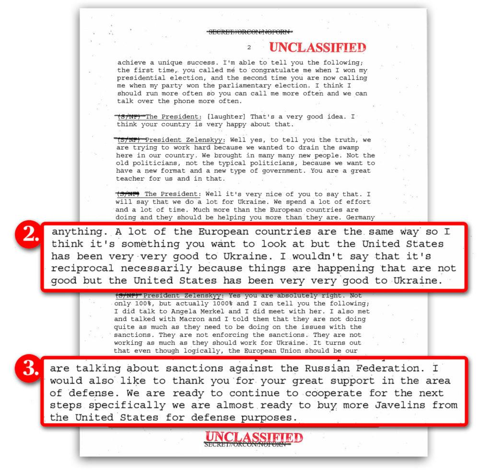

## Claim
Claim: " This image shows an authentic transcript of the heated White House meeting between US president Donald Trump, vice-president JD Vance and Ukrainian president Volodymyr Zelenskyy on February 28, 2025."

## Actions
```
image_search("Trump Zelenskyy conversation transcript")
```

## Evidence
### Evidence from `image_search`
The New York Times published a transcript of a phone call between Trump and Zelenskyy, declassified on September 24, 2019. () PBS also published a transcript of a conversation between Trump and Zelenskyy. ()

The provided sources do not contain the transcript in the claim.


## Elaboration
The evidence includes transcripts of conversations between Trump and Zelenskyy, but neither of them matches the transcript in the claim. The provided transcripts are from 2019, while the claim refers to a meeting on February 28, 2025.

Therefore, the claim is not supported by the evidence.


## Final Judgement
The image presents a fabricated transcript of a meeting between Trump, Zelenskyy, and Vance. While transcripts of Trump-Zelenskyy conversations exist, the one in the image is not authentic. The date of the alleged meeting (February 28, 2025) also suggests the claim is not accurate.

`false`

### Verdict: FALSE

### Justification
The claim is false. The provided image presents a fabricated transcript of a meeting between Trump, Zelenskyy, and Vance. While transcripts of Trump-Zelenskyy conversations exist, such as the ones published by the [New York Times]() and [PBS](), the one in the image is not authentic, and the date of the alleged meeting (February 28, 2025) is also inconsistent with the available evidence.
