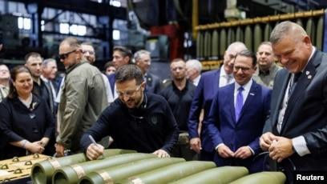

## Claim
Claim: " This image shows Ukrainian President Volodymyr Zelenskyy signing Israeli bombs intended for use against Palestinians in Gaza."

## Actions
```
reverse_search()
image_search("Zelenskyy signing bombs")
```

## Evidence
### Evidence from `reverse_search`
The image shows Ukrainian President Volodymyr Zelenskyy signing ammunition at the Scranton Army Ammunition Plant (SCAAP) in Pennsylvania. The BBC News article ([https://www.bbc.com/news/articles/c80rkv0k4j8o](https://www.bbc.com/news/articles/c80rkv0k4j8o)) and the BBC article ([https://www.bbc.co.uk/news/articles/c80rkv0k4j8o](https://www.bbc.co.uk/news/articles/c80rkv0k4j8o)) mention the visit. The New York Post ([https://nypost.com/2024/09/25/opinion/zelenskys-arms-factory-visit-reeks-of-partisan-foreign-election-interference/](https://nypost.com/2024/09/25/opinion/zelenskys-arms-factory-visit-reeks-of-partisan-foreign-election-interference/)) also reported on the visit. None of the sources mention Israeli bombs or Gaza.   


### Evidence from `image_search`
The Associated Press, Radio Free Europe/Radio Liberty, and BBC News all published images of Ukrainian President Volodymyr Zelenskyy signing artillery shells (, , ). The image in the claim shows Zelenskyy signing artillery shells ().
*   [https://apnews.com/article/zelenskyy-johnson-ambassador-ukraine-biden-harris-trump-d81b0a055d99cfd4804b3f2c00915d09](https://apnews.com/article/zelenskyy-johnson-ambassador-ukraine-biden-harris-trump-d81b0a055d99cfd4804b3f2c00915d09)
*   [https://www.rferl.org/a/zelenskiy-markarova-scranton-munitions-plant-johnson-harris/33135165.html](https://www.rferl.org/a/zelenskiy-markarova-scranton-munitions-plant-johnson-harris/33135165.html)
*   [https://www.bbc.com/news/articles/c5y30244467o](https://www.bbc.com/news/articles/c5y30244467o)


## Elaboration
The evidence indicates that the image shows Zelenskyy signing artillery shells at the Scranton Army Ammunition Plant (SCAAP) in Pennsylvania. The evidence does not mention Israeli bombs or Gaza.

Therefore, the claim that the image shows Zelenskyy signing Israeli bombs intended for use against Palestinians in Gaza is not supported by the evidence.


## Final Judgement
The image shows Zelenskyy signing artillery shells at a US ammunition plant, not Israeli bombs. The claim misrepresents the context of the image. `false`

### Verdict: FALSE

### Justification
The image depicts Ukrainian President Volodymyr Zelenskyy signing artillery shells at the Scranton Army Ammunition Plant in Pennsylvania, as reported by the BBC News ([https://www.bbc.com/news/articles/c80rkv0k4j8o](https://www.bbc.com/news/articles/c80rkv0k4j8o)) and other sources. The claim that the image shows Zelenskyy signing Israeli bombs intended for use against Palestinians in Gaza is false, as the evidence does not support this assertion.
