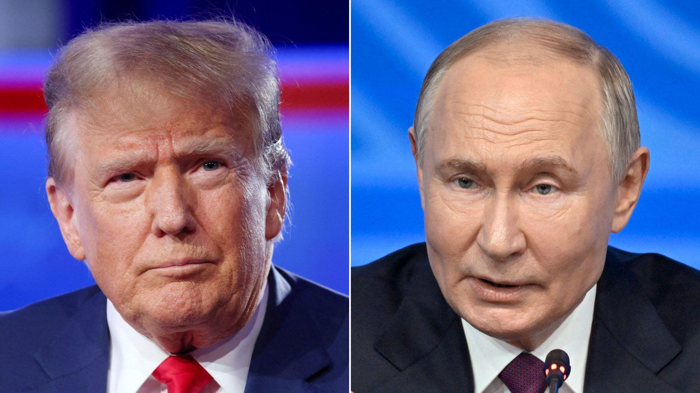
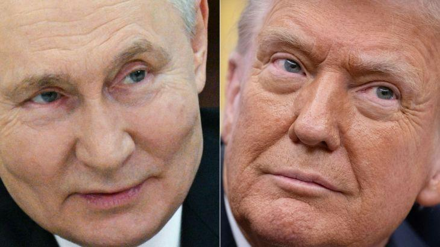

## Claim
Claim: "After a call with Russia's President Vladimir Putin on February 12, 2025, US President Donald Trump announced that he had reached an agreement to end the war in Ukraine."

## Actions
```
image_search("Donald Trump Vladimir Putin call February 12 2025")
image_search("Donald Trump Ukraine war agreement February 2025")
```

## Evidence
### Evidence from `image_search`
CNN reports on a phone call between Putin and Trump (). Al Jazeera reports that Trump said Putin wants peace and will begin talks on ending the Ukraine war ().

Reuters contains an image of a newspaper with photos of Donald Trump and Vladimir Putin, mentioning a phone call on February 12, 2025 ().
*   [Source](https://www.cnn.com/2025/02/12/politics/putin-trump-phone-call)
*   [Source](https://www.aljazeera.com/news/2025/2/13/trump-says-putin-wants-peace-will-begin-talks-on-ending-ukraine-war)
*   [Source](https://www.reuters.com/world/putin-trump-may-have-spoken-more-than-twice-kremlin-says-2025-03-23/)


### Evidence from `image_search`
The search results include articles and images related to Donald Trump and the war in Ukraine. One source from WHYY.org ([Source](https://whyy.org/articles/trump-pauses-aid-ukraine-russia-war/)) contains an image of Donald Trump and Volodymyr Zelenskyy . Another source from CFR.org ([Source](https://www.cfr.org/article/how-trump-could-make-good-deal-end-ukraine-war)) also contains an image of Donald Trump and Volodymyr Zelenskyy .

Al Jazeera ([Source](https://www.aljazeera.com/news/2025/2/19/trump-says-he-will-probably-meet-putin-this-month-hits-out-at-ukraine)) published an article on February 19, 2025, stating that Trump said he would probably meet Putin that month .


## Elaboration
The evidence confirms that Donald Trump and Vladimir Putin had a phone call on February 12, 2025. Al Jazeera reports that Trump said Putin wants peace and will begin talks on ending the Ukraine war. However, the evidence does not explicitly state that Trump announced he had reached an agreement to end the war in Ukraine.

Therefore, the claim is partially supported. While the phone call and Trump's statements about Putin's interest in peace are confirmed, the specific claim about an agreement is not directly supported by the provided evidence.

To fully verify the claim, additional information is needed to confirm whether Trump announced an agreement to end the war.


## Actions
```
image_search("Donald Trump Ukraine war agreement February 12 2025")
```

## Evidence
### Evidence from `image_search`
From [Source](https://www.aljazeera.com/economy/2025/2/26/trump-says-ukraines-zelensky-to-sign-very-big-deal-on-rare-earths): 
Content: Al Jazeera reports on February 26, 2025, that Trump said Ukraine's Zelenskyy would sign a "very big deal" regarding rare earths. 


## Elaboration
The new evidence from Al Jazeera, dated February 26, 2025, reports that Trump mentioned a "very big deal" involving Ukraine's Zelenskyy regarding rare earths. This does not confirm that Trump announced an agreement to end the war in Ukraine on February 12, 2025, as the claim states.

Therefore, the claim remains unverified.


## Final Judgement
The evidence confirms that Trump and Putin had a phone call on February 12, 2025, and that Trump mentioned Putin's interest in peace. However, there is no evidence to support the claim that Trump announced an agreement to end the war in Ukraine on that specific date.

`false`

### Verdict: FALSE

### Justification
The claim is not supported by the evidence. While there is evidence of a phone call between Trump and Putin on February 12, 2025, and Trump's statements about Putin's interest in peace, there is no evidence to support the assertion that Trump announced an agreement to end the war in Ukraine on that date, as reported by [Al Jazeera](https://www.aljazeera.com/news/2025/2/13/trump-says-putin-wants-peace-will-begin-talks-on-ending-ukraine-war).
