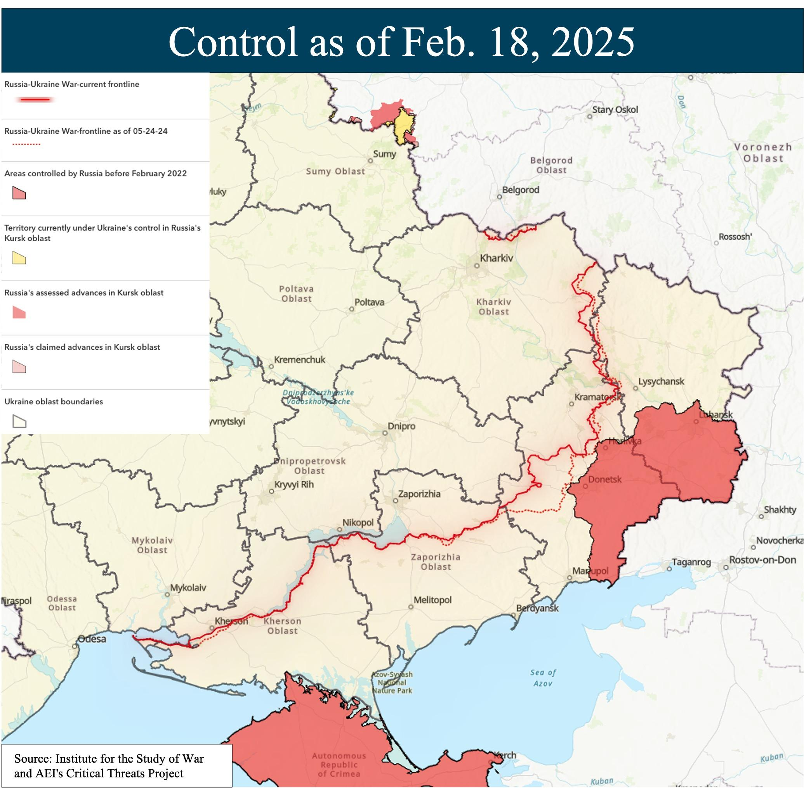
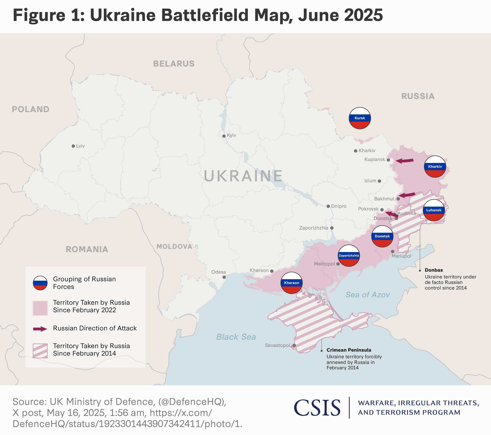
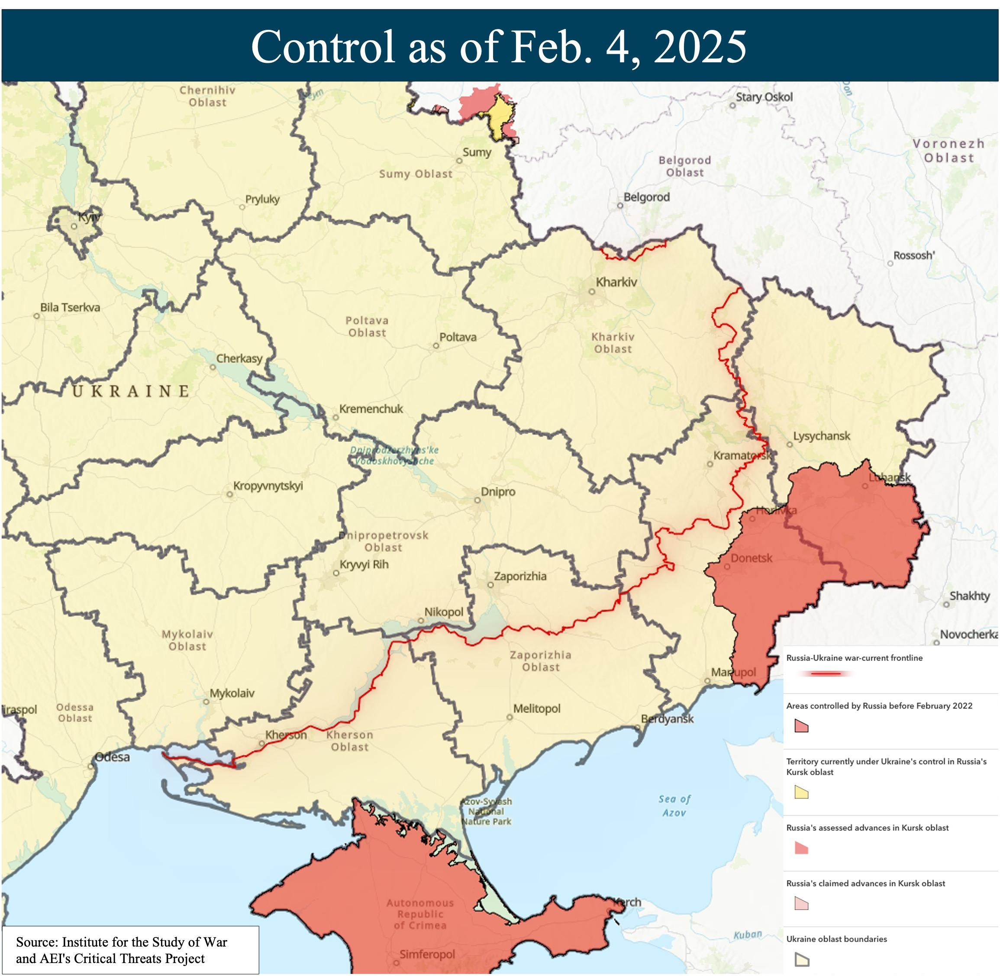
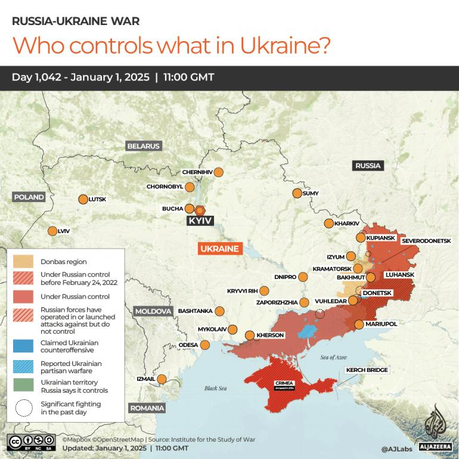

## Claim
Claim: "As of February 2025, Russia has lost 1.5 million troops in the Ukraine war."

## Actions
```
image_search("Russia Ukraine war casualties February 2025")
image_search("Russia Ukraine war troop losses February 2025")
```

## Evidence
### Evidence from `image_search`
The Institute for the Study of War and AEI's Critical Threats Project published a map on February 3, 2025, showing the assessed control of terrain in the Russo-Ukrainian War (). The Independent published an article on the Ukraine war anniversary, including statistics such as the number of Ukrainian soldiers killed (46,000+) and the number of civilians killed in Ukraine since February 24, 2022 (12,654) ().

Russia Matters includes a map showing the Russia-Ukraine war frontline as of February 18, 2025 ().


### Evidence from `image_search`
The Center for Strategic and International Studies (CSIS) provides a map of the Ukraine battlefield in June 2025, sourced from the UK Ministry of Defence (). Russia Matters offers a map showing territorial control in the Russia-Ukraine war as of February 4, 2025, created by the Institute for the Study of War and AEI's Critical Threats Project ().

The provided sources are: [https://www.csis.org/analysis/russias-battlefield-woes-ukraine](https://www.csis.org/analysis/russias-battlefield-woes-ukraine) and [https://www.russiamatters.org/news/russia-ukraine-war-report-card/russia-ukraine-war-report-card-feb-5-2025](https://www.russiamatters.org/news/russia-ukraine-war-report-card/russia-ukraine-war-report-card-feb-5-2025).


## Elaboration
The evidence includes maps and articles related to the Russia-Ukraine war, with dates in February and June 2025. However, none of the provided sources explicitly state the number of Russian troop losses as of February 2025. The Independent article provides statistics on Ukrainian casualties, but not Russian losses.

Therefore, I cannot verify the claim due to a lack of information regarding Russian troop losses.


## Actions
```
image_search("Russian troop losses Ukraine war February 2025")
```

## Evidence
### Evidence from `image_search`
From [Source](https://www.aljazeera.com/news/2025/1/3/highest-price-for-war-russia-lost-430000-soldiers-in-2024-says-ukraine): 
Content: Al Jazeera published an article stating that Russia lost 430,000 soldiers in 2024. The article includes a map of the Russia-Ukraine war as of January 1, 2025. 


## Elaboration
The Al Jazeera article states that Russia lost 430,000 soldiers in 2024. This information does not verify the claim that Russia lost 1.5 million troops as of February 2025.

The claim is not supported by the evidence.


## Final Judgement
The evidence indicates that while there are reports on the Russia-Ukraine war, including maps and casualty figures, there is no evidence to support the claim that Russia lost 1.5 million troops as of February 2025. The Al Jazeera article mentions 430,000 losses in 2024, but this does not align with the claim.

`false`

### Verdict: FALSE

### Justification
The available evidence, including maps and articles from various sources like Al Jazeera ([Source](https://www.aljazeera.com/news/2025/1/3/highest-price-for-war-russia-lost-430000-soldiers-in-2024-says-ukraine)), does not support the claim that Russia lost 1.5 million troops in the Ukraine war as of February 2025. While Al Jazeera reports 430,000 losses in 2024, this figure does not align with the claim.
