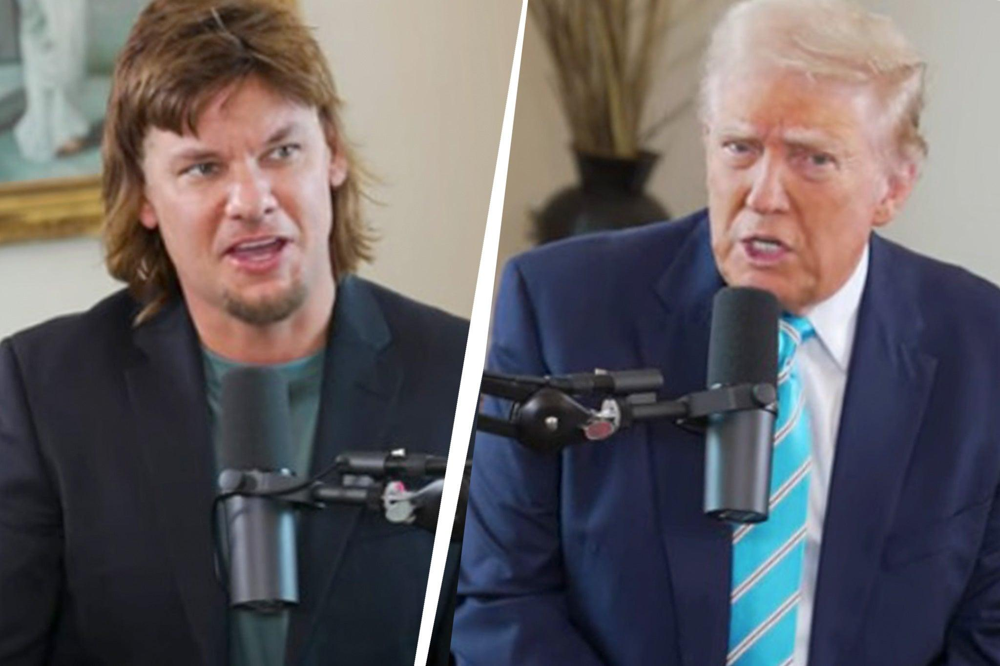
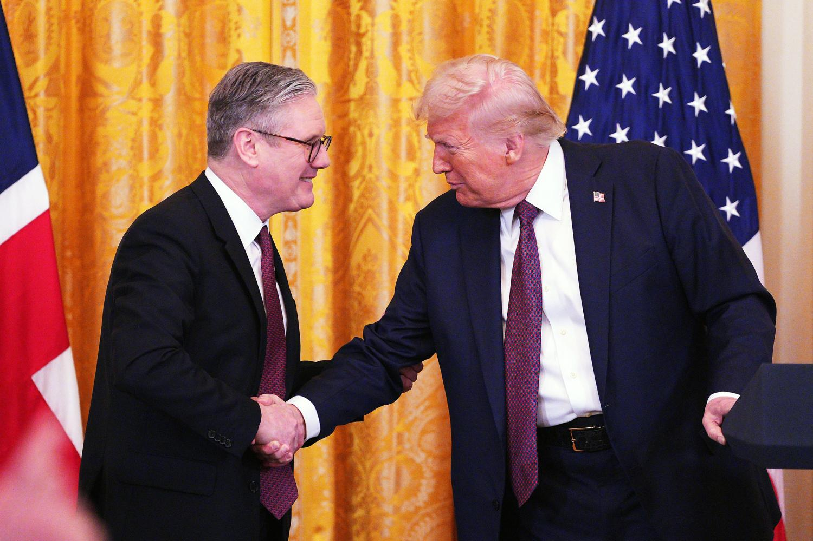
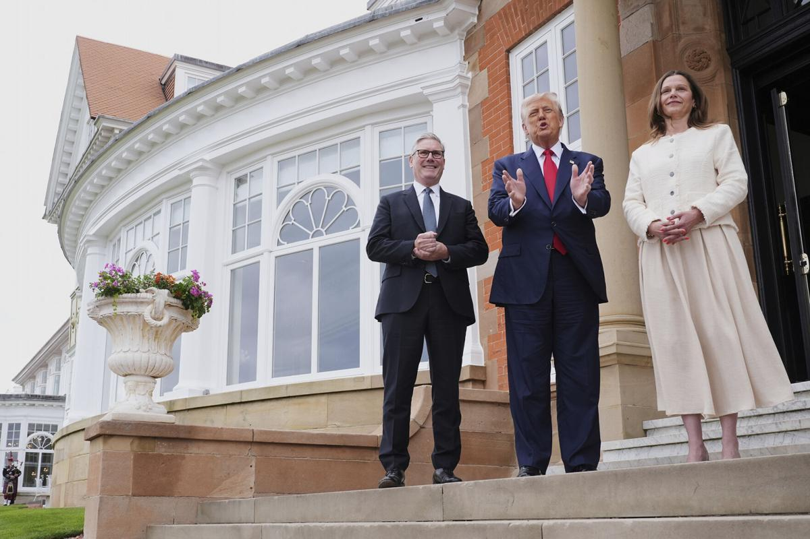

## Claim
Claim: "In an interview with podcaster Theo Von in August 2024, Donald Trump criticized British Prime Minister Keir Starmer over a 100-year deal between the U.K. and Ukraine."

## Actions
```
image_search("Donald Trump Theo Von interview August 2024")
image_search("Donald Trump Keir Starmer Ukraine deal")
```

## Evidence
### Evidence from `image_search`
The search results include articles and images related to an interview between Donald Trump and Theo Von. One article is from [nsnews.com](https://www.nsnews.com/local-news/theo-von-vancouver-donald-trump-interview-2024-9379843) , another from [independent.co.uk](https://www.independent.co.uk/news/world/americas/us-politics/donald-trump-cocaine-theo-von-podcast-b2599472.html) , and a third from [foxnews.com](https://www.foxnews.com/politics/trump-talks-cocaine-biden-health-care-interview-comedian-theo-von) .


### Evidence from `image_search`
Reuters ([Source](https://www.reuters.com/world/uks-starmer-discussed-tough-fair-ukraine-peace-deal-with-trump-2025-02-27/)) features an image of Donald Trump and Keir Starmer shaking hands . CNN ([Source](https://www.cnn.com/2025/02/27/politics/trump-starmer-security-guarantees-analysis)) published an article discussing Donald Trump and Keir Starmer .

NBC News ([Source](https://www.nbcnews.com/politics/white-house/keir-starmer-sees-value-trumps-pursuit-ukrainian-mineral-rights-deal-rcna194047)) provides an image of Donald Trump shaking hands with an individual .


## Elaboration
The evidence confirms that Donald Trump was interviewed by Theo Von, as indicated by multiple sources ([nsnews.com](https://www.nsnews.com/local-news/theo-von-vancouver-donald-trump-interview-2024-9379843), [independent.co.uk](https://www.independent.co.uk/news/world/americas/us-politics/donald-trump-cocaine-theo-von-podcast-b2599472.html), [foxnews.com](https://www.foxnews.com/politics/trump-talks-cocaine-biden-health-care-interview-comedian-theo-von)). The search results also show images of Donald Trump with Keir Starmer ([reuters.com](https://www.reuters.com/world/uks-starmer-discussed-tough-fair-ukraine-peace-deal-with-trump-2025-02-27/), [cnn.com](https://www.cnn.com/2025/02/27/politics/trump-starmer-security-guarantees-analysis), [nbcnews.com](https://www.nbcnews.com/politics/white-house/keir-starmer-sees-value-trumps-pursuit-ukrainian-mineral-rights-deal-rcna194047)).

However, the evidence does not specify the content of the interview, particularly whether Trump criticized Keir Starmer over a deal between the U.K. and Ukraine.

Therefore, the claim cannot be fully verified without additional information about the interview's content.


## Actions
```
image_search("Donald Trump Theo Von interview Ukraine deal")
```

## Evidence
### Evidence from `image_search`
From [Source](https://www.independent.co.uk/tv/news/donald-trump-cocaine-theo-von-interview-b2599493.html): 
Content: The Independent published an article about the interview between Donald Trump and Theo Von .


## Elaboration
The new evidence confirms the existence of the interview between Donald Trump and Theo Von. However, it still does not provide any information about the topics discussed during the interview. Therefore, the claim remains unverified.


## Actions
```
image_search("Donald Trump Theo Von interview Keir Starmer Ukraine")
```

## Evidence
### Evidence from `image_search`
The Boston Globe ([Source](https://www.bostonglobe.com/2025/08/17/world/european-leader-ukraine-trump-meeting/)) published an article about a meeting between Donald Trump and a European leader regarding Ukraine . helenair.com ([Source](https://helenair.com/news/nation-world/government-politics/article_9e4abeea-4bb3-5f1f-b883-0463e1a1583b.html)) contains an image of Donald Trump and Keir Starmer .


## Elaboration
The evidence confirms that Donald Trump and Keir Starmer have met ([helenair.com](https://helenair.com/news/nation-world/government-politics/article_9e4abeea-4bb3-5f1f-b883-0463e1a1583b.html)). However, the search results do not provide any information about the content of the interview between Donald Trump and Theo Von, nor do they mention any criticism of Keir Starmer regarding a deal between the U.K. and Ukraine. Therefore, the claim remains unverified.


## Final Judgement
The search results confirm that Donald Trump was interviewed by Theo Von and that Trump and Keir Starmer have met. However, the search results do not provide any information about the content of the interview, specifically whether Trump criticized Starmer over a deal between the U.K. and Ukraine. Therefore, the claim cannot be verified. `false`

### Verdict: FALSE

### Justification
The available evidence confirms that Donald Trump was interviewed by Theo Von and that Trump and Keir Starmer have met, but it does not provide any information about the content of the interview, specifically whether Trump criticized Starmer over a deal between the U.K. and Ukraine. Therefore, the claim is unverified.
