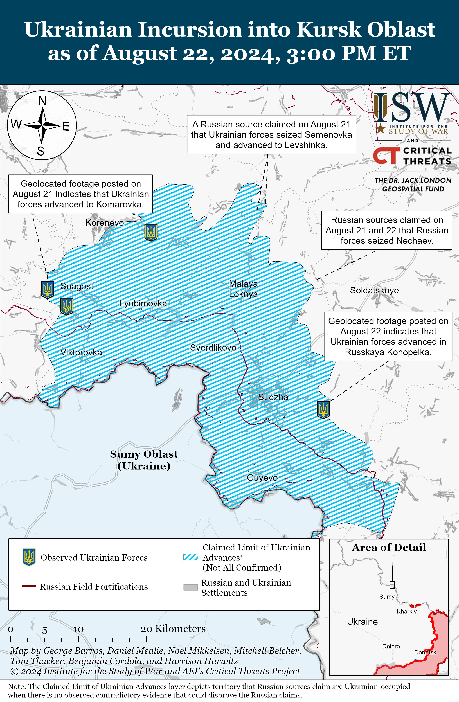
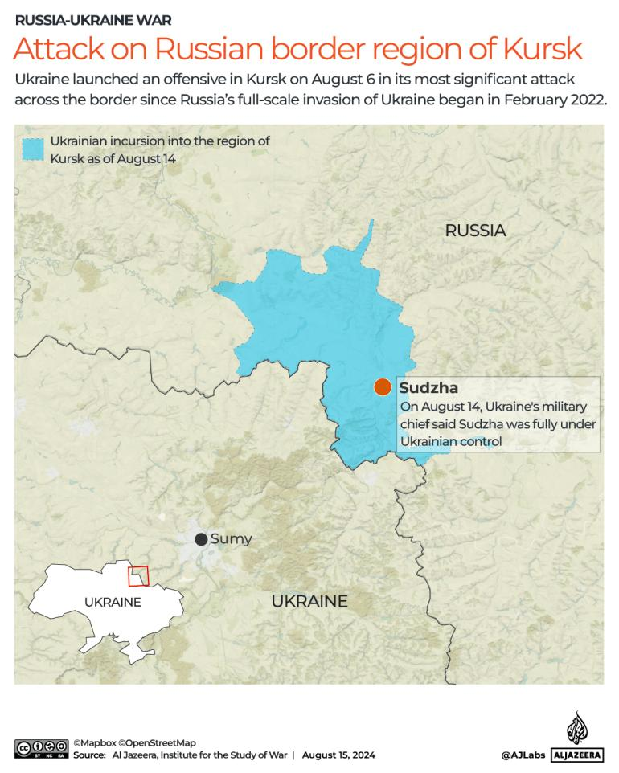
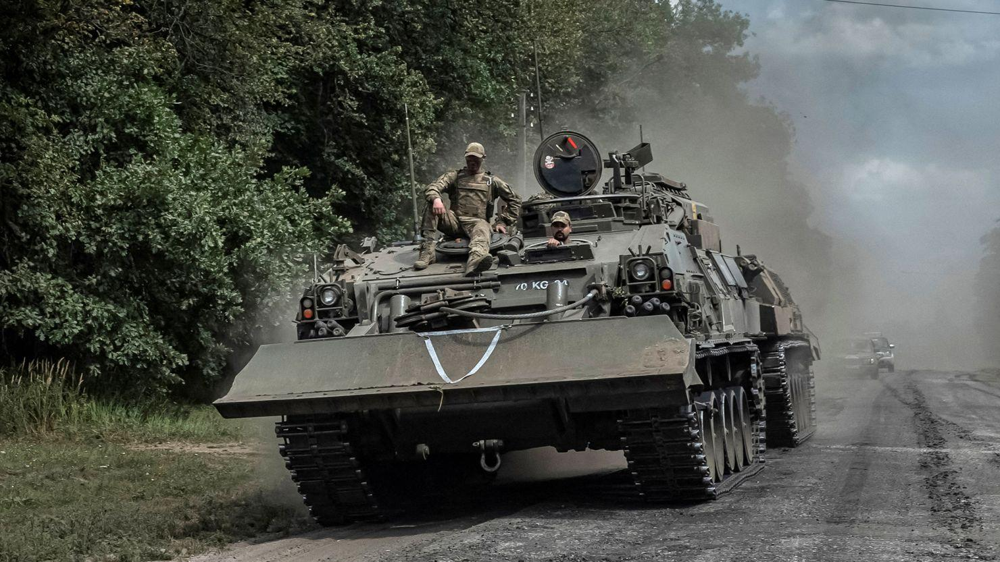
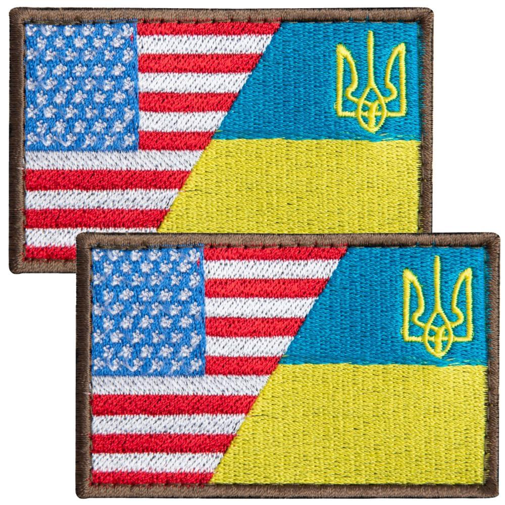
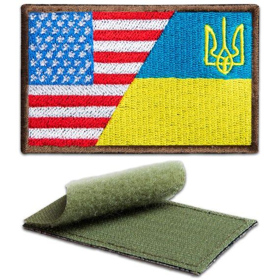

## Claim
Claim: " This image shows American mercenaries participating in Ukraine's incursion into Russia's Kursk Oblast in August 2024."

## Actions
```
reverse_search()
```

## Evidence
### Evidence from `reverse_search`
The image 

## Elaboration
The image shows individuals wearing patches of the American flag. However, the evidence does not provide any information about the location or the date of the event. Therefore, it is impossible to verify the claim that the image depicts American mercenaries participating in Ukraine's incursion into Russia's Kursk Oblast in August 2024.

The claim is based on the presence of the American flag patches, which suggests the involvement of Americans. However, without additional information about the context, the claim cannot be verified.

To verify the claim, additional information is needed, such as the location, date, and the identity of the individuals in the image.


## Actions
```
image_search("Ukraine Russia Kursk Oblast August 2024 military")
```

## Evidence
### Evidence from `image_search`
The Institute for the Study of War published a map showing the Ukrainian incursion into Kursk Oblast as of August 22, 2024. ([https://www.understandingwar.org/backgrounder/russian-offensive-campaign-assessment-august-22-2024](https://www.understandingwar.org/backgrounder/russian-offensive-campaign-assessment-august-22-2024))  Al Jazeera reported on an offensive launched by Ukraine in Kursk on August 6, stating that Sudzha was fully under Ukrainian control on August 14. ([https://www.aljazeera.com/news/liveblog/2024/8/15/russia-ukraine-war-live-news-no-sign-of-hostilities-weakening-in-kursk](https://www.aljazeera.com/news/liveblog/2024/8/15/russia-ukraine-war-live-news-no-sign-of-hostilities-weakening-in-kursk))  CNN published an article about the situation in Kursk Oblast, including an image of military vehicles. ([https://www.cnn.com/2024/11/11/europe/russia-ukraine-kursk-intl](https://www.cnn.com/2024/11/11/europe/russia-ukraine-kursk-intl)) 


## Elaboration
The evidence confirms that Ukraine launched an offensive in Kursk Oblast in August 2024. The Institute for the Study of War and Al Jazeera reported on the incursion, providing maps and details about the situation. However, the evidence does not provide any information about the presence of American mercenaries.

The image search results confirm that there was military activity in Kursk Oblast in August 2024, which aligns with the claim's timeframe. However, the evidence does not provide any information about the individuals involved in the conflict.

Therefore, while the evidence supports the timeframe and location mentioned in the claim, it does not provide any information to verify the presence of American mercenaries.


## Actions
```
image_search("American flag patch Ukraine military")
```

## Evidence
### Evidence from `image_search`
The search results show patches that combine the American and Ukrainian flags. One source is from Amazon ([https://www.amazon.com/Bluyellow-American-Embroidered-Military-Backpacks/dp/B0CG28DJVD](https://www.amazon.com/Bluyellow-American-Embroidered-Military-Backpacks/dp/B0CG28DJVD)), and another is from Etsy ([https://www.etsy.com/listing/4303814651/2pcs-ukraine-american-flag-patch](https://www.etsy.com/listing/4303814651/2pcs-ukraine-american-flag-patch)). , 

Another source is from dodguidons.com ([https://dodguidons.com/products/us-and-ukraine-in-unity-flag-patch-with-loop-backing-u1.html](https://dodguidons.com/products/us-and-ukraine-in-unity-flag-patch-with-loop-backing-u1.html)).


## Elaboration
The evidence shows that patches combining the American and Ukrainian flags are available for sale. This suggests that the presence of an American flag patch does not necessarily indicate the involvement of American mercenaries.

The image search results show that such patches are commercially available. This information weakens the claim that the image depicts American mercenaries, as the patches could be worn by anyone.

Without further evidence, it is impossible to verify the claim.


## Final Judgement
The image shows individuals wearing American flag patches, and the evidence confirms that Ukraine launched an offensive in Kursk Oblast in August 2024. However, the evidence does not provide any information about the identity of the individuals in the image or their involvement in the conflict. Additionally, the image search results show that patches combining the American and Ukrainian flags are commercially available, which weakens the claim. Therefore, there is not enough evidence to verify the claim. `false`

### Verdict: FALSE

### Justification
The claim cannot be verified. While the image shows individuals with American flag patches and the timeframe aligns with the Ukrainian offensive in Kursk Oblast in August 2024, there is no evidence to confirm the presence of American mercenaries. Furthermore, the availability of American and Ukrainian flag patches for sale weakens the claim.
