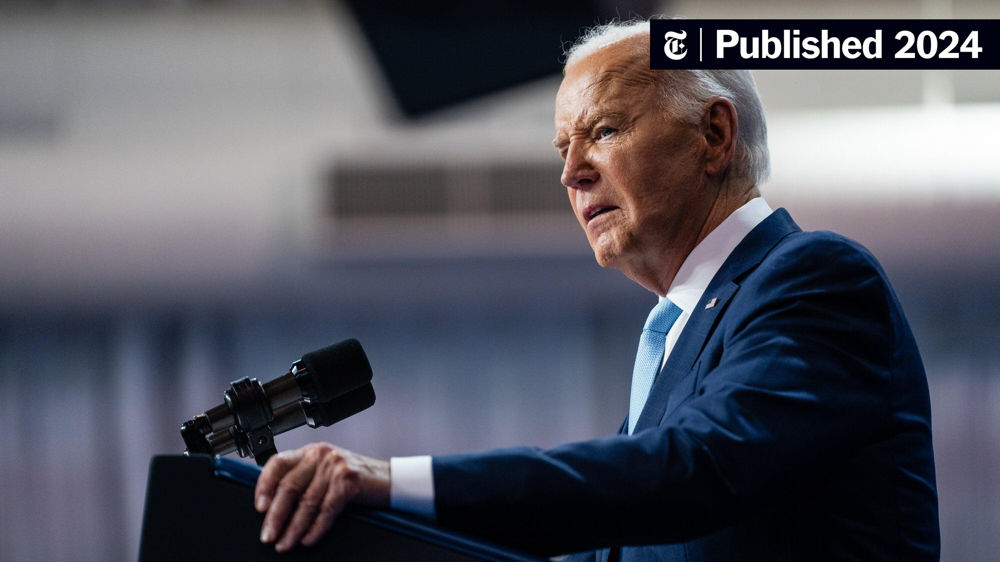
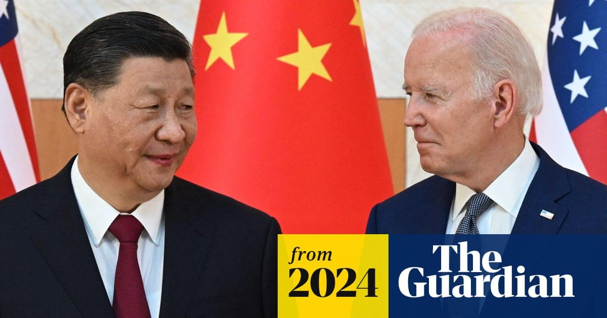
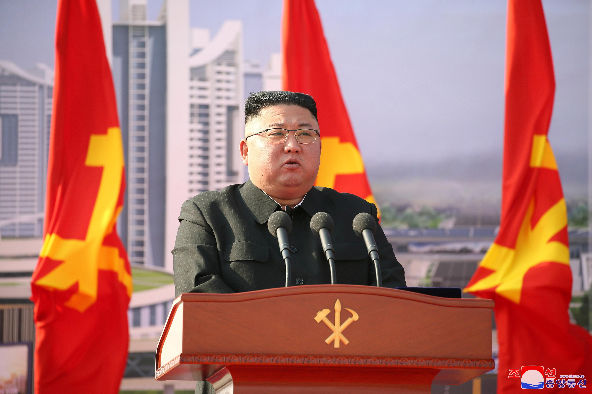
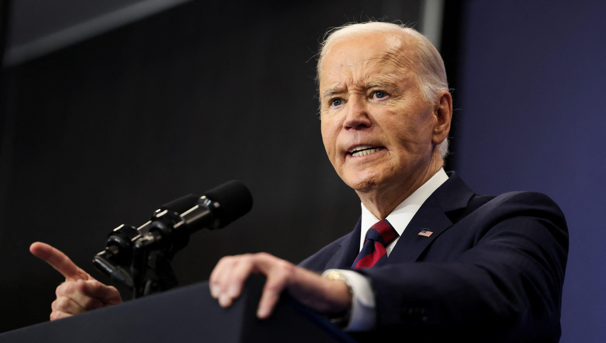

## Claim
Claim: "While serving as US President in 2024, Joe Biden ordered the US forces to prepare for possible nuclear confrontations with Russia, China, and North Korea."

## Actions
```
image_search("Joe Biden nuclear confrontation Russia China North Korea 2024")
```

## Evidence
### Evidence from `image_search`
The New York Times published an article in 2024 (). The Guardian also published an article in 2024 ().

Brookings.edu contains an image of Kim Jong Un ().


## Elaboration
The evidence includes articles published in 2024 by The New York Times and The Guardian, along with images of Joe Biden, Xi Jinping, and Kim Jong Un. However, the evidence does not provide any information about whether Joe Biden ordered the US forces to prepare for possible nuclear confrontations with Russia, China, and North Korea.

Therefore, the claim cannot be verified with the available information.


## Actions
```
image_search("Joe Biden nuclear war preparation Russia China North Korea 2024")
```

## Evidence
No new evidence found.

## Elaboration
The search results did not yield any new evidence. The claim remains unverified due to the lack of information regarding President Biden's actions related to nuclear confrontation preparations.


## Actions
```
image_search("Joe Biden nuclear strategy Russia China North Korea 2024")
```

## Evidence
### Evidence from `image_search`
From [Source](https://www.reuters.com/world/biden-pushes-new-russia-iran-korea-china-effort-before-trump-term-2024-12-11/): 
Content: Reuters published an article on December 11, 2024, featuring an image of Joe Biden ().


## Elaboration
The Reuters article from December 11, 2024, provides an image of Joe Biden. However, the article's content is not included in the evidence. Therefore, the claim remains unverified.


## Final Judgement
The search results provide images of Joe Biden and articles published in 2024, but they do not contain any information about whether Joe Biden ordered the US forces to prepare for possible nuclear confrontations with Russia, China, and North Korea. The claim cannot be verified with the available information.

The claim is not supported by the evidence. There is no information to confirm that Joe Biden ordered the US forces to prepare for possible nuclear confrontations with Russia, China, and North Korea. Therefore, the claim is considered false. `false`


### Verdict: FALSE

### Justification
The claim is unsubstantiated. While image searches yielded articles and images related to Joe Biden, Russia, China, and North Korea in 2024, none of the provided evidence confirms that Biden ordered the US forces to prepare for potential nuclear confrontations with these countries. Therefore, the claim is considered false.
