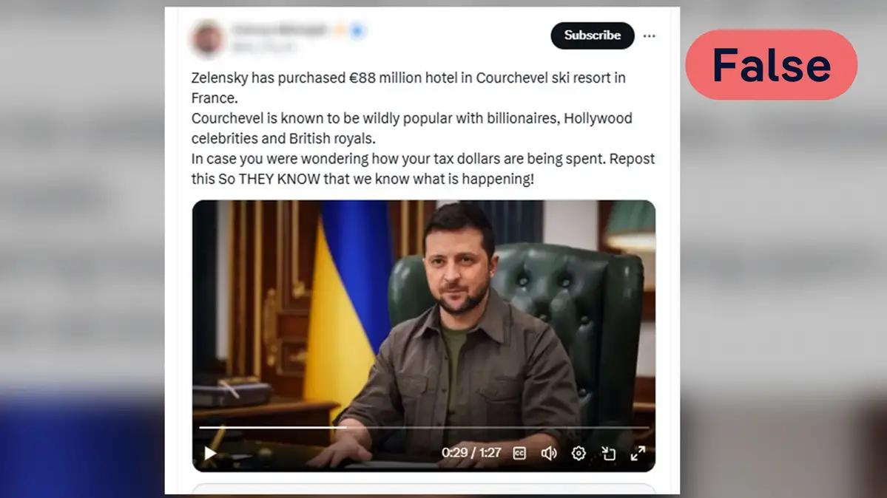
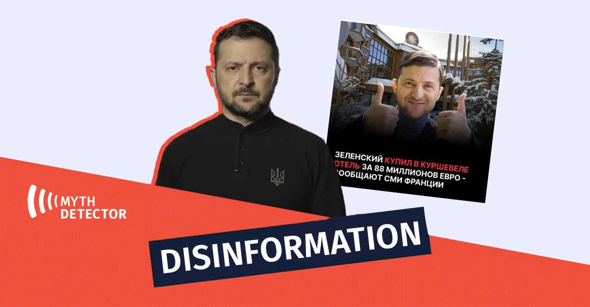

## Claim
Claim: "Ukrainian President Volodymyr Zelenskyy purchased an 88 million euro hotel in the Courchevel ski resort in France."

## Actions
```
image_search("Volodymyr Zelenskyy Courchevel hotel")
```

## Evidence
### Evidence from `image_search`
DW.com fact-checks the claim that Zelenskyy purchased an 88 million euro hotel in Courchevel, France, and labels it as "False" (). Myth Detector labels the same claim as disinformation ().

ABC News Australia published an article about the Courchevel ski resort ().

*   [https://www.dw.com/en/fact-check-no-zelenskyy-didnt-buy-a-luxury-hotel-in-france/a-70959821](https://www.dw.com/en/fact-check-no-zelenskyy-didnt-buy-a-luxury-hotel-in-france/a-70959821)
*   [https://mythdetector.com/en/that-volodymyr-zelenskyy/](https://mythdetector.com/en/that-volodymyr-zelenskyy/)
*   [https://www.abc.net.au/news/2022-04-10/courchevel-french-ski-resort-is-emptying-of-russian-oligarchs/100939856](https://www.abc.net.au/news/2022-04-10/courchevel-french-ski-resort-is-emptying-of-russian-oligarchs/100939856)


## Elaboration
The claim that Volodymyr Zelenskyy purchased an 88 million euro hotel in Courchevel, France, is false. Both DW.com and Myth Detector have fact-checked the claim and labeled it as false and disinformation, respectively.


## Final Judgement
The evidence from multiple sources, including DW.com and Myth Detector, indicates that the claim is false. Both sources explicitly debunk the claim, providing sufficient evidence to determine its inaccuracy.

`false`


### Verdict: FALSE

### Justification
The claim that Volodymyr Zelenskyy purchased an 88 million euro hotel in Courchevel, France, is false. This has been debunked by both [DW.com](https://www.dw.com/en/fact-check-no-zelenskyy-didnt-buy-a-luxury-hotel-in-france/a-70959821) and [Myth Detector](https://mythdetector.com/en/that-volodymyr-zelenskyy/), who label the claim as false and disinformation, respectively.
