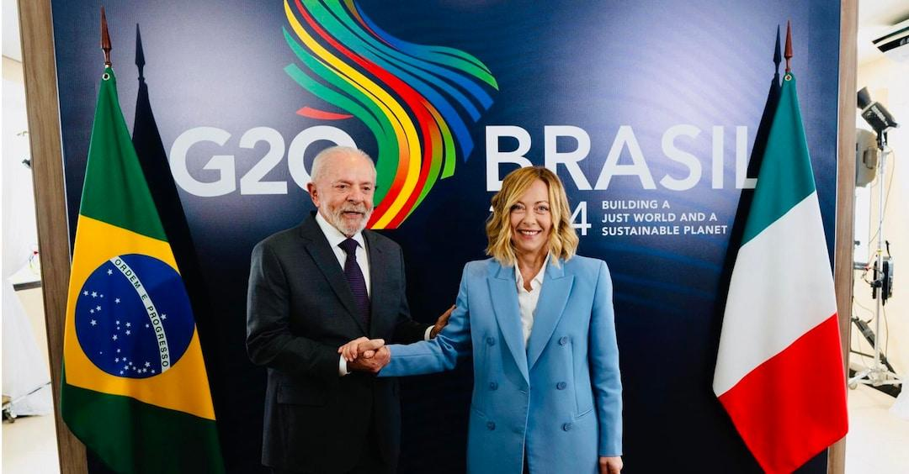
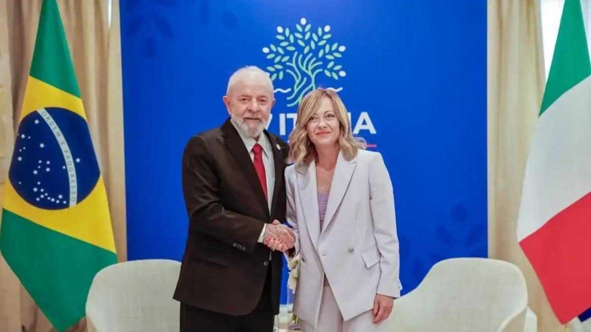
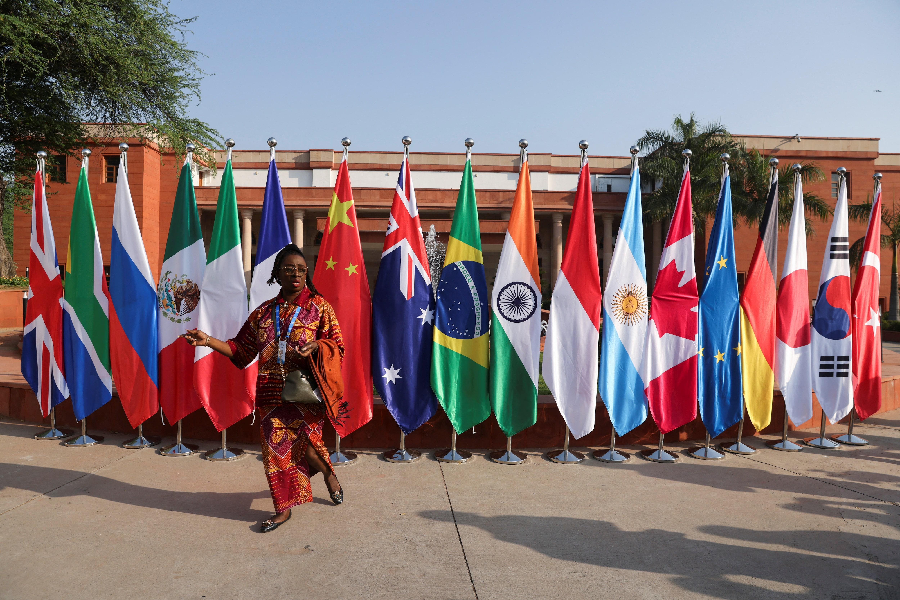
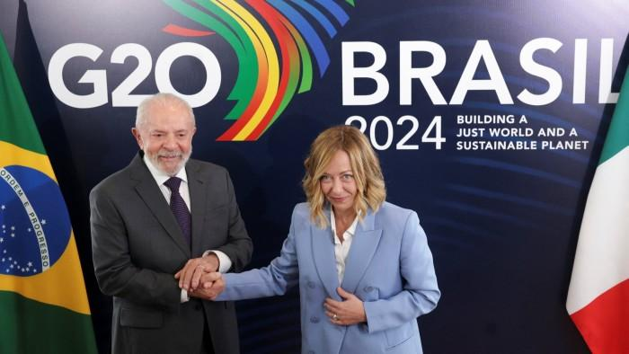
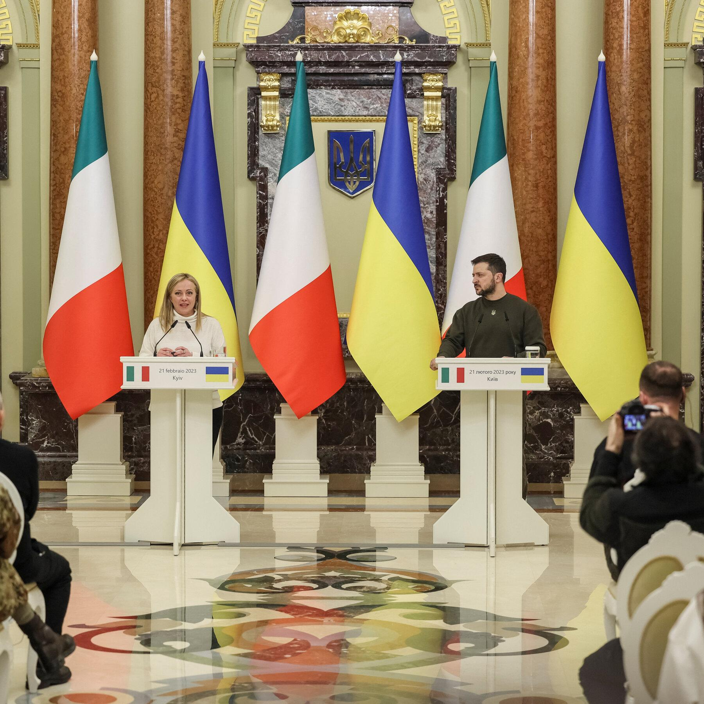

## Claim
Claim: "Italian Prime Minister Giorgia Meloni condemned the US-Ukrainian bombing of Russia at the G20 summit in Rio de Janeiro in November 2024."

## Actions
```
image_search("Giorgia Meloni G20 Rio de Janeiro November 2024")
image_search("G20 summit Rio de Janeiro November 2024")
```

## Evidence
### Evidence from `image_search`
Il Sole 24 Ore published an image of Giorgia Meloni at the G20 summit (). Another source also contains an image of Giorgia Meloni ().


### Evidence from `image_search`
From [Source](https://www.reuters.com/world/rio-de-janeiro-host-g20-summit-2024-2023-05-09/): 
Content: The search result from Reuters mentions that Rio de Janeiro will host the G20 summit in 2024. 


## Elaboration
The evidence confirms that Giorgia Meloni attended the G20 summit, which will be held in Rio de Janeiro in 2024. However, the evidence does not provide any information about whether she condemned the US-Ukrainian bombing of Russia.

Therefore, the claim cannot be verified with the available evidence.


## Actions
```
image_search("Giorgia Meloni G20 summit Rio de Janeiro Russia Ukraine")
image_search("Giorgia Meloni statement G20 summit Russia Ukraine")
```

## Evidence
### Evidence from `image_search`
From [Source](https://www.ft.com/content/1da295ef-8faa-4cd6-a535-6e6675808406): 
Content: The Financial Times published an image of Giorgia Meloni at the G20 summit in Brazil in 2024. 


### Evidence from `image_search`
The New York Times published an article about Giorgia Meloni's visit to Kyiv, Ukraine (). PBS mentions that world leaders are set to condemn Russia's invasion of Ukraine at the G20 summit (). Al Jazeera published an image from the G20 summit ().


## Elaboration
The evidence confirms that Giorgia Meloni attended the G20 summit in Brazil in 2024. The evidence also shows that world leaders, including Meloni, have been involved in discussions related to the Russia-Ukraine conflict. However, the evidence does not explicitly state whether Meloni condemned the US-Ukrainian bombing of Russia at the G20 summit.

Therefore, the claim remains unverified.


## Actions
```
image_search("Giorgia Meloni G20 summit Rio de Janeiro Russia Ukraine condemnation")
```

## Evidence
No new evidence found.

## Elaboration
The evidence confirms that Giorgia Meloni attended the G20 summit in Rio de Janeiro in 2024. However, the search results did not provide any information about whether she condemned the US-Ukrainian bombing of Russia.

Therefore, the claim remains unverified.


## Final Judgement
The search results confirm that Giorgia Meloni attended the G20 summit in Rio de Janeiro in 2024. However, the searches did not provide any information about whether she condemned the US-Ukrainian bombing of Russia. Therefore, the claim cannot be verified.

`false`

### Verdict: FALSE

### Justification
The evidence confirms that Giorgia Meloni attended the G20 summit in Rio de Janeiro in 2024, as shown in images from sources like the Financial Times. However, the search results did not provide any information about whether she condemned the US-Ukrainian bombing of Russia. Therefore, the claim remains unverified.
