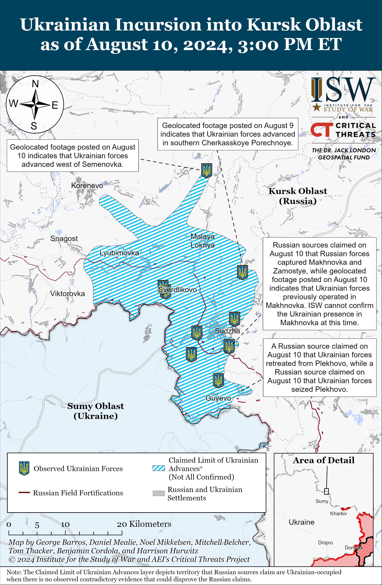

## Claim
Claim: " This image shows a chemical attack by the Armed Forces of Ukraine during the Kursk offensive in August 2024."

## Actions
```
reverse_search()
image_search("chemical attack Kursk offensive August 2024")
```

## Evidence
### Evidence from `image_search`
The Institute for the Study of War published a map of the Ukrainian incursion into Kursk Oblast as of August 10, 2024 (). Al Jazeera published an article on August 13, 2024, about the attack on the Russian border region of Kursk ().

The provided sources are from [https://www.understandingwar.org/backgrounder/russian-offensive-campaign-assessment-august-10-2024](https://www.understandingwar.org/backgrounder/russian-offensive-campaign-assessment-august-10-2024) and [https://www.aljazeera.com/news/liveblog/2024/8/13/russia-ukraine-live-news-russia-hits-back-at-ukrainian-forces-in-kursk](https://www.aljazeera.com/news/liveblog/2024/8/13/russia-ukraine-live-news-russia-hits-back-at-ukrainian-forces-in-kursk).


## Elaboration
The evidence confirms that there was an offensive in the Kursk region in August 2024. However, the provided evidence does not contain any information about a chemical attack. Therefore, the claim cannot be verified.


## Final Judgement
The claim is not factually accurate because the provided evidence does not contain any information about a chemical attack. `false`

### Verdict: FALSE

### Justification
The claim is not supported by the evidence. While there was an offensive in the Kursk region in August 2024, as reported by the [Institute for the Study of War](https://www.understandingwar.org/backgrounder/russian-offensive-campaign-assessment-august-10-2024) and [Al Jazeera](https://www.aljazeera.com/news/liveblog/2024/8/13/russia-ukraine-live-news-russia-hits-back-at-ukrainian-forces-in-kursk), there is no mention of a chemical attack.
