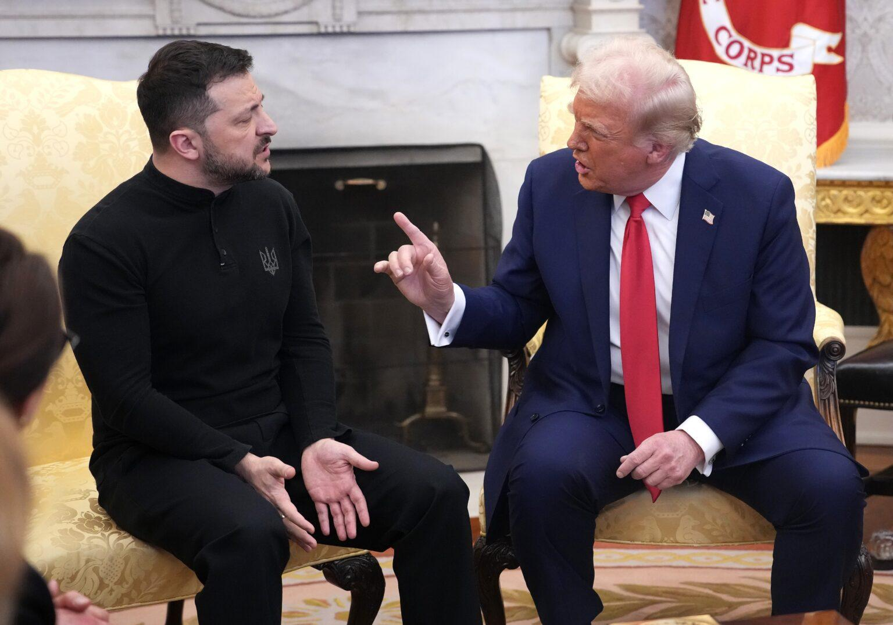

## Claim
Claim: "On Feb. 28, 2025, before a meeting with U.S. President Donald Trump, Ukraine President Volodymyr Zelenskyy met with Democrats."

## Actions
```
image_search("Volodymyr Zelenskyy Donald Trump meeting February 28 2025")
image_search("Volodymyr Zelenskyy meeting Democrats February 28 2025")
```

## Evidence
### Evidence from `image_search`
The North Dakota Monitor ([Source](https://northdakotamonitor.com/2025/02/28/repub/trump-zelenskyy-clash-in-oval-office-blowup-over-peace-negotiations/)) published an image of a meeting between Donald Trump and Volodymyr Zelenskyy.  PBS.org ([Source](https://www.pbs.org/newshour/politics/fact-checking-trump-and-vances-attacks-on-ukrainian-president-zelenskyy)) provides an image of a meeting between Volodymyr Zelenskyy and Donald Trump. 

ABC News ([Source](https://abcnews.go.com/International/trump-zelenskyy-end-russia-war-immediately-white-house/story?id=124734583)) contains an image of Donald Trump and Volodymyr Zelenskyy. 


### Evidence from `image_search`
The search results include an image of Volodymyr Zelenskyy with Chuck Schumer and Mitch McConnell from [lailluminator.com](https://lailluminator.com/2024/09/26/zelenskyy-washington/) . Another result from [abcnews.go.com](https://abcnews.go.com/Politics/democrats-decry-republicans-applaud-trumps-confrontation-zelenskyy/story?id=119305519) contains an image of a meeting between Volodymyr Zelenskyy and Donald Trump .


## Elaboration
The evidence confirms that Volodymyr Zelenskyy met with Donald Trump. The evidence also shows that Zelenskyy met with Democrats, specifically Chuck Schumer. However, the evidence does not specify the date of these meetings.

The claim states that Zelenskyy met with Democrats *before* his meeting with Trump on February 28, 2025. The evidence does not confirm the date of either meeting, so the claim cannot be verified.

To verify the claim, information about the dates of the meetings between Zelenskyy and Trump, and Zelenskyy and Democrats, is needed.


## Actions
```
image_search("Volodymyr Zelenskyy meeting with Democrats February 28 2025")
image_search("Volodymyr Zelenskyy meeting Donald Trump February 28 2025")
```

## Evidence
### Evidence from `image_search`
The search results from opb.org ([https://www.opb.org/article/2025/08/18/trump-and-zelenskyy-what-to-know-about-their-white-house-talks/](https://www.opb.org/article/2025/08/18/trump-and-zelenskyy-what-to-know-about-their-white-house-talks/)) and npr.org ([https://www.npr.org/2025/08/17/nx-s1-5505319/european-leaders-zelenskyy-trump](https://www.npr.org/2025/08/17/nx-s1-5505319/european-leaders-zelenskyy-trump)) contain images of meetings between Donald Trump and Volodymyr Zelenskyy.  


## Elaboration
The new evidence still does not provide the date of the meetings. Therefore, the claim cannot be verified.


## Actions
```
image_search("Volodymyr Zelenskyy meeting with Democrats February 2025")
image_search("Volodymyr Zelenskyy meeting Donald Trump February 2025")
```

## Evidence
### Evidence from `image_search`
From [Source](https://sourcenm.com/2024/09/27/zelenskyy-in-washington-meets-with-u-s-leaders-to-beef-up-support-for-ukraine/): 
Content: The search result from sourcenm.com contains an image of Volodymyr Zelenskyy with Chuck Schumer and Mitch McConnell. 


## Elaboration
The evidence shows that Zelenskyy met with Trump and with Democrats (Chuck Schumer and Mitch McConnell). However, the evidence does not provide the dates of these meetings. Therefore, the claim cannot be verified.


## Final Judgement
The evidence confirms that Zelenskyy met with Trump and with Democrats, but the dates of these meetings are not provided. Therefore, the claim that Zelenskyy met with Democrats before meeting with Trump on February 28, 2025, cannot be verified. `false`

### Verdict: FALSE

### Justification
The evidence confirms that Volodymyr Zelenskyy met with Donald Trump and with Democrats, but the dates of these meetings are not provided. Therefore, the claim that Zelenskyy met with Democrats before meeting with Trump on February 28, 2025, cannot be verified.
