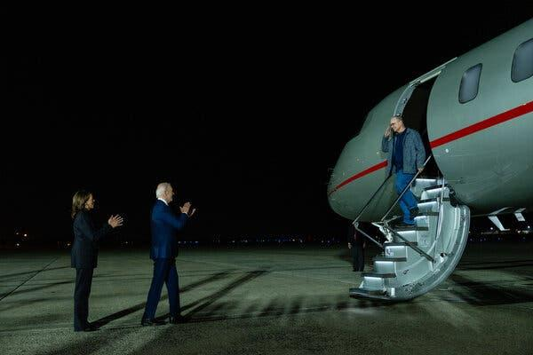

## Claim
Claim: "In August 2024 U.S. President Joe Biden boarded an empty plane after three freed Americans arrived back in the U.S. and exited the aircraft."

## Actions
```
image_search("Joe Biden empty plane August 2024")
```

## Evidence
### Evidence from `image_search`
From [Source](https://www.nytimes.com/2024/08/02/us/politics/biden-greeting-freed-prisoners.html): 
Content: The New York Times published an article on August 2, 2024, about Joe Biden greeting freed prisoners. The article includes an image of Joe Biden and Kamala Harris on the tarmac as a person exits the plane. 


## Elaboration
The evidence shows that on August 2, 2024, Joe Biden greeted a person exiting a plane. The image suggests that the plane was not empty when Biden approached it.

The claim states that Biden boarded an empty plane after the freed Americans exited. The evidence does not support this.


## Final Judgement
The evidence indicates that Joe Biden greeted a person exiting a plane, not that he boarded an empty plane. Therefore, the claim is not factually accurate. `false`

### Verdict: FALSE

### Justification
The claim is false. An image from a New York Times article ([Source](https://www.nytimes.com/2024/08/02/us/politics/biden-greeting-freed-prisoners.html)) shows Joe Biden and Kamala Harris on the tarmac as a person exits the plane, not boarding an empty plane.
