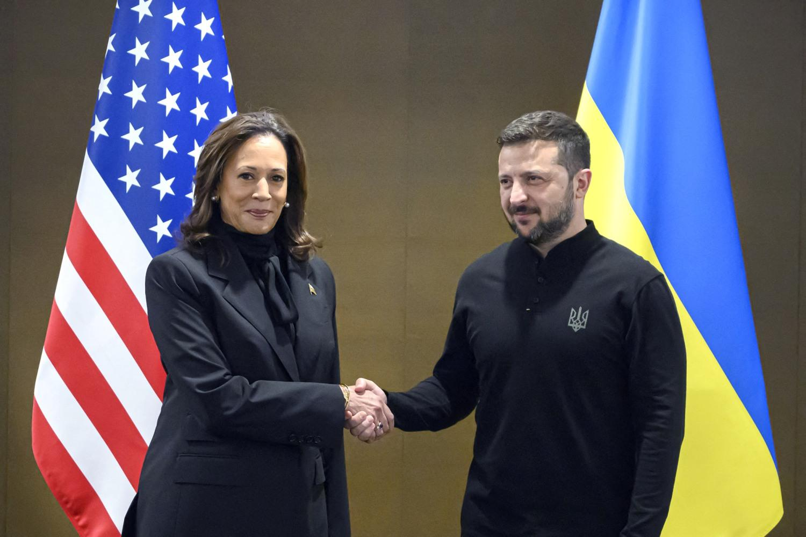
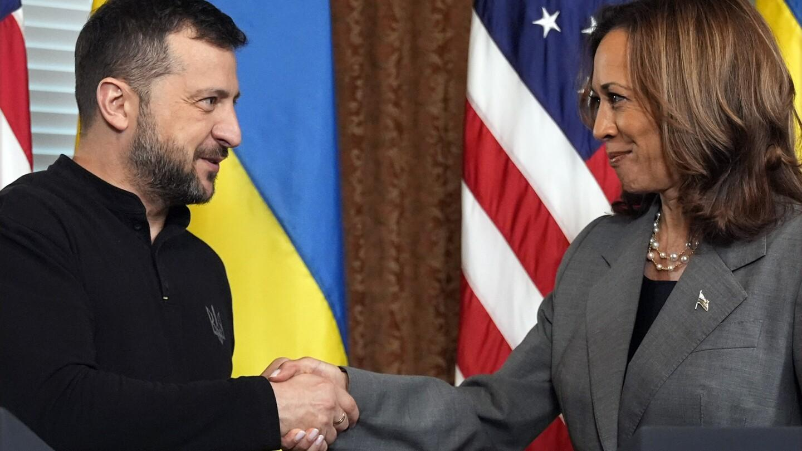
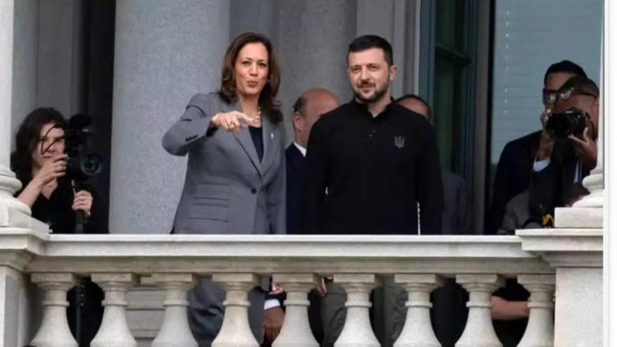
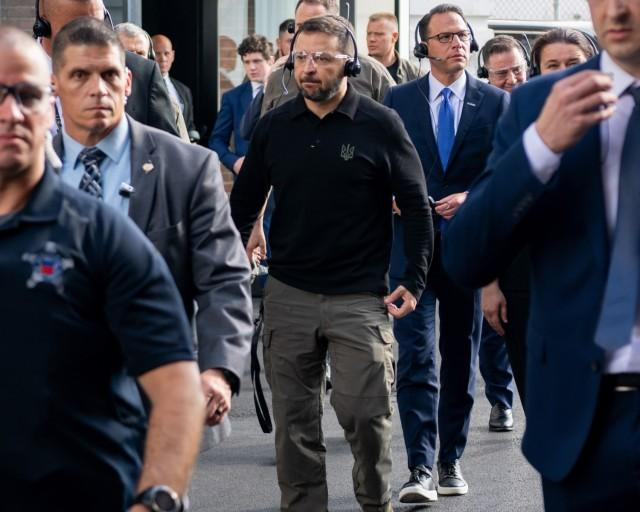

## Claim
Claim: "Ukrainian President Volodymyr Zelenskyy engaged in election interference by campaigning in Pennsylvania for Kamala Harris ahead of the US presidential election in 2024."

## Actions
```
image_search("Volodymyr Zelenskyy Kamala Harris Pennsylvania 2024")
```

## Evidence
### Evidence from `image_search`
NBC News ([https://www.nbcnews.com/politics/2024-election/zelenskyys-meeting-harris-spat-trump-reveal-growing-partisan-divide-uk-rcna172648](https://www.nbcnews.com/politics/2024-election/zelenskyys-meeting-harris-spat-trump-reveal-growing-partisan-divide-uk-rcna172648)) provides an image of Volodymyr Zelenskyy and Kamala Harris shaking hands. 

ABC News ([https://abcnews.go.com/Politics/harris-standing-zelenskyy-indirectly-jabs-trump-vance-ukraine/story?id=114219628](https://abcnews.go.com/Politics/harris-standing-zelenskyy-indirectly-jabs-trump-vance-ukraine/story?id=114219628)) contains an image of Volodymyr Zelenskyy and Kamala Harris.  AP News ([https://apnews.com/article/zelenskyy-joe-biden-kamala-harris-trump-229804fd42332c584dfbe05224634e44](https://apnews.com/article/zelenskyy-joe-biden-kamala-harris-trump-229804fd42332c584dfbe05224634e44)) contains an image of Volodymyr Zelenskyy and Kamala Harris shaking hands. 


## Elaboration
The evidence shows that Volodymyr Zelenskyy and Kamala Harris have met. However, the provided images do not show Zelenskyy campaigning in Pennsylvania for Harris. The images depict meetings between the two leaders, but do not provide any information about the location or purpose of these meetings.

The claim cannot be verified with the available evidence. More information is needed to confirm whether Zelenskyy campaigned in Pennsylvania for Harris.


## Actions
```
image_search("Volodymyr Zelenskyy Pennsylvania Kamala Harris campaign 2024")
```

## Evidence
### Evidence from `image_search`
Fox News ([https://www.foxnews.com/politics/abuse-power-house-gop-opens-probe-ukrainian-presidents-trip-battleground-pennsylvania](https://www.foxnews.com/politics/abuse-power-house-gop-opens-probe-ukrainian-presidents-trip-battleground-pennsylvania)) and MSN News ([https://www.msn.com/en-in/news/other/did-zelenskyy-campaign-for-kamala-harris-in-pennsylvania-truth-behind-trump-s-claim/ar-AA1A0SvA](https://www.msn.com/en-in/news/other/did-zelenskyy-campaign-for-kamala-harris-in-pennsylvania-truth-behind-trump-s-claim/ar-AA1A0SvA)) both contain images of Volodymyr Zelenskyy and Kamala Harris.  


## Elaboration
The new evidence continues to show images of meetings between Zelenskyy and Harris. However, the images do not depict Zelenskyy campaigning in Pennsylvania. The provided links from Fox News and MSN News do not confirm the claim either.

The claim remains unverified.


## Actions
```
image_search("Volodymyr Zelenskyy Pennsylvania speech 2024")
```

## Evidence
### Evidence from `image_search`
WHYY.org reports that Volodymyr Zelenskyy visited Scranton, Pennsylvania ([https://whyy.org/articles/ukraine-president-volodymyr-zelenskyy-visits-scranton-pennsylvania-ammunition-factory/](https://whyy.org/articles/ukraine-president-volodymyr-zelenskyy-visits-scranton-pennsylvania-ammunition-factory/)). The army.mil also contains an image of Zelenskyy in Scranton, Pennsylvania ([https://www.army.mil/article/279907/ukrainian_president_zelenskyy_praises_scranton_dod_for_role_supporting_ukraine](https://www.army.mil/article/279907/ukrainian_president_zelenskyy_praises_scranton_dod_for_role_supporting_ukraine)). Axios reports that Zelenskyy visited an ammunition plant in Pennsylvania ([https://www.axios.com/2024/09/23/zelensky-us-visit-ammunition-plant-pennsylvania-un-ukraine](https://www.axios.com/2024/09/23/zelensky-us-visit-ammunition-plant-pennsylvania-un-ukraine)).   


## Elaboration
The evidence confirms that Zelenskyy visited Scranton, Pennsylvania, and an ammunition plant. However, the provided sources do not mention any campaigning for Kamala Harris.

The claim remains unverified.


## Final Judgement
The search results show that Zelenskyy and Harris have met, and Zelenskyy visited Pennsylvania. However, there is no evidence to suggest that Zelenskyy campaigned for Harris in Pennsylvania. Therefore, the claim is not supported by the available evidence.

`false`


### Verdict: FALSE

### Justification
The evidence indicates that Volodymyr Zelenskyy and Kamala Harris have met, and Zelenskyy visited Scranton, Pennsylvania, as reported by [WHYY.org](https://whyy.org/articles/ukraine-president-volodymyr-zelenskyy-visits-scranton-pennsylvania-ammunition-factory/), [army.mil](https://www.army.mil/article/279907/ukrainian_president_zelenskyy_praises_scranton_dod_for_role_supporting_ukraine), and [Axios](https://www.axios.com/2024/09/23/zelensky-us-visit-ammunition-plant-pennsylvania-un-ukraine). However, there is no evidence to support the claim that Zelenskyy campaigned for Harris in Pennsylvania. Therefore, the claim is unsubstantiated.
