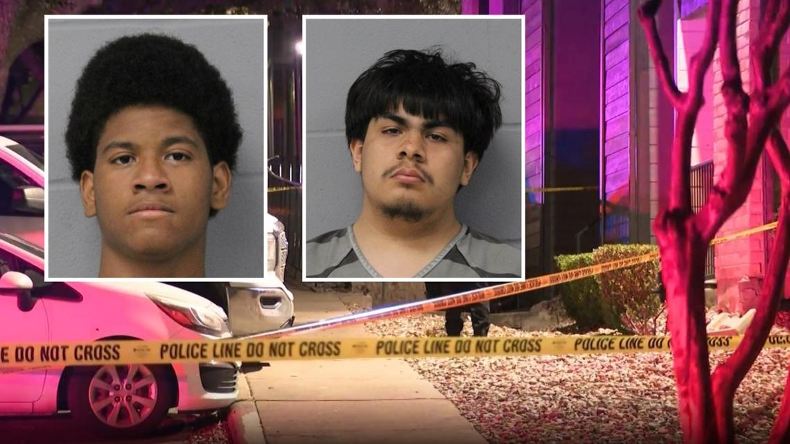

## Claim
Claim: "After InfoWars reporter Jamie White was shot dead on March 10, 2025 in Austin, Texas, it was revelaed that he was on a Ukranian enemies hit list."

## Actions
```
image_search("Jamie White InfoWars shot Austin Texas")
```

## Evidence
### Evidence from `image_search`
KVUE.com ([https://www.kvue.com/article/news/crime/jamie-white-murder-arrests-infowars/269-aa20c169-085c-4827-8e8c-ce8755a4b715](https://www.kvue.com/article/news/crime/jamie-white-murder-arrests-infowars/269-aa20c169-085c-4827-8e8c-ce8755a4b715)) contains images related to the murder of Jamie White in Austin, Texas.  Global News ([https://globalnews.ca/video/11078554/infowars-reporter-jamie-white-shot-dead-in-texas-parking-lot](https://globalnews.ca/video/11078554/infowars-reporter-jamie-white-shot-dead-in-texas-parking-lot)) reports that InfoWars reporter Jamie White was shot dead in a Texas parking lot. 

Fox7austin.com ([https://www.fox7austin.com/news/infowars-writer-shooting-austin-police-jamie-white](https://www.fox7austin.com/news/infowars-writer-shooting-austin-police-jamie-white)) contains an image of a person with glasses and a pink glow on their arm, as well as images of two other individuals. 


## Elaboration
The evidence confirms that Jamie White, an InfoWars reporter, was shot dead in Austin, Texas. However, the provided evidence does not mention the date of the shooting, nor does it mention anything about a Ukrainian enemies hit list.

Therefore, the claim cannot be fully verified due to missing information.


## Actions
```
image_search("Jamie White InfoWars Ukrainian hit list")
```

## Evidence
No new evidence found.

## Elaboration
The evidence confirms that Jamie White, an InfoWars reporter, was shot dead in Austin, Texas. However, the provided evidence does not mention the date of the shooting, nor does it mention anything about a Ukrainian enemies hit list.

Further search did not yield any information about a Ukrainian enemies hit list.

Therefore, the claim cannot be verified due to missing information.


## Final Judgement
The evidence confirms that Jamie White, an InfoWars reporter, was shot dead in Austin, Texas. However, the provided evidence does not mention the date of the shooting, nor does it mention anything about a Ukrainian enemies hit list. Further search did not yield any information about a Ukrainian enemies hit list.

The claim is not verifiable because there is no evidence to support the assertion that Jamie White was on a Ukrainian enemies hit list. The provided evidence only confirms the fact that he was shot dead in Austin, Texas.

`false`

### Verdict: FALSE

### Justification
The claim is not verifiable. While it is confirmed that Jamie White, an InfoWars reporter, was shot dead in Austin, Texas, as reported by sources like [KVUE.com](https://www.kvue.com/article/news/crime/jamie-white-murder-arrests-infowars/269-aa20c169-085c-4827-8e8c-ce8755a4b715) and [Global News](https://globalnews.ca/video/11078554/infowars-reporter-jamie-white-shot-dead-in-texas-parking-lot), there is no evidence to support the assertion that he was on a Ukrainian enemies hit list.
