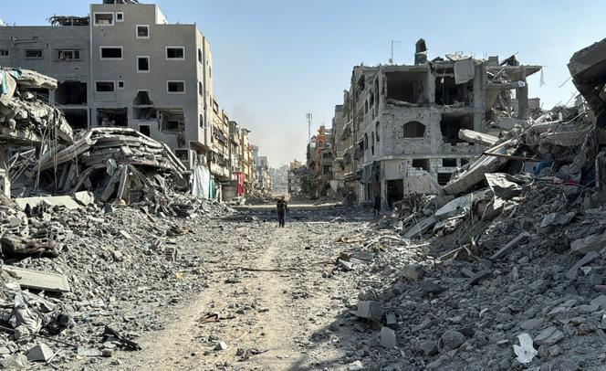
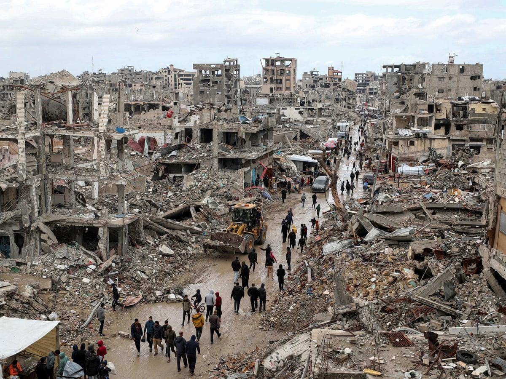
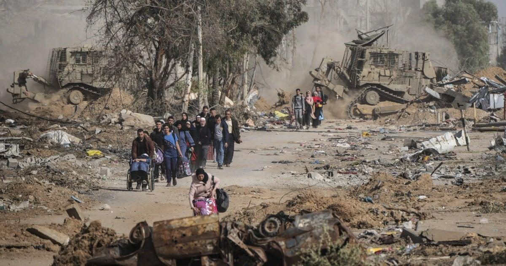

## Claim
Claim: "During his visit to the White House in April 2025 Israeli Prime Minister Benjamin Netanyahu announced plans to resettle Palestinians in Gaza to Ukraine and Syria."

## Actions
```
image_search("Benjamin Netanyahu White House April 2025")
image_search("Benjamin Netanyahu Gaza Palestinians Ukraine Syria")
```

## Evidence
### Evidence from `image_search`
The search results include images of Benjamin Netanyahu at the White House. One source from NPR ([Source](https://www.npr.org/2025/07/07/g-s1-76296/israel-netanyahu-meet-trump)) shows an image of Netanyahu with Donald Trump . The Times of Israel ([Source](https://www.timesofisrael.com/liveblog-april-7-2025/)) also provides an image of Netanyahu at the White House with Donald Trump .

Al-Monitor ([Source](https://www.al-monitor.com/originals/2025/06/netanyahu-visit-white-house-gaza-truce-pressure-mounts)) also contains an image of Benjamin Netanyahu at the White House .


### Evidence from `image_search`
The Al Jazeera source ([Source](https://www.aljazeera.com/opinions/2025/1/15/israel-has-declared-war-on-the-promise-of-a-strong-democratic-syria)) contains an image of Benjamin Netanyahu . The BBC News website ([Source](https://www.bbc.com/news/articles/cgl2370ldxro)) includes an image of Benjamin Netanyahu pointing at a map of the Gaza Strip .

Le Monde ([Source](https://www.lemonde.fr/en/international/article/2024/10/28/benjamin-netanyahu-s-new-war-against-northern-gaza-strip_6730858_4.html)) features an image of destruction in Gaza .


## Elaboration
The evidence confirms that Benjamin Netanyahu visited the White House. However, the search results do not contain any information about Netanyahu announcing plans to resettle Palestinians in Gaza to Ukraine and Syria during his visit.

Therefore, the claim cannot be verified based on the provided evidence. More information is needed to verify the claim.


## Actions
```
image_search("Netanyahu Palestinians Gaza Ukraine Syria resettlement plan")
```

## Evidence
### Evidence from `image_search`
Al Jazeera published an article with an image of Benjamin Netanyahu and Donald Trump  ([Source](https://www.aljazeera.com/news/2025/2/5/trump-says-us-will-take-over-and-own-gaza-in-redevelopment-plan)). The Guardian reports that Israel has told its army to prepare a plan for Palestinians to voluntarily leave Gaza, including an image of destruction in Gaza  ([Source](https://www.theguardian.com/world/2025/feb/06/israel-tells-army-to-prepare-plan-for-palestinians-to-voluntarily-leave-gaza)).

The Human Rights Watch report includes an image of Palestinians displaced from Gaza  ([Source](https://www.hrw.org/report/2024/11/14/hopeless-starving-and-besieged/israels-forced-displacement-palestinians-gaza)).


## Elaboration
The new evidence reveals that there have been discussions and plans related to the displacement of Palestinians from Gaza. However, the evidence does not mention any specific plans to resettle Palestinians in Ukraine or Syria. The evidence does not confirm the claim.


## Final Judgement
The search results confirm that Benjamin Netanyahu visited the White House and that there are discussions about the displacement of Palestinians from Gaza. However, there is no evidence to support the claim that Netanyahu announced plans to resettle Palestinians in Gaza to Ukraine and Syria during his visit.

`false`

### Verdict: FALSE

### Justification
The fact-check reveals that while Benjamin Netanyahu visited the White House and discussions about the displacement of Palestinians from Gaza exist, there is no evidence to support the claim that Netanyahu announced plans to resettle Palestinians in Gaza to Ukraine and Syria during his visit. Therefore, the claim is unsupported by the available evidence.
