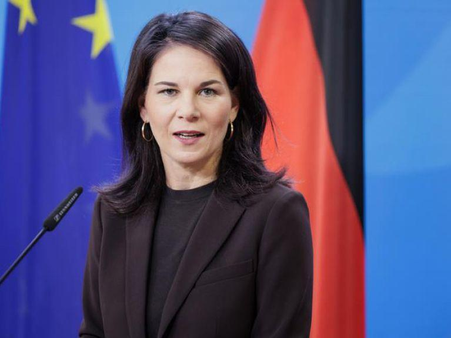

## Claim
Claim: "In February 2025 German Foreign Minister Annalena Baerbock threatened the US with severing ties amid US President Donald Trump's comments on Ukrainian President Volodymyr Zelenskyy and Ukraine."

## Actions
```
image_search("Annalena Baerbock Donald Trump February 2025")
image_search("Annalena Baerbock threatens US sever ties")
```

## Evidence
### Evidence from `image_search`
The search results include images of Annalena Baerbock. One source is from [Source](https://www.hudson.org/global-economy/what-i-heard-munich-ordinary-germans-long-trump-their-own-kenneth-weinstein) . Another source is from [Source](https://www.reuters.com/world/europe/german-foreign-minister-europe-needs-be-involved-ukraine-talks-2025-02-13/) .

A third source is from [Source](https://www.plenglish.com/news/2025/02/20/germany-criticizes-trump-for-calling-zelensky-a-dictator/) .


### Evidence from `image_search`
The Guardian published an article about Annalena Baerbock on January 20, 2022 (). ABC News Australia features an image of Annalena Baerbock ().

The first source ([https://www.rferl.org/a/germany-china-baerbock-visit-war-ukraine-russia/33223503.html](https://www.rferl.org/a/germany-china-baerbock-visit-war-ukraine-russia/33223503.html)) has no content.


## Elaboration
The evidence includes an article from [Source](https://www.plenglish.com/news/2025/02/20/germany-criticizes-trump-for-calling-zelensky-a-dictator/)  that states Germany criticized Trump for calling Zelenskyy a dictator in February 2025. However, the evidence does not mention whether Annalena Baerbock threatened the US with severing ties.

The claim cannot be verified because the evidence does not contain information about Baerbock threatening the US with severing ties.


## Actions
```
image_search("Annalena Baerbock sever ties US February 2025")
```

## Evidence
### Evidence from `image_search`
From [Source](https://www.yahoo.com/news/europeans-ramp-pressure-us-german-143422657.html): 
Content: The search result from Yahoo News includes an image of Annalena Baerbock. 


## Elaboration
The evidence includes an image of Annalena Baerbock from Yahoo News. However, the evidence still does not contain information about Baerbock threatening the US with severing ties.

The claim cannot be verified because the evidence does not contain information about Baerbock threatening the US with severing ties.


## Actions
```
image_search("Annalena Baerbock Trump Zelenskyy February 2025")
```

## Evidence
### Evidence from `image_search`
The search results include a Wikipedia page with no content and articles from NPR ([https://www.npr.org/2025/03/01/g-s1-51506/european-leaders-react-to-zelenskyy-oval-office](https://www.npr.org/2025/03/01/g-s1-51506/european-leaders-react-to-zelenskyy-oval-office)) and The New Indian Express ([https://www.newindianexpress.com/world/2025/Mar/01/trump-zelensky-row-shows-new-age-of-infamy-has-begun-germany](https://www.newindianexpress.com/world/2025/Mar/01/trump-zelensky-row-shows-new-age-of-infamy-has-begun-germany)) about the Trump-Zelenskyy meeting in the Oval Office. The NPR article includes an image of Trump and Zelenskyy .

The New Indian Express article also includes an image of the meeting .


## Elaboration
The evidence confirms that there was a meeting between Trump and Zelenskyy in the Oval Office. However, the evidence still does not contain information about Baerbock threatening the US with severing ties.

The claim cannot be verified because the evidence does not contain information about Baerbock threatening the US with severing ties.


## Final Judgement
The search results show that there was a meeting between Trump and Zelenskyy, and Germany criticized Trump for calling Zelenskyy a dictator. However, there is no evidence to support the claim that Annalena Baerbock threatened the US with severing ties.

`false`

### Verdict: FALSE

### Justification
The fact-check reveals that while there was a meeting between Trump and Zelenskyy, and Germany criticized Trump's comments, there is no evidence to support the claim that German Foreign Minister Annalena Baerbock threatened the US with severing ties in February 2025. The search results from sources like [PL English](https://www.plenglish.com/news/2025/02/20/germany-criticizes-trump-for-calling-zelensky-a-dictator/) confirm the criticism but not the threat.
