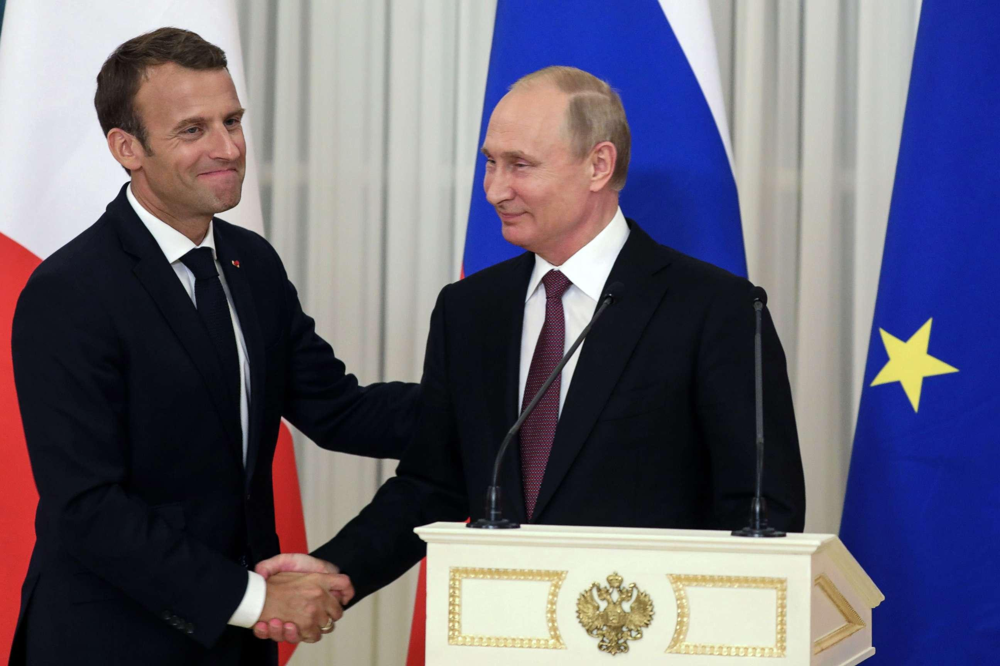
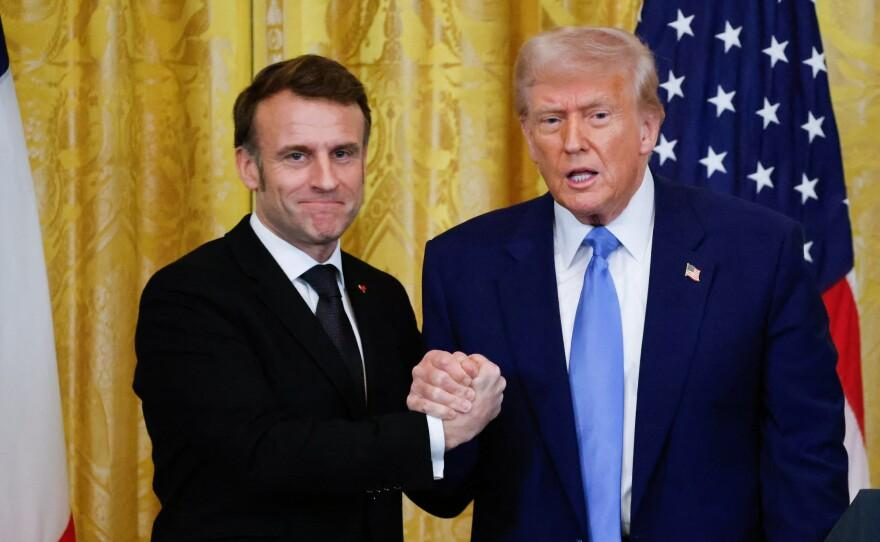
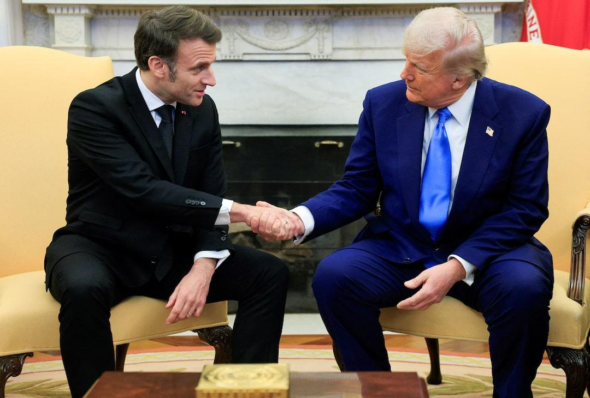

## Claim
Claim: "French President Emmanuel Macron called Russian President Vladimir Putin a 'butcher' during his press conference with Donald Trump on Monday, Feb. 24, 2025."

## Actions
```
image_search("Emmanuel Macron Vladimir Putin press conference")
image_search("Emmanuel Macron Donald Trump press conference February 24 2025")
```

## Evidence
### Evidence from `image_search`
The Atlantic published an image of a press conference between Emmanuel Macron and Vladimir Putin on May 29, 2017 (). The New Yorker provides an image of Emmanuel Macron and Vladimir Putin ().

ABC News contains an image of Emmanuel Macron and Vladimir Putin ().


### Evidence from `image_search`
The web sources provide information about a meeting between Emmanuel Macron and Donald Trump on February 24, 2025. VPM.org/NPR News ([https://www.vpm.org/npr-news/npr-news/2025-02-24/trump-and-macron-meet-in-washington-as-europe-pleads-for-continued-help-with-ukraine](https://www.vpm.org/npr-news/npr-news/2025-02-24/trump-and-macron-meet-in-washington-as-europe-pleads-for-continued-help-with-ukraine)) and CNN ([https://edition.cnn.com/politics/live-news/trump-administration-news-02-24-25?Date=20250224&Profile=cnnbrk](https://edition.cnn.com/politics/live-news/trump-administration-news-02-24-25?Date=20250224&Profile=cnnbrk)) both show images of the event.

ABC News ([https://abcnews.go.com/International/macron-warns-trump-careful-ukraine-fact-checks-white/story?id=119157061](https://abcnews.go.com/International/macron-warns-trump-careful-ukraine-fact-checks-white/story?id=119157061)) also provides an image of the meeting.   


## Elaboration
The evidence confirms that Emmanuel Macron and Donald Trump had a press conference on February 24, 2025. However, the provided sources do not contain any information about Macron calling Putin a "butcher" during the press conference.

Therefore, the claim cannot be verified with the available information. Additional sources would be needed to confirm whether Macron made the statement.


## Actions
```
image_search("Macron Trump Putin butcher February 24 2025")
```

## Evidence
### Evidence from `image_search`
Al Jazeera ([https://www.aljazeera.com/news/2025/2/24/macron-tells-trump-europe-wants-to-secure-solid-peace-in-ukraine](https://www.aljazeera.com/news/2025/2/24/macron-tells-trump-europe-wants-to-secure-solid-peace-in-ukraine)) published an image of Emmanuel Macron and Donald Trump on February 24, 2025 (). CNN ([https://www.cnn.com/2025/02/25/politics/trump-macron-ukraine-united-nations-analysis](https://www.cnn.com/2025/02/25/politics/trump-macron-ukraine-united-nations-analysis)) also published an image of the same event (). Reuters ([https://www.reuters.com/world/macron-arrives-white-house-ukraine-talks-with-trump-2025-02-24/](https://www.reuters.com/world/macron-arrives-white-house-ukraine-talks-with-trump-2025-02-24/)) also published an image of Emmanuel Macron and Donald Trump on February 24, 2025 ().


## Elaboration
The new evidence confirms the meeting between Macron and Trump on February 24, 2025. However, it still does not provide any information about Macron calling Putin a "butcher" during the press conference.

Therefore, the claim remains unverified.


## Actions
```
image_search("Macron Putin butcher speech")
```

## Evidence
### Evidence from `image_search`
Axios published an image of Emmanuel Macron. The Moscow Times published an image of Emmanuel Macron and discusses Biden calling Putin a "butcher" ().


## Elaboration
The evidence does not contain any information about Macron calling Putin a "butcher." Therefore, the claim is unverified.


## Final Judgement
The evidence confirms that Macron and Trump met on February 24, 2025, but there is no evidence to support the claim that Macron called Putin a "butcher" during the press conference. The search results do not provide any information about Macron using that specific term.

`false`

### Verdict: FALSE

### Justification
The fact-check reveals that while Emmanuel Macron and Donald Trump did hold a press conference on February 24, 2025, as evidenced by sources like [VPM.org/NPR News](https://www.vpm.org/npr-news/npr-news/2025-02-24/trump-and-macron-meet-in-washington-as-europe-pleads-for-continued-help-with-ukraine) and [CNN](https://edition.cnn.com/politics/live-news/trump-administration-news-02-24-25?Date=20250224&Profile=cnnbrk), there is no supporting evidence to confirm that Macron referred to Vladimir Putin as a "butcher" during the event.
