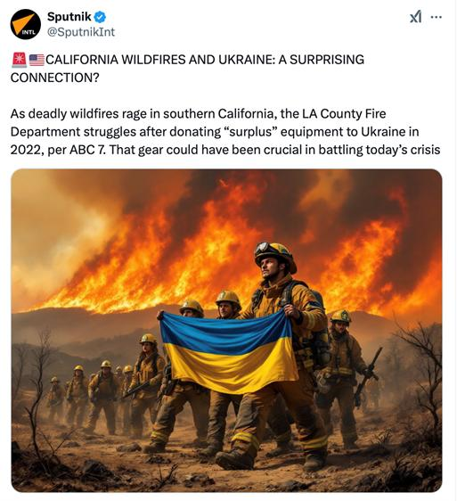
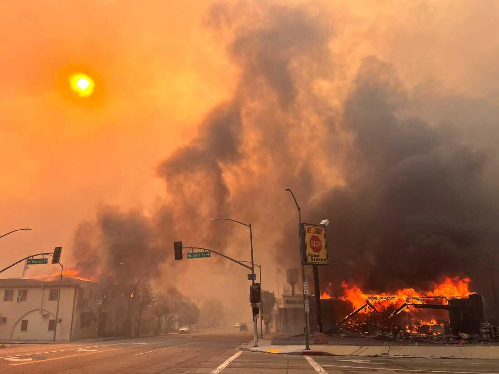
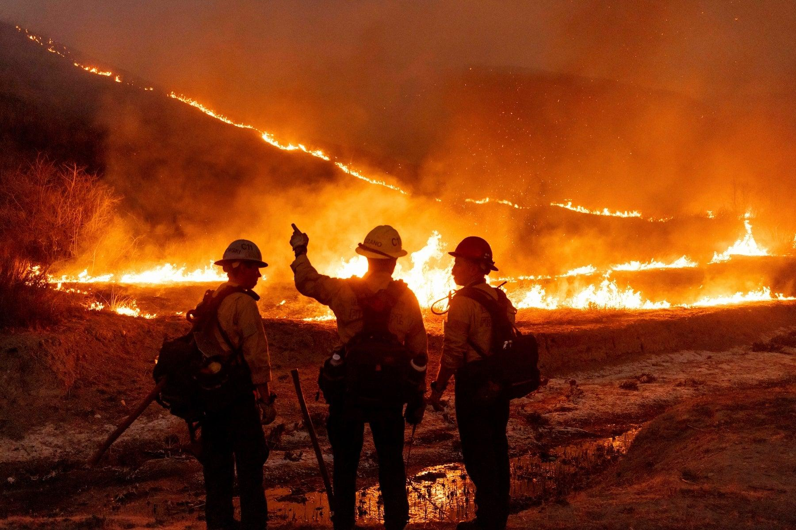
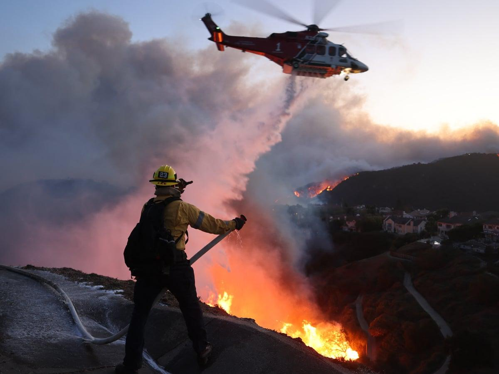
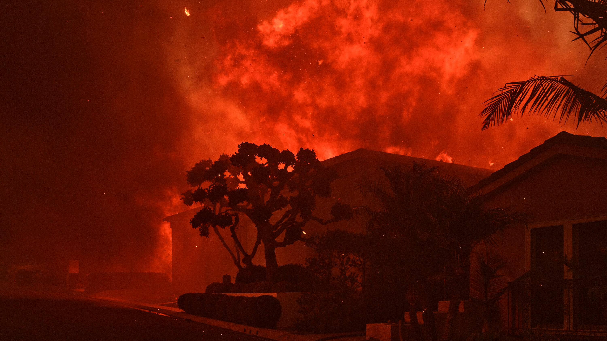
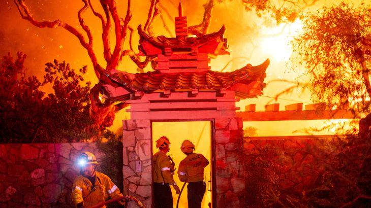

## Claim
Claim: "Russia offered assistance for the California wildfires from January 2025."

## Actions
```
image_search("California wildfires January 2025 Russia assistance")
```

## Evidence
### Evidence from `image_search`
The search results discuss Russia's involvement in the California wildfires. One source from Securing Democracy includes an image from Sputnik  that discusses California wildfires and Ukraine. The Voice of America discusses Russia exploiting California wildfires to push propaganda .

NPR.org contains an image of a fire .


## Elaboration
The evidence does not mention Russia offering assistance for the California wildfires. Instead, it discusses Russia's involvement in the California wildfires, including exploiting them for propaganda. The evidence does not provide any information about the date of the wildfires.

Insufficient information to verify the claim.


## Actions
```
image_search("Russia assistance California wildfires")
```

## Evidence
### Evidence from `image_search`
From [Source](https://whyy.org/articles/california-wildfire-help-victims-los-angeles/): 
Content: The search result from WHYY.org contains an image of firefighters and a wildfire .


## Elaboration
The new evidence does not provide any information about Russia offering assistance for the California wildfires.


## Actions
```
image_search("California wildfires Russia aid 2025")
```

## Evidence
### Evidence from `image_search`
The Guardian published an article on January 9, 2025, about the growing danger and destruction of California's wildfires, including an image of a firefighter and a helicopter fighting a fire (). The New York Times published an article on January 8, 2025, about the Los Angeles wildfires (). Al Jazeera discusses the California wildfires and contains an image of firefighters and a fire ().


## Elaboration
The evidence indicates that there were California wildfires in January 2025. However, the evidence does not mention Russia offering assistance for these wildfires.

Insufficient information to verify the claim.


## Final Judgement
The search results show that there were California wildfires in January 2025. However, the evidence does not mention Russia offering assistance for these wildfires.

`false`

### Verdict: FALSE

### Justification
The fact-check reveals that while there were indeed California wildfires in January 2025, as evidenced by articles from sources like *The Guardian* and *The New York Times*, there is no supporting evidence to suggest that Russia offered assistance for these wildfires. Therefore, the claim is unsubstantiated.
