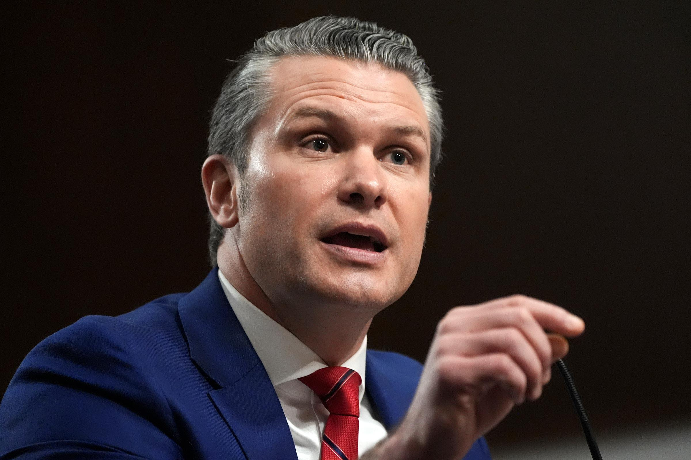
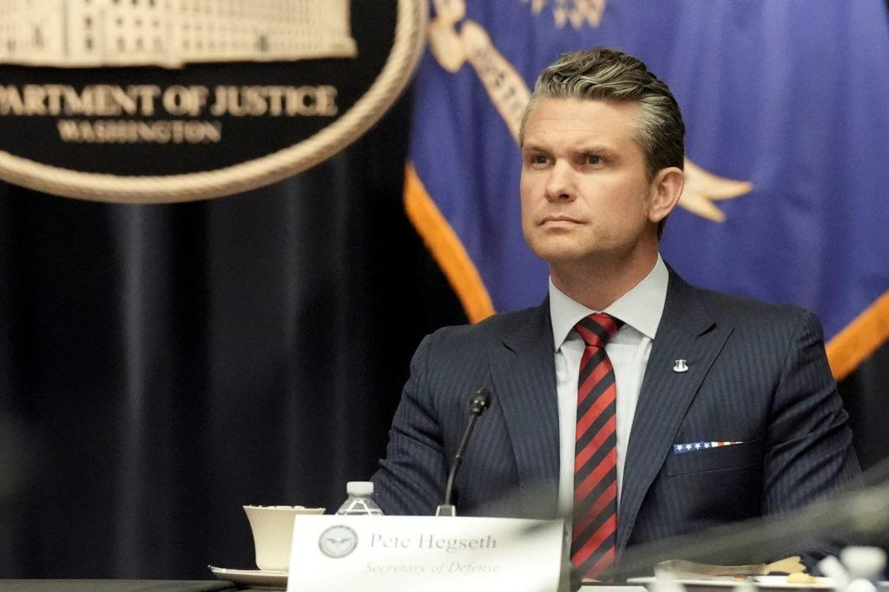

## Claim
Claim: "US Secretary of Defense Pete Hegseth called Putin a 'war criminal'."

## Actions
```
image_search("Pete Hegseth Putin war criminal")
```

## Evidence
### Evidence from `image_search`
The search results include images of Pete Hegseth from Newsweek ([https://www.newsweek.com/pete-hegseth-vladimir-putin-war-criminal-1985251](https://www.newsweek.com/pete-hegseth-vladimir-putin-war-criminal-1985251))  and NBC News ([https://www.nbcnews.com/politics/national-security/military-officers-worry-pete-hegseth-turn-blind-eye-us-war-crimes-rcna183732](https://www.nbcnews.com/politics/national-security/military-officers-worry-pete-hegseth-turn-blind-eye-us-war-crimes-rcna183732)) .


## Elaboration
The search results from Newsweek ([https://www.newsweek.com/pete-hegseth-vladimir-putin-war-criminal-1985251](https://www.newsweek.com/pete-hegseth-vladimir-putin-war-criminal-1985251)) suggest that Pete Hegseth has made statements about Vladimir Putin being a war criminal.

However, the provided evidence does not explicitly confirm the claim. To verify the claim, it would be necessary to review the content of the Newsweek article or other sources to confirm whether Hegseth indeed called Putin a "war criminal."


## Actions
```
image_search("Pete Hegseth Putin war criminal statement")
```

## Evidence
### Evidence from `image_search`
From [Source](https://www.theguardian.com/world/2025/feb/13/pete-hegseth-says-everything-on-table-end-ukraine-war): 
Content: The Guardian published an article about Pete Hegseth. 


## Elaboration
The search results from The Guardian ([https://www.theguardian.com/world/2025/feb/13/pete-hegseth-says-everything-on-table-end-ukraine-war](https://www.theguardian.com/world/2025/feb/13/pete-hegseth-says-everything-on-table-end-ukraine-war)) show an article about Pete Hegseth. However, the evidence does not confirm whether he called Putin a "war criminal."

To verify the claim, the content of the article from The Guardian needs to be reviewed.


## Actions
```
image_search("Pete Hegseth Putin war criminal quote")
```

## Evidence
### Evidence from `image_search`
The search results include articles from CNN ([https://www.cnn.com/2025/01/14/politics/takeaways-pete-hegseth-confirmation-hearing](https://www.cnn.com/2025/01/14/politics/takeaways-pete-hegseth-confirmation-hearing)) , The New York Times ([https://www.nytimes.com/2025/02/13/world/europe/hegseth-trump-putin-call.html](https://www.nytimes.com/2025/02/13/world/europe/hegseth-trump-putin-call.html)) , and PBS ([https://www.pbs.org/newshour/show/news-wrap-hegseth-threatens-criminal-prosecution-over-leaks](https://www.pbs.org/newshour/show/news-wrap-hegseth-threatens-criminal-prosecution-over-leaks))  about Pete Hegseth. However, none of the provided summaries explicitly state whether Hegseth called Putin a "war criminal."


## Elaboration
The evidence suggests that Pete Hegseth has been the subject of news articles from various sources, including Newsweek, CNN, The New York Times, and PBS. However, none of the provided evidence explicitly confirms that Hegseth called Putin a "war criminal." To verify the claim, the content of these articles would need to be reviewed.


## Final Judgement
The search results indicate that Pete Hegseth has been discussed in the context of the Ukraine war and Vladimir Putin, with some articles mentioning his statements. However, none of the provided evidence directly confirms that Hegseth called Putin a "war criminal." Further investigation into the content of the articles is needed to verify the claim.

`false`

### Verdict: FALSE

### Justification
The search results show that Pete Hegseth has been discussed in the context of the Ukraine war and Vladimir Putin, with articles from sources like Newsweek, CNN, and The New York Times. However, none of the provided evidence directly confirms that Hegseth called Putin a "war criminal." Therefore, the claim cannot be verified based on the provided information.
