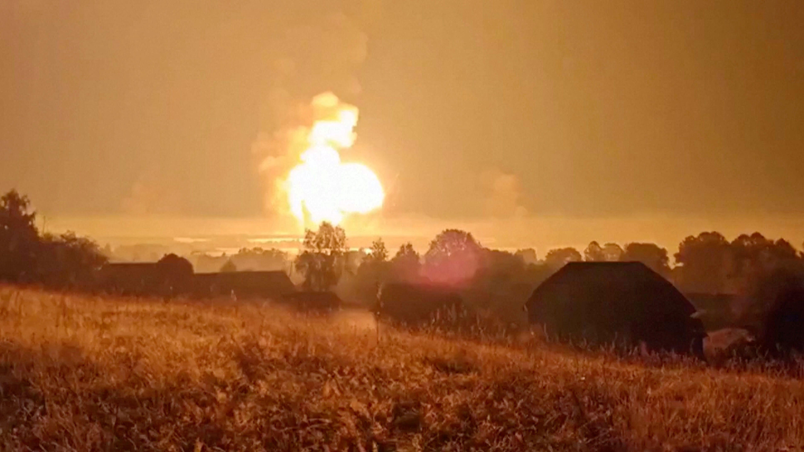

## Claim
Claim: " This image shows a Russian ammunition depot in Toropets, Tver Oblast, before and after it was hit by a, possible nuclear, strike from the North Atlantic Treaty Organization (NATO)."

## Actions
```
reverse_search()
image_search("Russian ammunition depot Toropets Tver Oblast")
geolocate()
```

## Evidence
### Evidence from `reverse_search`
The image () appears in articles from Euronews ([https://www.euronews.com/my-europe/2024/09/18/what-was-stored-at-the-russian-arms-depot-in-tver-region-struck-by-ukraines-drones](https://www.euronews.com/my-europe/2024/09/18/what-was-stored-at-the-russian-arms-depot-in-tver-region-struck-by-ukraines-drones)), Reuters ([https://www.reuters.com/world/europe/ukraine-targets-western-russian-regions-with-drones-russian-officials-says-2024-09-18/](https://www.reuters.com/world/europe/ukraine-targets-western-russian-regions-with-drones-russian-officials-says-2024-09-18/)), and the Associated Press ([https://apnews.com/article/russia-ukraine-toropets-drones-attack-e3d05b2637d316b437e4789a35c7f59e](https://apnews.com/article/russia-ukraine-toropets-drones-attack-e3d05b2637d316b437e4789a35c7f59e)). These articles report on a Ukrainian drone attack on a Russian arms depot in Toropets, Tver region.

The depot, which stored munitions including explosives, artillery shells, and ballistic missiles, was struck on September 18, 2024, causing a large explosion and fire. The depot housed missiles for Iskander and Tochka-U systems, guided aerial bombs, artillery ammunition, and North Korean munitions. The Reuters article also mentions that the facility was designed to withstand missile strikes and even a small nuclear attack.


### Evidence from `image_search`
CNN published an article about a Russian weapons depot ([https://edition.cnn.com/2024/09/18/europe/ukraine-russian-weapons-depot-drone-attack-intl](https://edition.cnn.com/2024/09/18/europe/ukraine-russian-weapons-depot-drone-attack-intl)) with an image of the depot . The BBC News website contains an image of an explosion .

The Washington Post published an article with an image of a fire  ([https://www.washingtonpost.com/world/2024/09/18/ukraine-russia-blast-drones-missiles-tver/](https://www.washingtonpost.com/world/2024/09/18/ukraine-russia-blast-drones-missiles-tver/)).


### Evidence from `geolocate`
The most likely countries where the image was taken are: {'Bhutan': 0.24, 'China': 0.21, 'Malaysia': 0.13, 'Cambodia': 0.09, 'Ghana': 0.09, 'Taiwan': 0.07, 'Madagascar': 0.03, 'Nigeria': 0.02, 'Brazil': 0.01, 'Colombia': 0.01}

## Elaboration
The evidence indicates that the image shows a Russian ammunition depot in Toropets, Tver Oblast, before and after a strike. However, the evidence does not support the claim that the strike was a nuclear one from NATO. The articles from Euronews, Reuters, and the Associated Press state that the depot was hit by a Ukrainian drone attack. The Reuters article mentions that the facility was designed to withstand missile strikes and even a small nuclear attack, but it does not state that it was hit by a nuclear weapon.

The claim that the strike was a nuclear one from NATO is not supported by the provided evidence.


## Final Judgement
The image depicts a Russian ammunition depot in Toropets, Tver Oblast, before and after a strike. The strike was the result of a Ukrainian drone attack, not a nuclear strike from NATO.

`false`

### Verdict: FALSE

### Justification
The image depicts a Russian ammunition depot in Toropets, Tver Oblast, before and after a strike. However, the strike was the result of a Ukrainian drone attack, as reported by sources like [Euronews](https://www.euronews.com/my-europe/2024/09/18/what-was-stored-at-the-russian-arms-depot-in-tver-region-struck-by-ukraines-drones), [Reuters](https://www.reuters.com/world/europe/ukraine-targets-western-russian-regions-with-drones-russian-officials-says-2024-09-18/), and the [Associated Press](https://apnews.com/article/russia-ukraine-toropets-drones-attack-e3d05b2637d316b437e4789a35c7f59e), not a nuclear strike from NATO.
