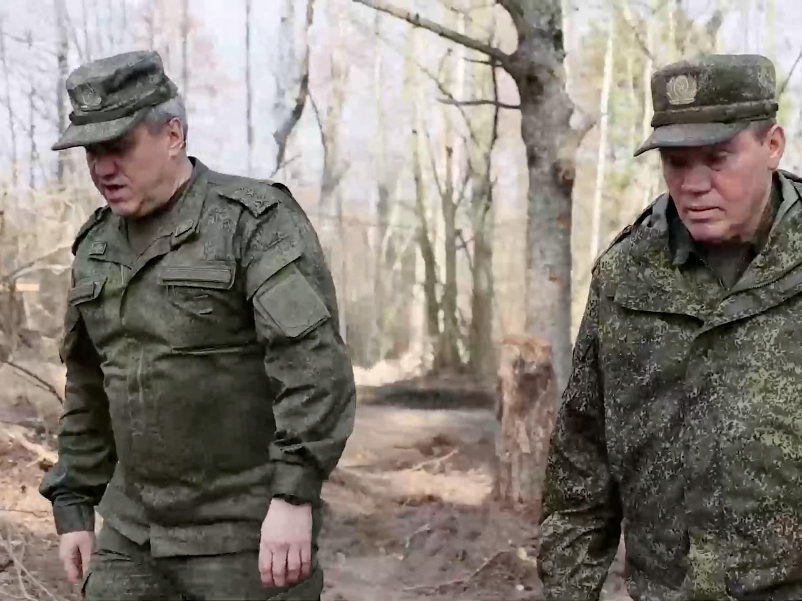
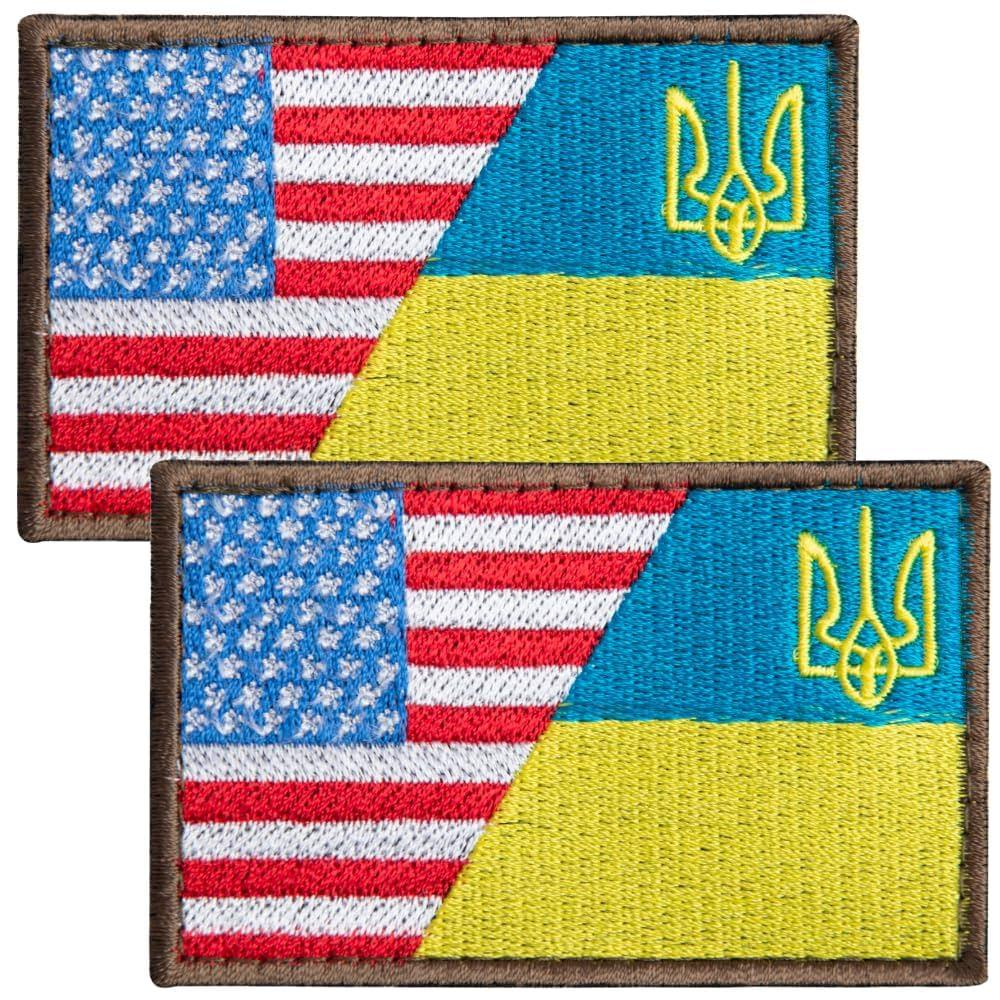
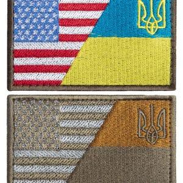
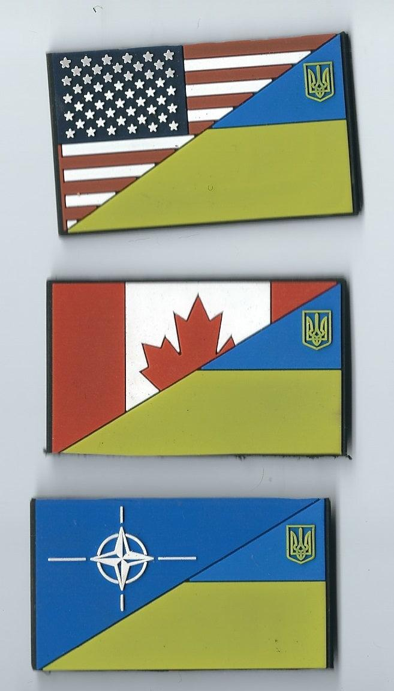

## Claim
Claim: " This image shows American mercenaries participating in Ukraine's incursion into Russia's Kursk Oblast in August 2024."

## Actions
```
reverse_search()
```

## Evidence
### Evidence from `reverse_search`
The image 

## Elaboration
The image shows individuals wearing uniforms with patches of the American flag. The claim states that these individuals are American mercenaries participating in Ukraine's incursion into Russia's Kursk Oblast in August 2024.

The evidence does not provide any information about the location or the date of the image. It also does not confirm that the individuals are mercenaries or that they are involved in any military operations.

The claim cannot be verified due to a lack of information about the context of the image.


## Actions
```
image_search("American mercenaries Ukraine Russia Kursk Oblast")
```

## Evidence
### Evidence from `image_search`
Al Jazeera published an article on March 13, 2025, discussing the recapture of Kursk by Russian forces (). The BBC News website contains an image of Ukrainian soldiers (). The Telegraph published an article on August 14, 2024, discussing Ukraine's seizure of land in the border region, including an image of Ukrainian servicemen near the Russian border ().


## Elaboration
The evidence from the image search provides additional context. The Telegraph article from August 14, 2024, discusses Ukraine's actions in the border region. This aligns with the claim's mention of August 2024. However, the evidence does not mention American mercenaries. The images provided show Russian and Ukrainian soldiers, but not American mercenaries.

The claim is not supported by the evidence. The evidence does not mention American mercenaries.


## Actions
```
image_search("American flag patch military Ukraine Russia")
```

## Evidence
### Evidence from `image_search`
The search results from Amazon ([https://www.amazon.com/Bluyellow-American-Embroidered-Military-Backpacks/dp/B0CG28DJVD](https://www.amazon.com/Bluyellow-American-Embroidered-Military-Backpacks/dp/B0CG28DJVD)), Etsy ([https://www.etsy.com/listing/1446788819/usa-ukrainian-national-flags-patch-us-ua](https://www.etsy.com/listing/1446788819/usa-ukrainian-national-flags-patch-us-ua)), and buypatch.net ([https://buypatch.net/products/copy-of-international-legion-ukraine-ukraine-war-flag-patch-velcro?srsltid=AfmBOorMWgFencNtYgMk9AkM8DPtO_k6cDX7jPrRy6ED0EXDqv32gChX](https://buypatch.net/products/copy-of-international-legion-ukraine-ukraine-war-flag-patch-velcro?srsltid=AfmBOorMWgFencNtYgMk9AkM8DPtO_k6cDX7jPrRy6ED0EXDqv32gChX)) show patches that combine the American and Ukrainian flags (, , ).


## Elaboration
The evidence shows that patches combining the American and Ukrainian flags are available for sale. This suggests a connection between the two countries, but it does not confirm the presence of American mercenaries in Ukraine or their involvement in any specific military operations. The claim remains unverified.


## Final Judgement
The image shows individuals wearing uniforms with American flag patches. The claim asserts these are American mercenaries in Ukraine's Kursk Oblast in August 2024. While the image search provides some context about the conflict and the date, it does not confirm the presence of American mercenaries or their involvement in the specified incursion. The evidence also shows that patches combining the American and Ukrainian flags are available for sale.

`false`

### Verdict: FALSE

### Justification
The claim that the image depicts American mercenaries participating in Ukraine's incursion into Russia's Kursk Oblast in August 2024 is not supported by the evidence. While the image shows individuals with American flag patches, and the image search provides context about the conflict, there is no evidence to confirm the presence of American mercenaries or their involvement in the specified military operation.
