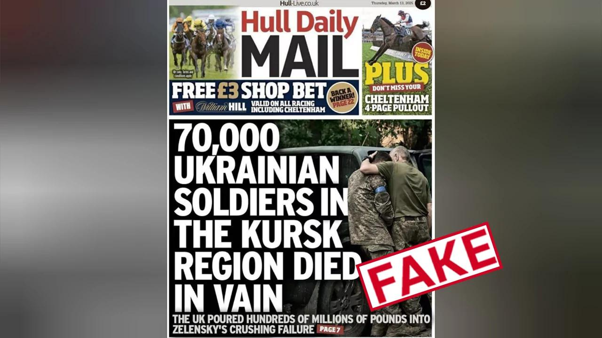
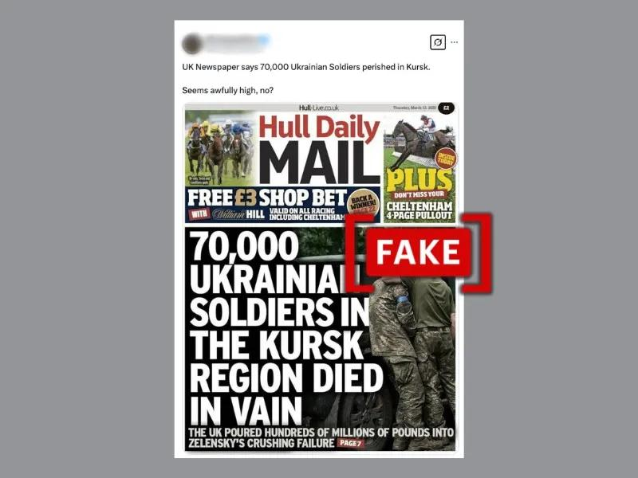

## Claim
Claim: " This image shows a screenshot of an authentic Hull Daily Mail's frontpage from March 13, 2025 saying '70,000 Ukrainian soldiers in the Kursk region died in vain. The UK poured hundreds of millions of pounds into Zelensky's crushing failure'."

## Actions
```
reverse_search()
```

## Evidence
No new evidence found.

## Elaboration
The provided image is a screenshot of the Hull Daily Mail's front page. The headline states that 70,000 Ukrainian soldiers died in the Kursk region, and it also mentions the UK's financial involvement in what is described as Zelensky's crushing failure.

Without additional information, it is impossible to verify the accuracy of the claims made in the headline. The veracity of the statements about the number of casualties, the location, and the UK's financial involvement cannot be confirmed based solely on the image.


## Actions
```
image_search("Hull Daily Mail front page Ukrainian soldiers Kursk region")
```

## Evidence
### Evidence from `image_search`
The web sources indicate that the Hull Daily Mail front page image is fake. Gwaramedia.com ([https://gwaramedia.com/en/debunking-russian-fakes-hull-daily-mail-didnt-write-about-70000-ukrainian-soldiers-killed-in-russias-kursk-oblast/](https://gwaramedia.com/en/debunking-russian-fakes-hull-daily-mail-didnt-write-about-70000-ukrainian-soldiers-killed-in-russias-kursk-oblast/)) debunks the claim, Myth Detector labels the image as a "Fabricated Cover" ([https://mythdetector.com/en/british-hull-daily-mail/](https://mythdetector.com/en/british-hull-daily-mail/)), and a LinkedIn post also identifies the front page as fake ([https://www.linkedin.com/posts/scott-reid-1a22a2a6_fake-hull-daily-mail-headline-about-ukrainian-activity-7307787626227372032-XtAk](https://www.linkedin.com/posts/scott-reid-1a22a2a6_fake-hull-daily-mail-headline-about-ukrainian-activity-7307787626227372032-XtAk)).   


## Elaboration
The evidence indicates that the Hull Daily Mail front page image is fake. Several sources, including Gwaramedia.com, Myth Detector, and a LinkedIn post, explicitly label the image as fabricated.


## Final Judgement
The image of the Hull Daily Mail front page is a fabrication. Multiple sources confirm that the image is fake, debunking the claims made in the headline. `false`

### Verdict: FALSE

### Justification
The claim is false. The image of the Hull Daily Mail front page is a fabrication, as confirmed by multiple sources, including [Gwaramedia.com](https://gwaramedia.com/en/debunking-russian-fakes-hull-daily-mail-didnt-write-about-70000-ukrainian-soldiers-killed-in-russias-kursk-oblast/), [Myth Detector](https://mythdetector.com/en/british-hull-daily-mail/), and a [LinkedIn post](https://www.linkedin.com/posts/scott-reid-1a22a2a6_fake-hull-daily-mail-headline-about-ukrainian-activity-7307787626227372032-XtAk).
