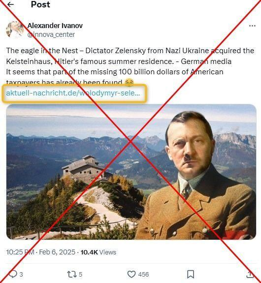
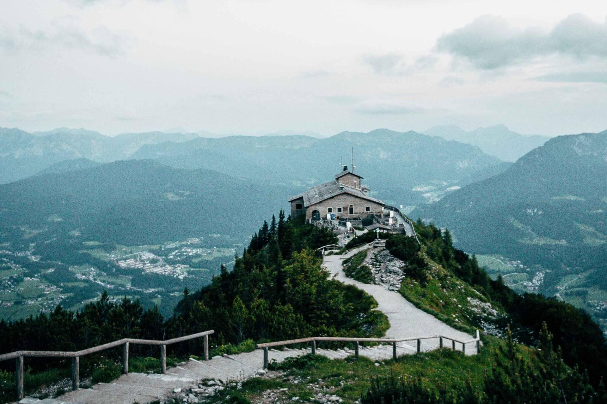
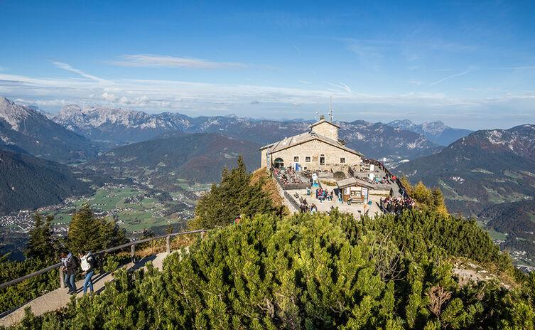

## Claim
Claim: "Ukrainian President Volodymyr Zelenskyy purchased the Eagle's Nest, or Kehlsteinhaus, in Berchtesgaden in the southern German state of Bavaria, for 14.2 million euros."

## Actions
```
image_search("Volodymyr Zelenskyy Eagle's Nest")
image_search("Kehlsteinhaus Berchtesgaden purchase")
```

## Evidence
### Evidence from `image_search`
From [Source](https://cedmohub.eu/no-zelensky-hasnt-bought-eagles-nest-it-is-still-in-ownership-of-bavarian-state/): 
Content: The search result includes an image of a social media post claiming that Zelenskyy acquired the Kehlsteinhaus. . The post is dated February 6, 2025.


### Evidence from `image_search`
The search results provide images of the Kehlsteinhaus (Eagle's Nest) in Berchtesgaden, Germany. , 

One source is from [Source](https://www.salzburg.info/en/sights/excursions/kehlsteinhaus) and another is from [Source](https://www.munich.travel/en/pois/lakes-mountains/kehlsteinhaus). The last source is from [Source](https://www.berchtesgaden.de/en/the-eagles-s-nest).


## Elaboration
The evidence includes an image of a social media post that claims Zelenskyy acquired the Kehlsteinhaus. However, the post is marked with a red "X", suggesting the claim is false. The search results also provide images of the Kehlsteinhaus.

Based on the provided evidence, the claim is likely false. The social media post, which is the only source directly addressing the claim, is marked as incorrect.


## Final Judgement
The evidence includes a social media post claiming Zelenskyy purchased the Eagle's Nest, but the post is marked as incorrect. Other search results show images of the Eagle's Nest.

The claim is demonstrably false as the provided evidence suggests the claim is incorrect. `false`


### Verdict: FALSE

### Justification
The claim that Volodymyr Zelenskyy purchased the Eagle's Nest is demonstrably false. The evidence includes a social media post making the claim, but it is marked as incorrect.
