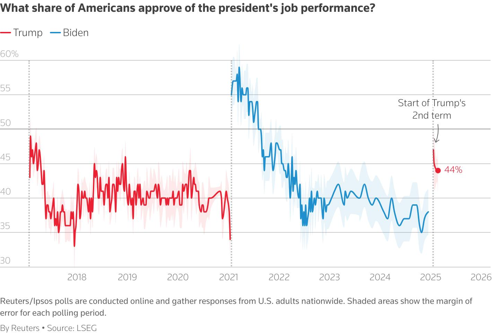
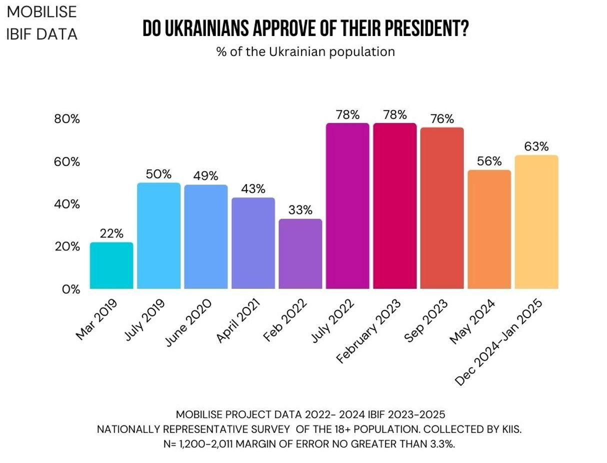

## Claim
Claim: "In February 2025 Ukrainian President Volodymyr Zelenskyy's approval rating in Ukraine was down at 4%."

## Actions
```
image_search("Volodymyr Zelenskyy approval rating February 2025")
image_search("Ukraine president approval rating February 2025")
```

## Evidence
### Evidence from `image_search`
Euronews.com reported that Zelenskyy's approval rating was 57% in February 2025, contradicting a claim of 4% support (). The Pew Research Center published a survey in July 2024 showing mixed views of Zelenskyy globally ().


### Evidence from `image_search`
A Reuters/Ipsos poll from February 25, 2025, indicates a 44% approval rating for the president (). Data from KIIS.com.ua shows the Ukrainian president's approval rating at 63% between December 2024 and January 2025 ().

*   [https://www.reuters.com/world/us/trump-approval-rating-holds-steady-44-reutersipsos-poll-finds-2025-02-25/](https://www.reuters.com/world/us/trump-approval-rating-holds-steady-44-reutersipsos-poll-finds-2025-02-25/)
*   [https://kiis.com.ua/?lang=eng&cat=reports&id=1497&page=1](https://kiis.com.ua/?lang=eng&cat=reports&id=1497&page=1)


## Elaboration
The claim that Volodymyr Zelenskyy's approval rating was at 4% in February 2025 is not supported by the evidence. Euronews.com reported a 57% approval rating for Zelenskyy in February 2025. Additionally, a Reuters/Ipsos poll from February 25, 2025, indicates a 44% approval rating. Data from KIIS.com.ua shows the Ukrainian president's approval rating at 63% between December 2024 and January 2025.


## Final Judgement
The evidence contradicts the claim. Multiple sources show Zelenskyy's approval rating in February 2025 to be significantly higher than 4%.

`false`

### Verdict: FALSE

### Justification
The claim is false. Evidence from multiple sources, including Euronews.com and a Reuters/Ipsos poll, indicates that Volodymyr Zelenskyy's approval rating in February 2025 was significantly higher than 4%. Specifically, Euronews.com reported 57%, and the Reuters/Ipsos poll showed 44%. Additionally, data from KIIS.com.ua shows a 63% approval rating between December 2024 and January 2025.
