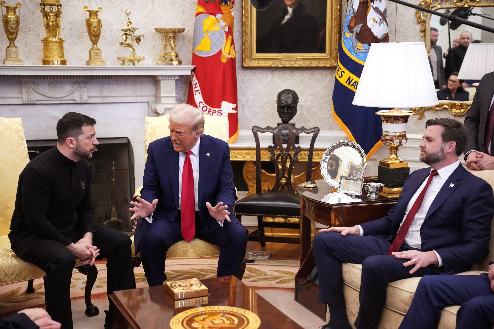
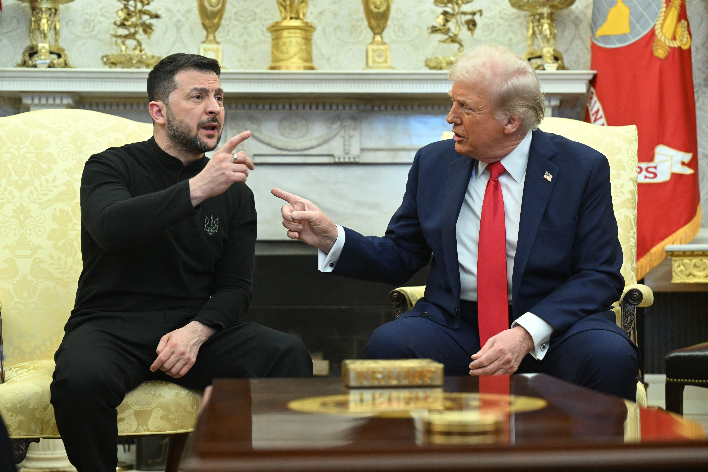
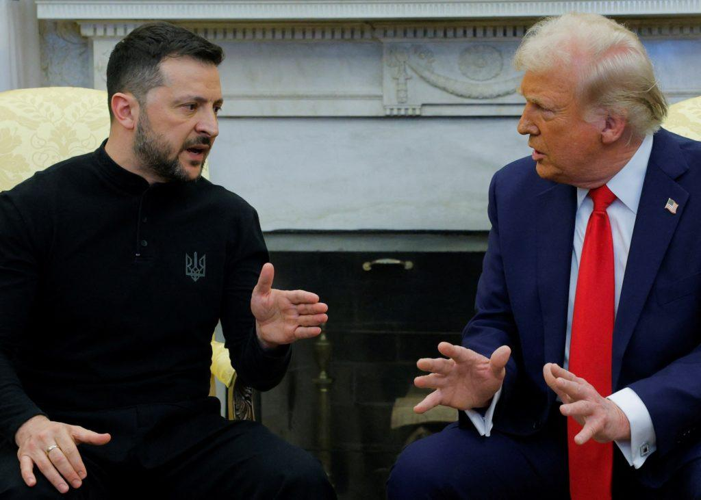
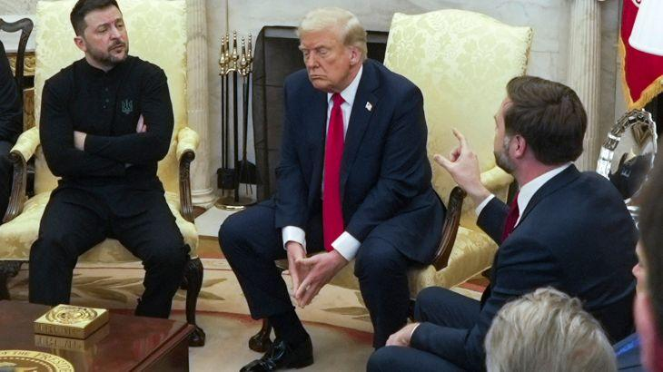
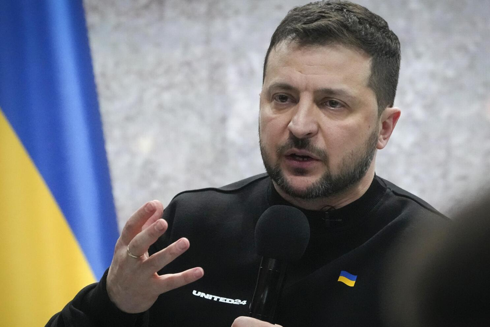
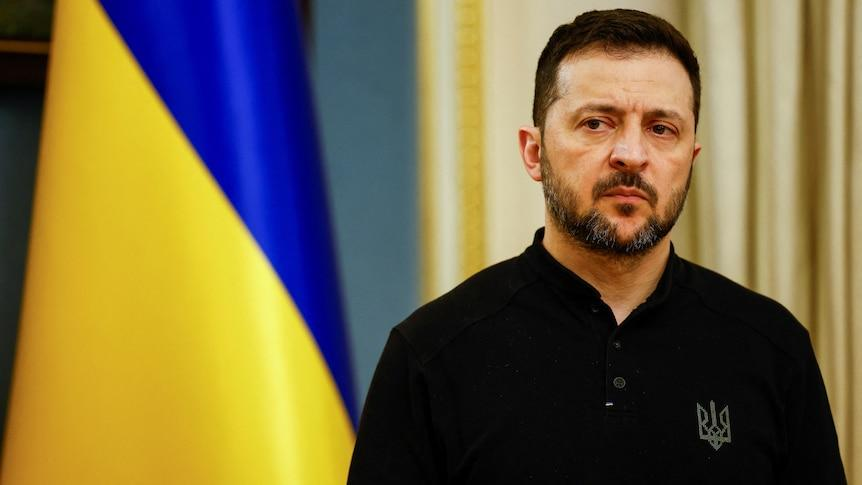
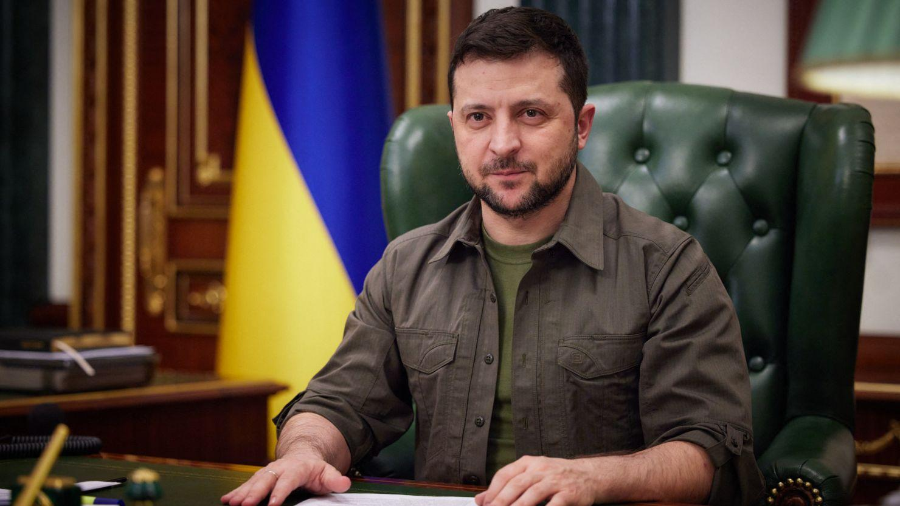

## Claim
Claim: "Ukrainian President Volodymyr Zelenskyy said the U.S. will have 'to send their sons and daughters' to die for Ukraine after having a heated exchange with U.S. President Donald Trump at the White House in February 2025."

## Actions
```
image_search("Volodymyr Zelenskyy Donald Trump White House February 2025")
```

## Evidence
### Evidence from `image_search`
The North Dakota Monitor ([https://northdakotamonitor.com/2025/02/28/repub/trump-zelenskyy-clash-in-oval-office-blowup-over-peace-negotiations/](https://northdakotamonitor.com/2025/02/28/repub/trump-zelenskyy-clash-in-oval-office-blowup-over-peace-negotiations/)) published an image of Volodymyr Zelenskyy and Donald Trump in the White House. 

NPR.org ([https://www.npr.org/2025/02/28/nx-s1-5313079/trump-zelenskyy-meeting](https://www.npr.org/2025/02/28/nx-s1-5313079/trump-zelenskyy-meeting)) also contains an image of Volodymyr Zelenskyy and Donald Trump.  American Progress ([https://www.americanprogress.org/article/trump-and-vances-disgraceful-oval-office-ambush-of-zelenskyy-comes-at-americas-expense-and-only-benefits-putin/](https://www.americanprogress.org/article/trump-and-vances-disgraceful-oval-office-ambush-of-zelenskyy-comes-at-americas-expense-and-only-benefits-putin/)) includes an image of Volodymyr Zelenskyy and Donald Trump in the White House. 


## Elaboration
The evidence confirms that Volodymyr Zelenskyy and Donald Trump met at the White House. However, the provided evidence does not contain any information about the content of their discussion or any statements made by Zelenskyy regarding the U.S. sending troops to Ukraine.

Therefore, the claim cannot be verified based on the available evidence.


## Actions
```
image_search("Zelenskyy Trump heated exchange White House February 2025")
```

## Evidence
### Evidence from `image_search`
The search results include images of Volodymyr Zelenskyy and Donald Trump. OPB.org ([https://www.opb.org/article/2025/02/28/trump-zelenskyy-white-house-argument/](https://www.opb.org/article/2025/02/28/trump-zelenskyy-white-house-argument/)) , PBS.org ([https://www.pbs.org/newshour/politics/what-trump-and-zelenskyy-said-during-their-heated-argument-in-the-oval-office](https://www.pbs.org/newshour/politics/what-trump-and-zelenskyy-said-during-their-heated-argument-in-the-oval-office)) , and Al Jazeera ([https://www.aljazeera.com/news/2025/2/28/key-takeaways-from-the-fiery-white-house-meeting-with-trump-and-zelenskyy](https://www.aljazeera.com/news/2025/2/28/key-takeaways-from-the-fiery-white-house-meeting-with-trump-and-zelenskyy))  all published images of the two leaders.


## Elaboration
The new evidence confirms that there was a "heated argument" between Trump and Zelenskyy at the White House. However, the evidence still does not provide any information about the specific statements made by Zelenskyy, particularly the one mentioned in the claim.

Therefore, the claim remains unverified.


## Actions
```
image_search("Zelenskyy U.S. send sons daughters die Ukraine February 2025")
```

## Evidence
### Evidence from `image_search`
The search results include images of Volodymyr Zelenskyy from AP News ([https://apnews.com/article/fact-check-volodymyr-zelenskyy-ukraine-war-troops-883661209159](https://apnews.com/article/fact-check-volodymyr-zelenskyy-ukraine-war-troops-883661209159)) , ABC News ([https://www.abc.net.au/news/2025-02-12/volodymyr-zelenskyy-offers-ukraine-land-swap-with-russia/104929254](https://www.abc.net.au/news/2025-02-12/volodymyr-zelenskyy-offers-ukraine-land-swap-with-russia/104929254)) , and CNN ([https://www.cnn.com/world/europe/volodymyr-zelensky-fast-facts](https://www.cnn.com/world/europe/volodymyr-zelensky-fast-facts)) . None of the sources mention the specific quote in the claim.


## Elaboration
The evidence does not support the claim. While there is evidence of a meeting and a heated exchange between Zelenskyy and Trump, there is no evidence to support the specific quote attributed to Zelenskyy.


## Final Judgement
The fact-check reveals that while there was a meeting and a heated exchange between Zelenskyy and Trump at the White House, there is no evidence to support the specific quote attributed to Zelenskyy. Therefore, the claim cannot be verified. `false`

### Verdict: FALSE

### Justification
The claim that Volodymyr Zelenskyy said the U.S. would have to send their sons and daughters to die for Ukraine after a heated exchange with Donald Trump in February 2025 is not supported by the available evidence. While images confirm a meeting and a heated exchange between the two leaders, no source provides the specific quote attributed to Zelenskyy.
