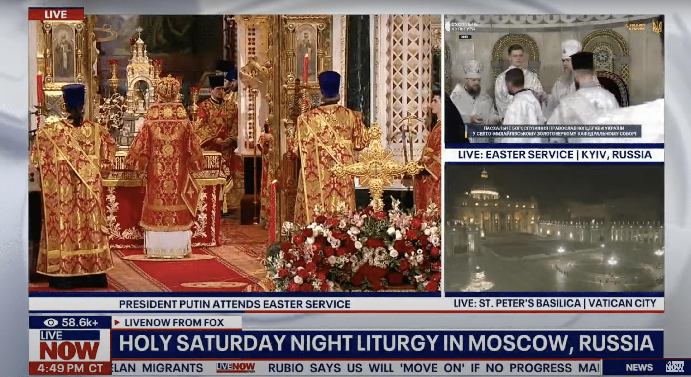
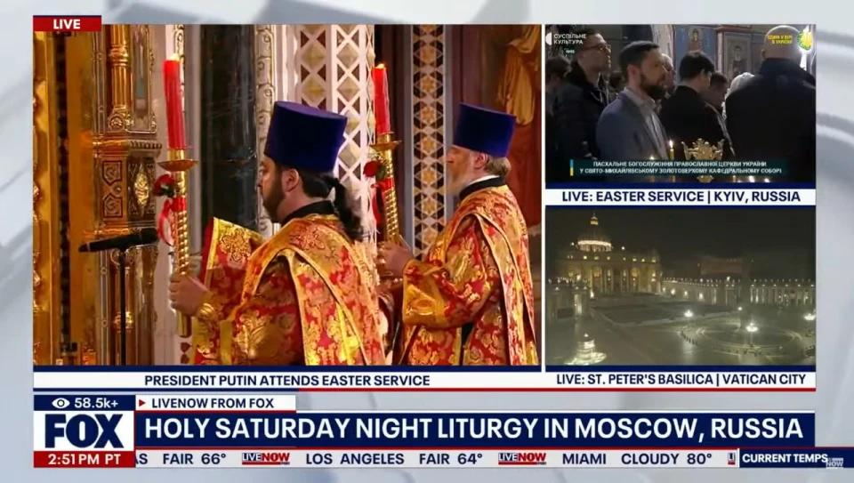
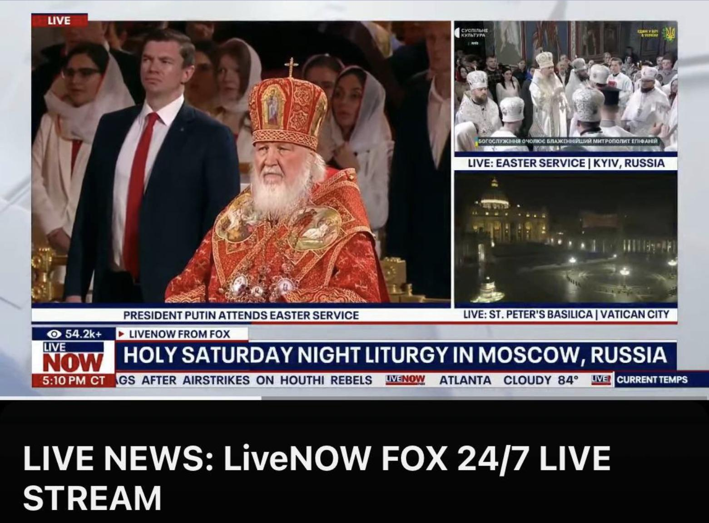

## Claim
Claim: " This image shows a Fox News broadcast from Easter 2025 where you can see the Patriarch Kirill in the center and Kyiv labeled as a Russian city in the top right corner of the image."

## Actions
```
image_search("Fox News Easter service Moscow Kyiv")
reverse_search()
```

## Evidence
### Evidence from `image_search`
The web sources describe a Fox News broadcast of an Easter service that labels Kyiv as a Russian city. One source is from united24media.com ([https://united24media.com/latest-news/fox-news-labels-kyiv-as-russia-during-easter-service-broadcast-7731](https://united24media.com/latest-news/fox-news-labels-kyiv-as-russia-during-easter-service-broadcast-7731)) and another is from Espresso TV ([https://global.espreso.tv/world-news-fox-news-airs-easter-service-with-putin-in-moscow-labels-kyiv-as-russian-city](https://global.espreso.tv/world-news-fox-news-airs-easter-service-with-putin-in-moscow-labels-kyiv-as-russian-city)).  


### Evidence from `reverse_search`
The image shows a Fox News broadcast from an Easter service where Kyiv was labeled as a Russian city. The broadcast featured the Russian Orthodox Church ceremony with President Putin and Patriarch Kirill. The Ukrainian media outlet "Suspіlne" reported that the error was displayed for over 20 minutes before being corrected, which led to criticism and a demand for an apology and investigation. The articles were published on April 20, 2025, and August 6, 2025. 

The articles can be found on the following websites: [https://suspilne.media/999087-fox-news-poznaciv-kiiv-ak-rosijske-misto-pid-cas-translacii-velikodnogo-bogosluzinna-pcu/](https://suspilne.media/999087-fox-news-poznaciv-kiiv-ak-rosijske-misto-pid-cas-translacii-velikodnogo-bogosluzinna-pcu/), [https://444.hu/2025/04/20/oroszorszaghoz-csatolta-kijevet-a-fox-news](https://444.hu/2025/04/20/oroszorszaghoz-csatolta-kijevet-a-fox-news), and [https://www.rijekadanas.com/fox-news-nazvao-kijev-ruskim-gradom/](https://www.rijekadanas.com/fox-news-nazvao-kijev-ruskim-gradom/). 


## Elaboration
The evidence confirms that the image is from a Fox News broadcast of an Easter service. The broadcast labeled Kyiv as a Russian city. The broadcast also featured Patriarch Kirill and President Putin. The error was displayed for over 20 minutes.


## Final Judgement
The claim is accurate. The image is from a Fox News broadcast of an Easter service where Kyiv was incorrectly labeled as a Russian city. The broadcast featured Patriarch Kirill and President Putin.

`true`

### Verdict: TRUE

### Justification
The image is from a Fox News broadcast of an Easter service that incorrectly labeled Kyiv as a Russian city, as reported by sources like [united24media.com](https://united24media.com/latest-news/fox-news-labels-kyiv-as-russia-during-easter-service-broadcast-7731) and [Espresso TV](https://global.espreso.tv/world-news-fox-news-airs-easter-service-with-putin-in-moscow-labels-kyiv-as-russian-city). The broadcast also featured Patriarch Kirill and President Putin.
