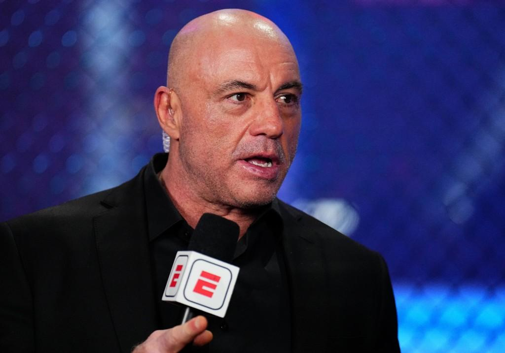

## Claim
Claim: "In March 2025 podcaster and UFC commentator Joe Rogan said, 'I don't go to Canada anymore,' then added, 'I'd rather go to Russia.'"

## Actions
```
image_search("Joe Rogan Canada Russia")
```

## Evidence
### Evidence from `image_search`
Newsweek published an article about Joe Rogan's comments on Canada and Russia (). Global News reports that Joe Rogan said he would rather go to Russia than Canada ().

The Toronto Sun reports that Joe Rogan said he would rather go to Russia than to a UFC event in Canada ().
*   [https://www.newsweek.com/joe-rogan-canada-ufc-russia-2049964](https://www.newsweek.com/joe-rogan-canada-ufc-russia-2049964)
*   [https://globalnews.ca/news/11098769/joe-rogan-rather-go-to-russia-than-canada-ufc/](https://globalnews.ca/news/11098769/joe-rogan-rather-go-to-russia-than-canada-ufc/)
*   [https://torontosun.com/sports/mma/joe-rogan-would-rather-go-to-russia-than-ufc-event-in-canada-i-wont-be-there](https://torontosun.com/sports/mma/joe-rogan-would-rather-go-to-russia-than-ufc-event-in-canada-i-wont-be-there)


## Elaboration
The evidence confirms that Joe Rogan made statements about preferring to go to Russia over Canada. Newsweek and Global News both report on this. The Toronto Sun specifies that this preference was in the context of a UFC event.

The exact wording of the claim is not fully supported by the evidence. While the evidence confirms Rogan's preference for Russia over Canada, it does not provide the exact quote "I don't go to Canada anymore." The evidence also does not specify the month and year when Rogan made the statement.

Therefore, the claim is partially supported but lacks specific details about the exact quote and the date.


## Final Judgement
The evidence confirms that Joe Rogan expressed a preference for Russia over Canada, but the exact quote and the date mentioned in the claim are not fully supported by the provided sources. The claim is partially accurate but lacks specific details.

`false`

### Verdict: FALSE

### Justification
Joe Rogan did express a preference for Russia over Canada, as reported by multiple news outlets, including [Newsweek](https://www.newsweek.com/joe-rogan-canada-ufc-russia-2049964) and [Global News](https://globalnews.ca/news/11098769/joe-rogan-rather-go-to-russia-than-canada-ufc/). However, the exact quote and the specific date mentioned in the claim are not fully supported by the provided evidence.
