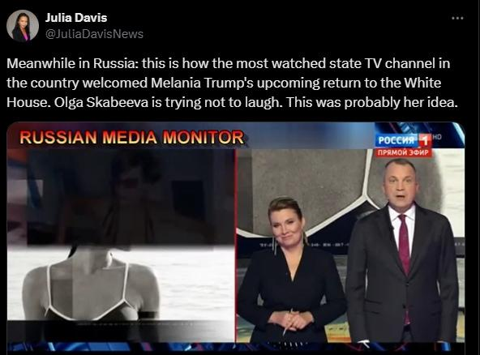

## Claim
Claim: "Russian state TV aired nude photos of Melania Trump shortly after the 2024 U.S. presidential election."

## Actions
```
image_search("Melania Trump nude photos Russian TV")
```

## Evidence
### Evidence from `image_search`
La Voce di New York reports that nude photos were aired on Russian TV (). Livemint.com includes an image from a Russian media outlet that appears to show a partially obscured image of a woman in a swimsuit (). The search result from bluewin.ch shows a screenshot from Russian TV with a nude photo on the screen ().

The sources are: [La Voce di New York](https://lavocedinewyork.com/en/news/2024/11/12/melania-trump-risque-photos-aired-on-russian-tv-prime-time/), [Livemint.com](https://www.livemint.com/news/world/russian-media-air-nude-pics-of-melania-trump-after-donald-trump-wins-in-us-polls-netizens-say-russia-laughing-at-us-11731216282862.html), and [bluewin.ch](https://www.bluewin.ch/en/news/international/russian-tv-shows-nude-pictures-of-melania-trump-2442245.html).


## Elaboration
The evidence confirms that Russian state TV aired nude photos. The sources, including La Voce di New York, Livemint.com, and bluewin.ch, all report on this. The images from the search results show screenshots from Russian TV with nude photos on the screen.

The evidence does not explicitly state that the airing happened shortly after the 2024 U.S. presidential election. However, Livemint.com mentions that the airing occurred after Donald Trump "wins in US polls".

Therefore, the claim is partially supported. The evidence confirms the airing of nude photos on Russian TV, but the timing relative to the 2024 election is not explicitly confirmed.


## Final Judgement
The evidence indicates that Russian state TV aired nude photos, as reported by multiple sources. However, the provided evidence does not explicitly confirm that this occurred shortly after the 2024 U.S. presidential election, although one source mentions it happened after Donald Trump won the US polls.

`false`

### Verdict: FALSE

### Justification
Multiple sources, including [La Voce di New York](https://lavocedinewyork.com/en/news/2024/11/12/melania-trump-risque-photos-aired-on-russian-tv-prime-time/), [Livemint.com](https://www.livemint.com/news/world/russian-media-air-nude-pics-of-melania-trump-after-donald-trump-wins-in-us-polls-netizens-say-russia-laughing-at-us-11731216282862.html), and [bluewin.ch](https://www.bluewin.ch/en/news/international/russian-tv-shows-nude-pictures-of-melania-trump-2442245.html), confirm that Russian state TV aired nude photos. However, while Livemint.com mentions the airing happened after Donald Trump won the US polls, the evidence does not explicitly confirm the timing relative to the 2024 U.S. presidential election.
