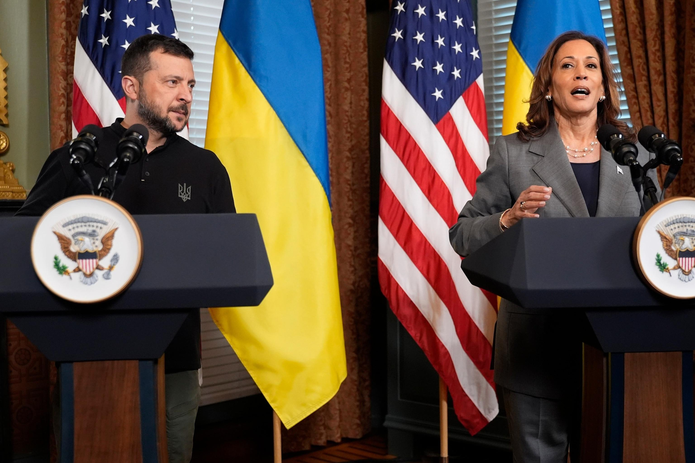
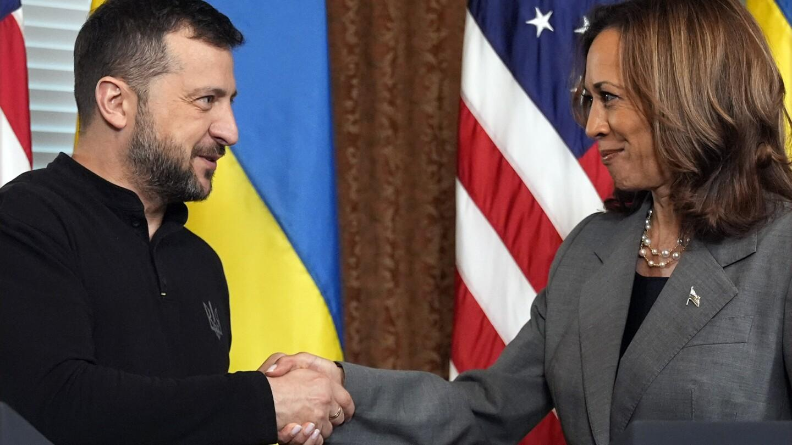
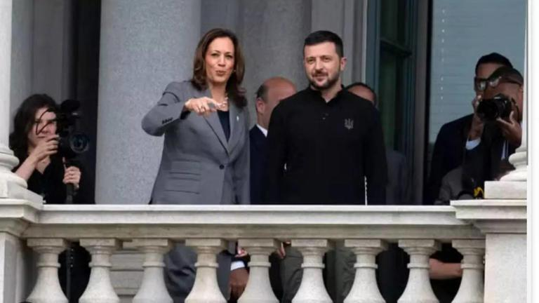
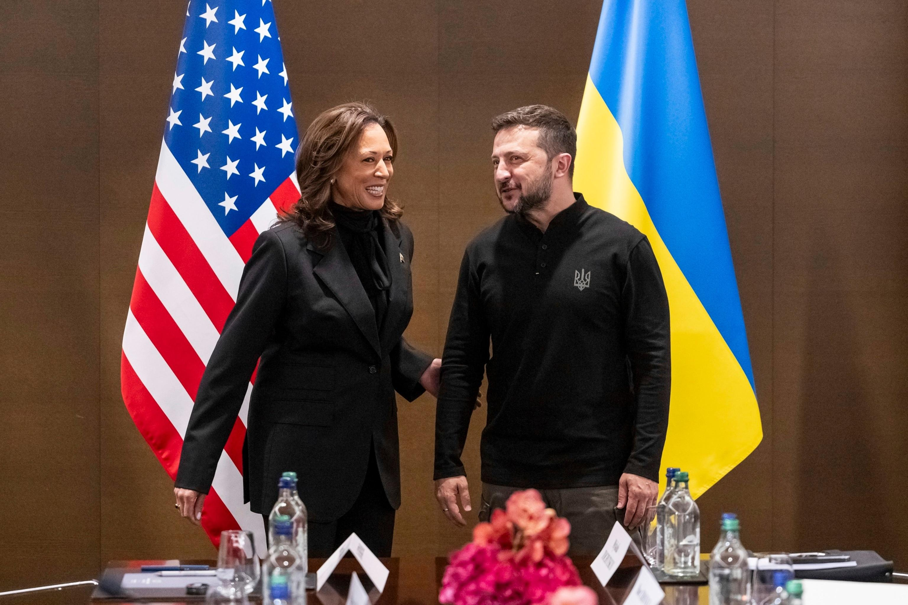

## Claim
Claim: "Ukrainian President Volodymyr Zelenskyy engaged in election interference by campaigning in Pennsylvania for Kamala Harris ahead of the US presidential election in 2024."

## Actions
```
image_search("Volodymyr Zelenskyy Kamala Harris Pennsylvania 2024")
```

## Evidence
### Evidence from `image_search`
NBC News ([https://www.nbcnews.com/politics/2024-election/zelenskyys-meeting-harris-spat-trump-reveal-growing-partisan-divide-uk-rcna172648](https://www.nbcnews.com/politics/2024-election/zelenskyys-meeting-harris-spat-trump-reveal-growing-partisan-divide-uk-rcna172648)) provides an image of Volodymyr Zelenskyy and Kamala Harris shaking hands .

ABC News ([https://abcnews.go.com/Politics/harris-standing-zelenskyy-indirectly-jabs-trump-vance-ukraine/story?id=114219628](https://abcnews.go.com/Politics/harris-standing-zelenskyy-indirectly-jabs-trump-vance-ukraine/story?id=114219628)) and AP News ([https://apnews.com/article/zelenskyy-joe-biden-kamala-harris-trump-229804fd42332c584dfbe05224634e44](https://apnews.com/article/zelenskyy-joe-biden-kamala-harris-trump-229804fd42332c584dfbe05224634e44)) also contain images of Volodymyr Zelenskyy and Kamala Harris , .


## Elaboration
The evidence shows that Volodymyr Zelenskyy and Kamala Harris have met. However, the provided sources do not mention any campaigning by Zelenskyy in Pennsylvania or anywhere else for Kamala Harris. Therefore, the claim cannot be verified with the available information.

The evidence does not provide any information about the context of the meetings, such as the location or the purpose of the meetings.


## Actions
```
image_search("Volodymyr Zelenskyy Pennsylvania Kamala Harris 2024 campaign")
```

## Evidence
### Evidence from `image_search`
MSN News ([https://www.msn.com/en-in/news/other/did-zelenskyy-campaign-for-kamala-harris-in-pennsylvania-truth-behind-trump-s-claim/ar-AA1A0SvA](https://www.msn.com/en-in/news/other/did-zelenskyy-campaign-for-kamala-harris-in-pennsylvania-truth-behind-trump-s-claim/ar-AA1A0SvA)) provides an image of Volodymyr Zelenskyy and Kamala Harris . The Boston Herald ([https://www.bostonherald.com/2024/09/26/zelenskyy-washington-ukraine-war/](https://www.bostonherald.com/2024/09/26/zelenskyy-washington-ukraine-war/)) provides an image of Volodymyr Zelenskyy and Kamala Harris shaking hands .


## Elaboration
The new evidence continues to show meetings between Zelenskyy and Harris. However, it still does not provide any information about Zelenskyy campaigning for Harris in Pennsylvania or anywhere else.

Therefore, the claim remains unverified.


## Actions
```
image_search("Volodymyr Zelenskyy campaign Kamala Harris")
```

## Evidence
### Evidence from `image_search`
From [Source](https://abcnews.go.com/International/harris-zelenskyy-join-world-leaders-discuss-peace-plan/story?id=111156046): 
Content: ABC News provides an image of Volodymyr Zelenskyy and Kamala Harris .


## Elaboration
The evidence consistently shows meetings between Zelenskyy and Harris. However, none of the provided sources mention Zelenskyy campaigning for Harris, let alone in Pennsylvania. Therefore, the claim remains unverified.


## Final Judgement
The search results consistently show meetings between Volodymyr Zelenskyy and Kamala Harris, but they do not provide any evidence of Zelenskyy campaigning for Harris in Pennsylvania or anywhere else. Therefore, the claim is not supported by the available evidence. `false`

### Verdict: FALSE

### Justification
The fact-check reveals multiple instances of meetings between Volodymyr Zelenskyy and Kamala Harris, as evidenced by sources like [NBC News](https://www.nbcnews.com/politics/2024-election/zelenskyys-meeting-harris-spat-trump-reveal-growing-partisan-divide-uk-rcna172648), [ABC News](https://abcnews.go.com/Politics/harris-standing-zelenskyy-indirectly-jabs-trump-vance-ukraine/story?id=114219628), and [AP News](https://apnews.com/article/zelenskyy-joe-biden-kamala-harris-trump-229804fd42332c584dfbe05224634e44). However, none of the provided evidence supports the claim that Zelenskyy campaigned for Harris in Pennsylvania or elsewhere. Therefore, the claim is not supported by the available information.
