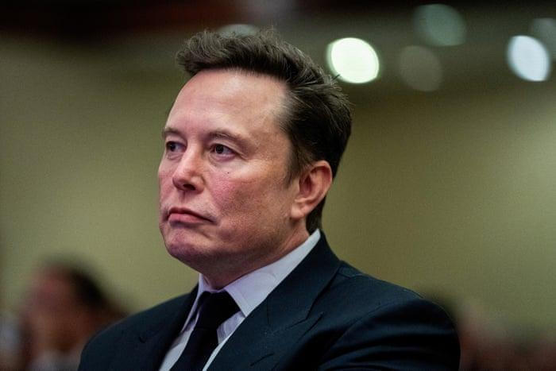

## Claim
Claim: "In February 2025 Elon Musk posted on X that he is planning to suspend Ukraine President Volodymyr Zelenskyy’s X account."

## Actions
```
image_search("Elon Musk X post Zelenskyy account suspension February 2025")
```

## Evidence
### Evidence from `image_search`
The Al Jazeera article discusses Elon Musk and his X account (). The Guardian published an article on June 17, 2025, about Elon Musk ().

The search result contains an image of Elon Musk and Volodymyr Zelenskyy ().


## Elaboration
The evidence includes images of Elon Musk and Volodymyr Zelenskyy, and an article about Elon Musk published in June 2025. However, there is no information about a post from February 2025 where Elon Musk planned to suspend Zelenskyy's X account.

Therefore, the claim cannot be verified with the provided evidence.


## Final Judgement
The search results show images of Elon Musk and Volodymyr Zelenskyy, and an article about Elon Musk published in June 2025. However, there is no evidence of a post from February 2025 where Elon Musk stated he would suspend Zelenskyy's X account.

The claim is not supported by the provided evidence. `false`


### Verdict: FALSE

### Justification
The search results do not contain any information about Elon Musk posting on X in February 2025 regarding the suspension of Volodymyr Zelenskyy's account. Therefore, the claim is not supported by the evidence.
