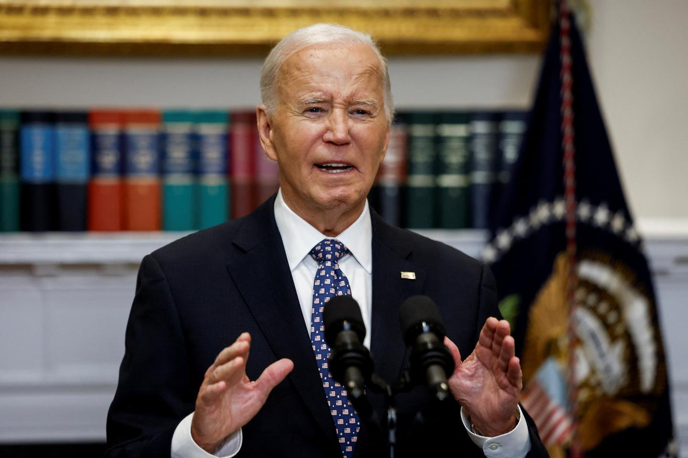
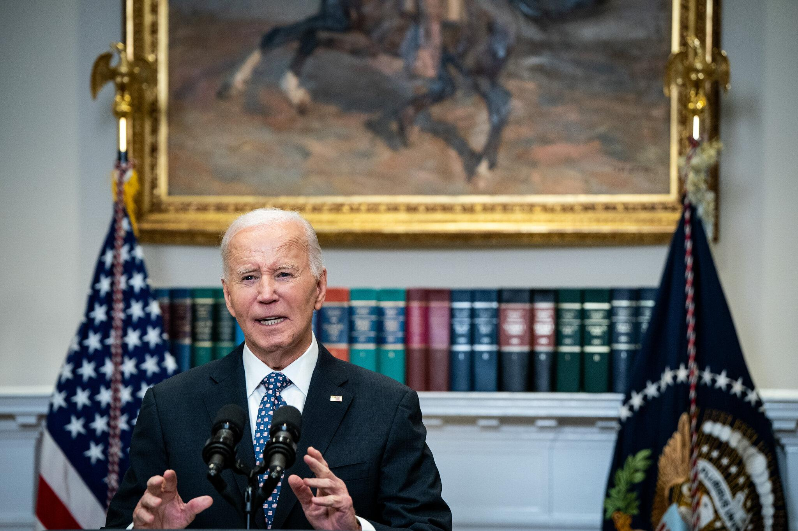
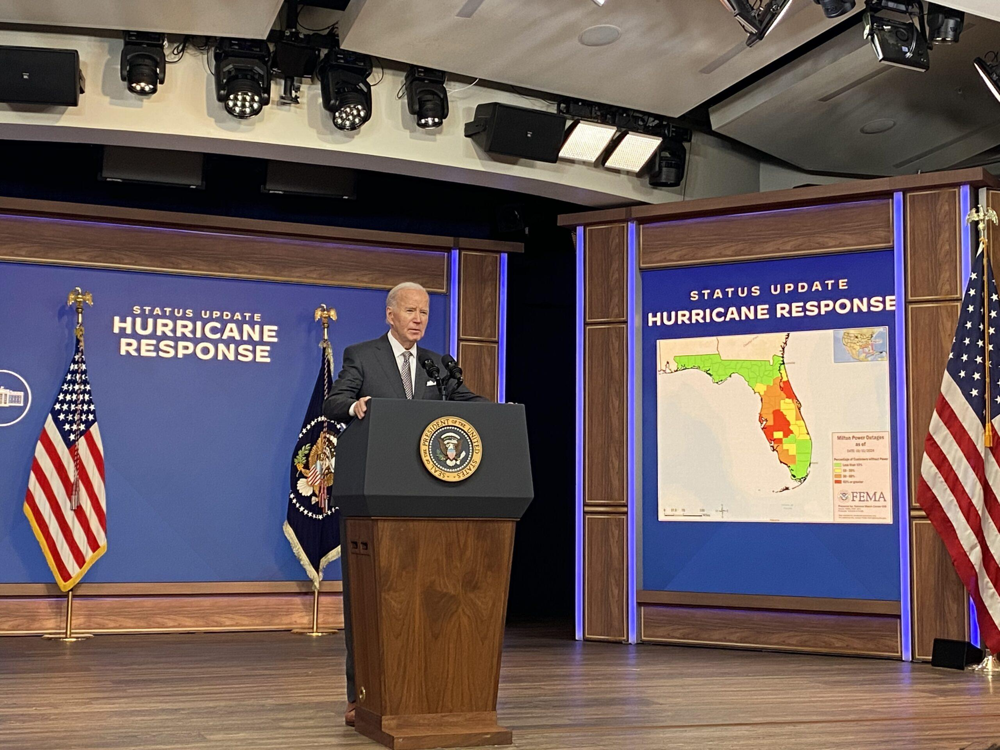
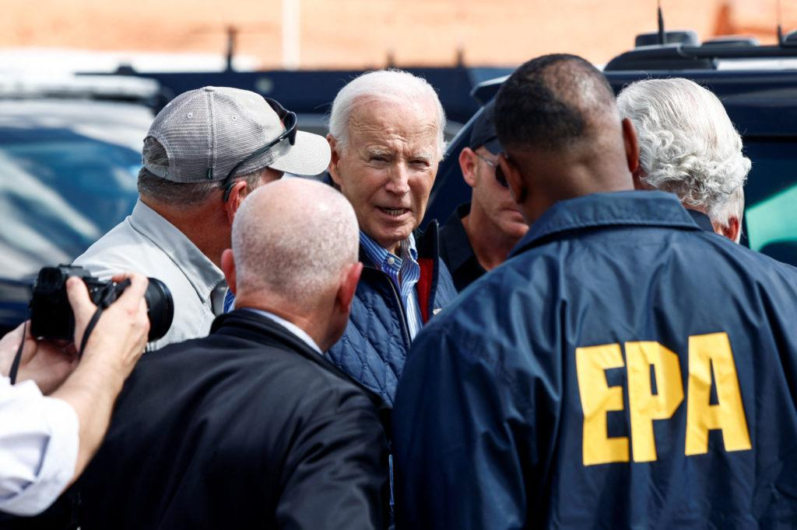
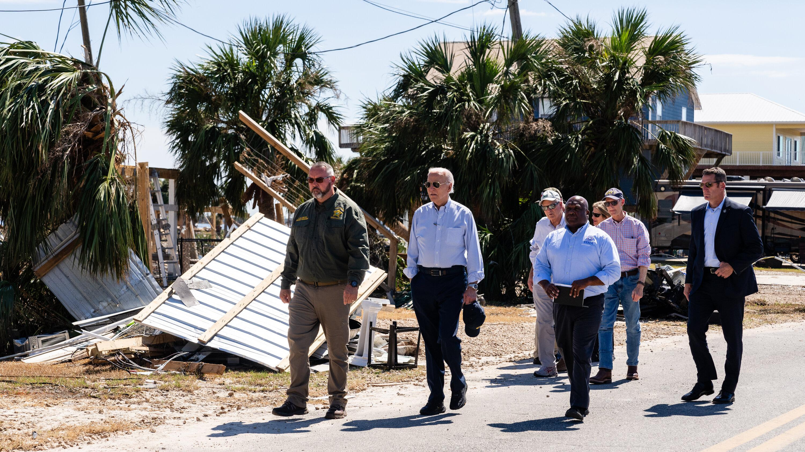

## Claim
Claim: "In remarks to reporters on September 29, 2024 US President Joe Biden announced that no more aid would be provided for the areas affected by Hurrican Helene, but 2.4 billion US-$ more for Ukraine."

## Actions
```
image_search("Joe Biden remarks September 29 2024 Hurricane Helene Ukraine aid")
```

## Evidence
### Evidence from `image_search`
Le Monde published an article on September 30, 2024, about Joe Biden's remarks regarding Hurricane Helene (). The New York Times provides an image of Joe Biden ().

An article from lailluminator.com, published on October 10, 2024, contains an image of President Joe Biden speaking at a podium with the words "STATUS UPDATE HURRICANE RESPONSE" visible ().


## Elaboration
The evidence confirms that Joe Biden made remarks regarding Hurricane Helene. However, the provided evidence does not contain any information about the content of these remarks, specifically whether he announced the cessation of aid for areas affected by Hurricane Helene or the allocation of additional funds to Ukraine.

Therefore, the claim cannot be verified with the available information.


## Actions
```
image_search("Joe Biden Hurricane Helene aid Ukraine")
```

## Evidence
### Evidence from `image_search`
PBS published an article about Joe Biden's visit to the areas affected by Hurricane Helene (). The New York Times published an article about Joe Biden and Hurricane Helene ().


## Elaboration
The new evidence confirms that Joe Biden visited areas affected by Hurricane Helene. However, it still does not provide any information about the content of his remarks on September 29, 2024, specifically regarding aid for the affected areas or additional funds for Ukraine.

Therefore, the claim remains unverified due to a lack of specific information about the content of Biden's statements.


## Actions
```
image_search("Joe Biden speech September 29 2024 Hurricane Helene Ukraine aid")
```

## Evidence
### Evidence from `image_search`
From [Source](https://kansasreflector.com/2024/10/10/biden-slams-trump-as-damn-un-american-urges-congress-to-speed-up-hurricane-aid/): 
Content: Kansas Reflector published an article on October 10, 2024, about Joe Biden's remarks regarding Hurricane Helene. 


## Elaboration
The Kansas Reflector article from October 10, 2024, shows Joe Biden speaking about Hurricane Helene. However, the article's content is not provided, so it's impossible to verify the claim about the content of his September 29, 2024, remarks.

The claim remains unverified.


## Final Judgement
The evidence confirms that Joe Biden made remarks and visited areas affected by Hurricane Helene. However, the search results do not provide any information about the content of these remarks, specifically whether he announced the cessation of aid for areas affected by Hurricane Helene or the allocation of additional funds to Ukraine. Therefore, the claim cannot be verified.

`false`

### Verdict: FALSE

### Justification
The available evidence confirms that President Biden made remarks and visited areas affected by Hurricane Helene, as reported by sources like the [Kansas Reflector](https://kansasreflector.com/2024/10/10/biden-slams-trump-as-damn-un-american-urges-congress-to-speed-up-hurricane-aid/). However, the provided sources do not contain any information about the content of these remarks, specifically whether he announced the cessation of aid for areas affected by Hurricane Helene or the allocation of additional funds to Ukraine. Therefore, the claim remains unverified.
