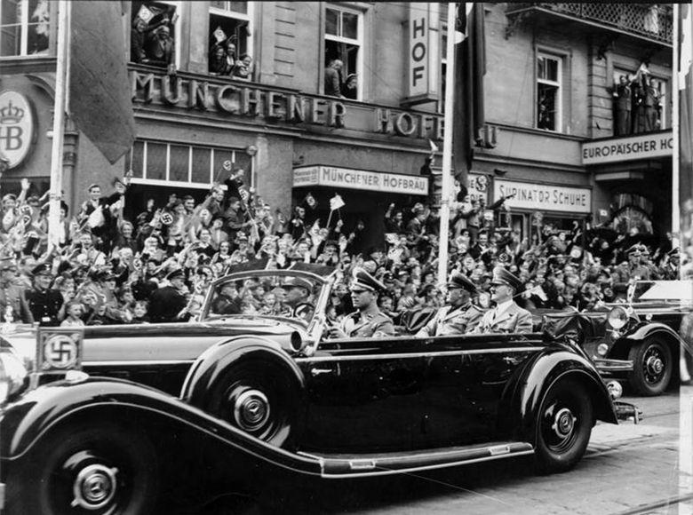
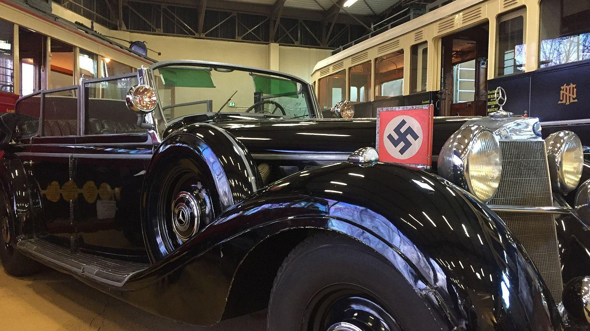

## Claim
Claim: " This image shows Hitler's parade car which was bought by the Ukrainian president Volodymyr Zelenskyy for 15 Million US-$."

## Actions
```
reverse_search()
image_search("Hitler parade car")
image_search("Volodymyr Zelenskyy car")
```

## Evidence
### Evidence from `reverse_search`
Multiple sources debunk a claim that Volodymyr Zelenskyy bought Hitler's parade car for $15 million. The Voice of America ([https://www.voanews.com/a/russian-propagandists-push-fake-story-that-zelenskyy-bought-hitler-s-car/7818175.html](https://www.voanews.com/a/russian-propagandists-push-fake-story-that-zelenskyy-bought-hitler-s-car/7818175.html)) and The Insider ([https://theins.ru/en/antifake/275232](https://theins.ru/en/antifake/275232)) state that the image of the car was doctored and the story originated from a fake news source.

Truthmeter.mk ([https://truthmeter.mk/endless-inspiration-for-disinformation-zelenskys-new-alleged-luxury-is-hitlers-mercedes/](https://truthmeter.mk/endless-inspiration-for-disinformation-zelenskys-new-alleged-luxury-is-hitlers-mercedes/)) also debunks the claim, stating the image is a montage and the car was auctioned in Arizona in 2018. The car was purchased by Australian national Clive Palmer in February 2022. 

### Evidence from `image_search`
The Seattle Times published an article about Hitler's car, including a photograph of Hitler in his parade car (). Newsweek also published an article about Adolf Hitler's car, showing Hitler in the car (). Euronews shows a black car that was made for Hitler ().

*   [https://www.seattletimes.com/seattle-news/how-hitlers-car-ended-up-parked-in-medina/](https://www.seattletimes.com/seattle-news/how-hitlers-car-ended-up-parked-in-medina/)
*   [https://www.newsweek.com/adolf-hitlers-car-will-be-sold-auction-who-would-buy-it-756783](https://www.newsweek.com/adolf-hitlers-car-will-be-sold-auction-who-would-buy-it-756783)
*   [https://www.euronews.com/2016/12/13/360-video-the-car-that-was-made-for-hitler](https://www.euronews.com/2016/12/13/360-video-the-car-that-was-made-for-hitler)


### Evidence from `image_search`
DW.com states that the claim about Zelenskyy's new car is fake. () The Financial Times published an image of a car with bullet holes and a police officer investigating the scene. ()

Al Jazeera shows an image of Volodymyr Zelenskyy's car. ()


## Elaboration
The claim is false. Multiple sources, including The Voice of America ([https://www.voanews.com/a/russian-propagandists-push-fake-story-that-zelenskyy-bought-hitler-s-car/7818175.html](https://www.voanews.com/a/russian-propagandists-push-fake-story-that-zelenskyy-bought-hitler-s-car/7818175.html)), The Insider ([https://theins.ru/en/antifake/275232](https://theins.ru/en/antifake/275232)), and Truthmeter.mk ([https://truthmeter.mk/endless-inspiration-for-disinformation-zelenskys-new-alleged-luxury-is-hitlers-mercedes/](https://truthmeter.mk/endless-inspiration-for-disinformation-zelenskys-new-alleged-luxury-is-hitlers-mercedes/)) debunk the claim, stating that the image is doctored and the story is fake. The car in the image was auctioned in 2018 and purchased by Clive Palmer in February 2022.


## Final Judgement
The claim is demonstrably false. The image is a montage, and the story is fake. The car was auctioned in 2018 and purchased by Clive Palmer in 2022. `false`

### Verdict: FALSE

### Justification
The claim that Volodymyr Zelenskyy bought Hitler's parade car for $15 million is false. Multiple sources, including The Voice of America ([https://www.voanews.com/a/russian-propagandists-push-fake-story-that-zelenskyy-bought-hitler-s-car/7818175.html](https://www.voanews.com/a/russian-propagandists-push-fake-story-that-zelenskyy-bought-hitler-s-car/7818175.html)) and Truthmeter.mk ([https://truthmeter.mk/endless-inspiration-for-disinformation-zelenskys-new-alleged-luxury-is-hitlers-mercedes/](https://truthmeter.mk/endless-inspiration-for-disinformation-zelenskys-new-alleged-luxury-is-hitlers-mercedes/)), confirm the image is doctored and the story is fake. The car was auctioned in 2018 and purchased by Clive Palmer in 2022.
