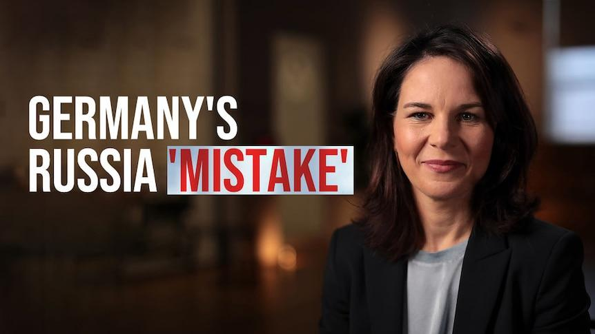

## Claim
Claim: "In February 2025 German Foreign Minister Annalena Baerbock threatened the US with severing ties amid US President Donald Trump's comments on Ukrainian President Volodymyr Zelenskyy and Ukraine."

## Actions
```
image_search("Annalena Baerbock Donald Trump February 2025")
image_search("Annalena Baerbock threatens US sever ties")
```

## Evidence
### Evidence from `image_search`
The search results include images of Annalena Baerbock. One source is from [Source](https://www.hudson.org/global-economy/what-i-heard-munich-ordinary-germans-long-trump-their-own-kenneth-weinstein) . Another source is from [Source](https://www.reuters.com/world/europe/german-foreign-minister-europe-needs-be-involved-ukraine-talks-2025-02-13/) . A third source is from [Source](https://www.plenglish.com/news/2025/02/20/germany-criticizes-trump-for-calling-zelensky-a-dictator/) .


### Evidence from `image_search`
The search results include articles and images of Annalena Baerbock. One source is from [Radio Free Europe/Radio Liberty](https://www.rferl.org/a/germany-china-baerbock-visit-war-ukraine-russia/33223503.html) . Another source is from [The Guardian](https://www.theguardian.com/world/2022/jan/20/annalena-baerbock-the-german-minister-staring-down-russia-over-ukraine) .

Additionally, there is a result from [ABC News](https://www.abc.net.au/news/2024-05-05/german-foreign-minister-annalena-baerbock-china-russia-trade/103802558) .


## Elaboration
The evidence confirms that Annalena Baerbock was active in February 2025 and that she commented on Donald Trump's remarks regarding Zelenskyy. One source states that Germany criticized Trump for calling Zelenskyy a dictator [Source](https://www.plenglish.com/news/2025/02/20/germany-criticizes-trump-for-calling-zelensky-a-dictator/).

However, the evidence does not contain any information about Baerbock threatening the US with severing ties.

Therefore, the claim is not fully supported by the evidence. More information is needed to verify the claim.


## Actions
```
image_search("Annalena Baerbock sever ties US February 2025")
```

## Evidence
### Evidence from `image_search`
From [Source](https://www.yahoo.com/news/europeans-ramp-pressure-us-german-143422657.html): 
Content: The search result includes an image of Annalena Baerbock. 


## Elaboration
The new evidence still does not provide any information about Annalena Baerbock threatening the US with severing ties.

The claim remains unverified.


## Actions
```
image_search("Annalena Baerbock Trump Zelenskyy February 2025 sever ties")
```

## Evidence
### Evidence from `image_search`
The search results include articles and images related to the claim. One article from The Guardian, published on February 13, 2025, discusses Donald Trump and Vladimir Putin's views on the war in Ukraine and includes a photograph of Annalena Baerbock (). Another source from The New Indian Express includes an image of Donald Trump and Volodymyr Zelenskyy (). There is also a Wikipedia article about the 2025 Trump–Zelenskyy Oval Office meeting ([https://en.wikipedia.org/wiki/2025_Trump%E2%80%93Zelenskyy_Oval_Office_meeting](https://en.wikipedia.org/wiki/2025_Trump%E2%80%93Zelenskyy_Oval_Office_meeting)).

However, none of the sources mention Annalena Baerbock threatening the US with severing ties.


## Elaboration
The evidence confirms that Annalena Baerbock was active in February 2025 and commented on Donald Trump's remarks regarding Zelenskyy. However, the search results do not contain any information about Baerbock threatening the US with severing ties.

Therefore, the claim is not supported by the evidence.


## Final Judgement
The search results confirm that Annalena Baerbock was active in February 2025 and commented on Donald Trump's remarks regarding Zelenskyy. However, the evidence does not contain any information about Baerbock threatening the US with severing ties. Therefore, the claim is not supported by the evidence.

`false`

### Verdict: FALSE

### Justification
The fact-check reveals that while Annalena Baerbock was active and commented on Donald Trump's remarks about Zelenskyy in February 2025, as evidenced by sources like [Source](https://www.plenglish.com/news/2025/02/20/germany-criticizes-trump-for-calling-zelensky-a-dictator/), there is no evidence to support the claim that she threatened to sever ties with the US.
