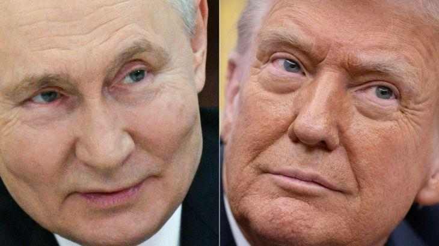
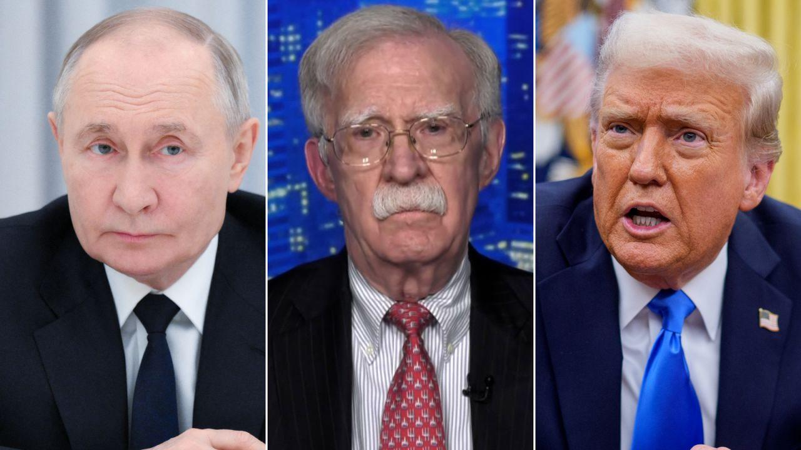
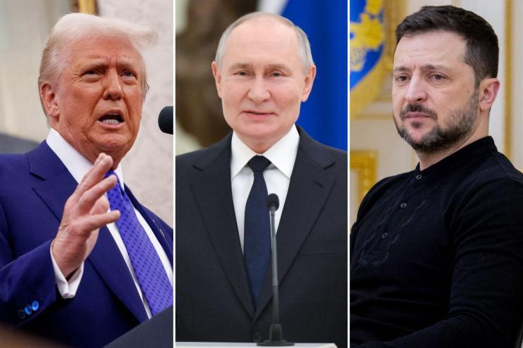
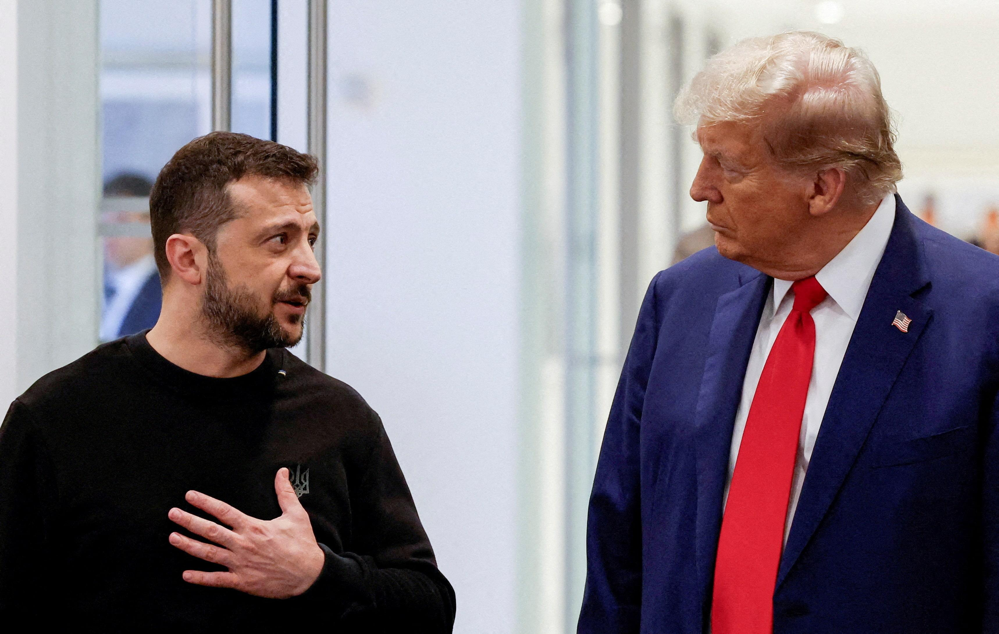
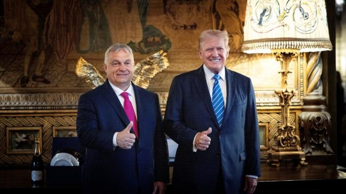
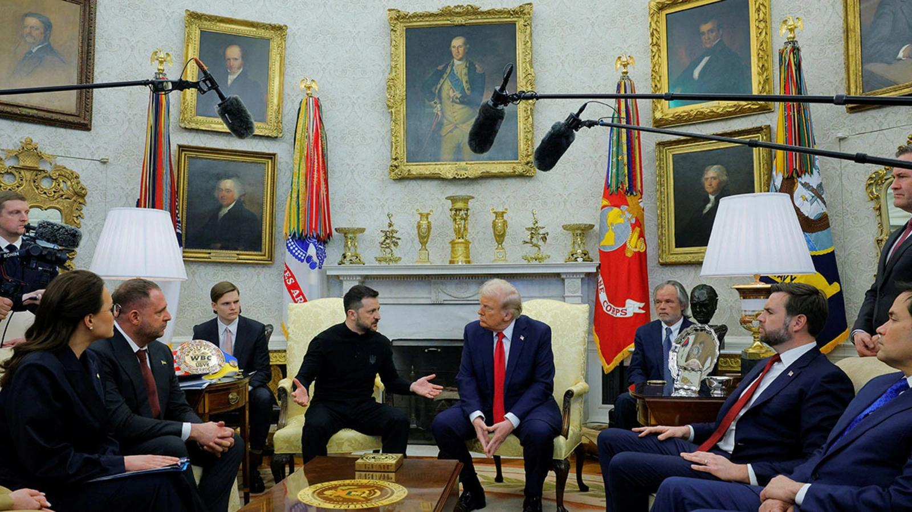

## Claim
Claim: "After a call with Russia's President Vladimir Putin on February 12, 2025, US President Donald Trump announced that he had reached an agreement to end the war in Ukraine."

## Actions
```
image_search("Donald Trump Vladimir Putin February 12 2025")
image_search("Donald Trump Ukraine war agreement")
```

## Evidence
### Evidence from `image_search`
Al Jazeera published an article on February 13, 2025, stating that Trump said Putin wants peace and will begin talks on ending the Ukraine war. 

CNN includes an image of Vladimir Putin, John Bolton, and Donald Trump.  The New York Post published an article with an image of Donald Trump, Vladimir Putin, and Volodymyr Zelenskyy. 


### Evidence from `image_search`
A Reuters article from February 1, 2025, discusses the US's desire for Ukraine to hold elections following a ceasefire. [] The search results also include images of Donald Trump. [, ]

The provided sources do not mention a call between Donald Trump and Vladimir Putin on February 12, 2025, or an agreement to end the war in Ukraine.


## Elaboration
The evidence suggests that Donald Trump was involved in discussions related to the Ukraine war. An article from February 13, 2025, indicates that Trump stated Putin wanted peace and would begin talks. However, there is no mention of an agreement to end the war.

The search results include images of Trump with Putin and Zelenskyy, suggesting direct involvement with both leaders. However, the evidence does not confirm that Trump announced an agreement to end the war after a call with Putin on February 12, 2025.

The claim cannot be verified based on the provided evidence. The evidence does not mention the specific call on February 12, 2025, or an agreement to end the war.


## Final Judgement
The evidence indicates that Donald Trump was involved in discussions related to the Ukraine war, but there is no mention of a call between Trump and Putin on February 12, 2025, or an agreement to end the war.

The claim is not supported by the evidence. The provided sources do not mention the specific call on February 12, 2025, or an agreement to end the war.

`false`

### Verdict: FALSE

### Justification
Based on the evidence, while Donald Trump was involved in discussions related to the Ukraine war, there is no mention of a call between Trump and Putin on February 12, 2025, or an agreement to end the war. An article from Al Jazeera on February 13, 2025, mentions Trump stating Putin wants peace and will begin talks, but no agreement was announced.
