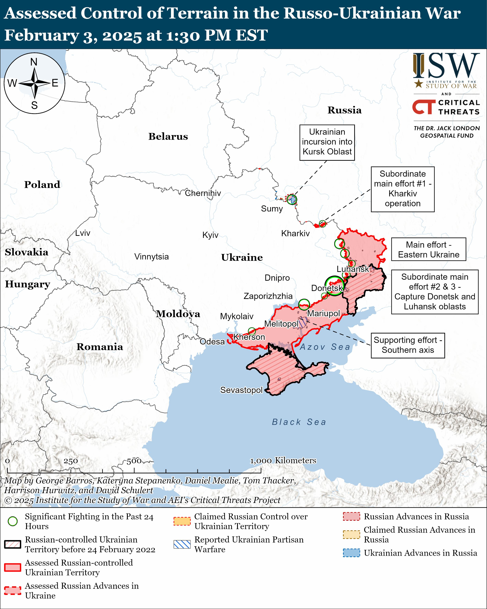
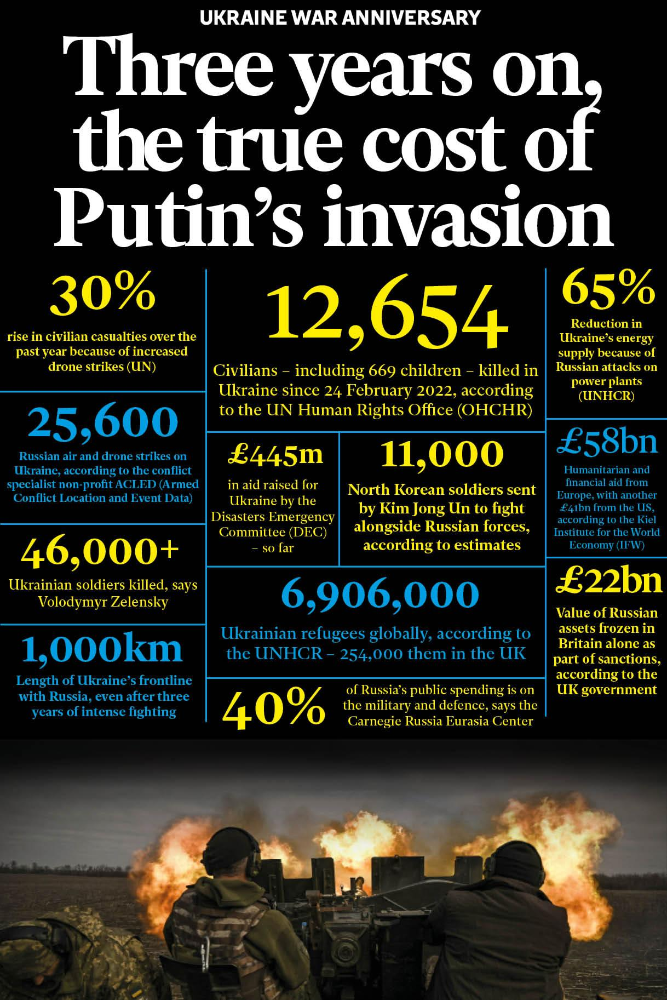

## Claim
Claim: "As of February 2025, Russia has lost 1.5 million troops in the Ukraine war."

## Actions
```
image_search("Russia Ukraine war casualties February 2025")
```

## Evidence
### Evidence from `image_search`
The Institute for the Study of War and AEI's Critical Threats Project published a map on February 3, 2025, assessing the control of terrain in the Russo-Ukrainian War (). The Independent published an article on the Ukraine war anniversary, including statistics on the number of Ukrainian soldiers killed (46,000+) and the number of civilians killed in Ukraine since February 24, 2022 (12,654) (). Al Jazeera published an article on February 6, 2025, discussing the Russia-Ukraine war, including a map showing the control of territories in Ukraine as of February 5, 2025 ().

The sources are: [https://www.understandingwar.org/backgrounder/russian-offensive-campaign-assessment-february-3-2025](https://www.understandingwar.org/backgrounder/russian-offensive-campaign-assessment-february-3-2025), [https://www.independent.co.uk/news/world/europe/ukraine-war-anniversary-russia-putin-zelensky-casualties-map-drones-b2703340.html](https://www.independent.co.uk/news/world/europe/ukraine-war-anniversary-russia-putin-zelensky-casualties-map-drones-b2703340.html), and [https://www.aljazeera.com/news/2025/2/6/north-koreans-disappear-amid-heavy-russian-casualties-in-ukraine-war](https://www.aljazeera.com/news/2025/2/6/north-koreans-disappear-amid-heavy-russian-casualties-in-ukraine-war).


## Elaboration
The provided evidence does not contain any information about the number of Russian troops lost in the Ukraine war as of February 2025. The Independent article mentions the number of Ukrainian soldiers killed (46,000+) and the number of civilians killed in Ukraine since February 24, 2022 (12,654). The other sources provide maps and discuss the war's context but do not include casualty figures for Russian troops.

Therefore, the claim cannot be verified with the available evidence.


## Final Judgement
The search results provide information about the war's context, including maps of territorial control and statistics on Ukrainian casualties. However, none of the sources provide data on the number of Russian troops lost in the Ukraine war as of February 2025.

The claim is `false`.

### Verdict: FALSE

### Justification
The available evidence, including articles from The Independent and Al Jazeera, and a map from the Institute for the Study of War, does not provide any information on the number of Russian troops lost in the Ukraine war as of February 2025. Therefore, the claim cannot be verified.
