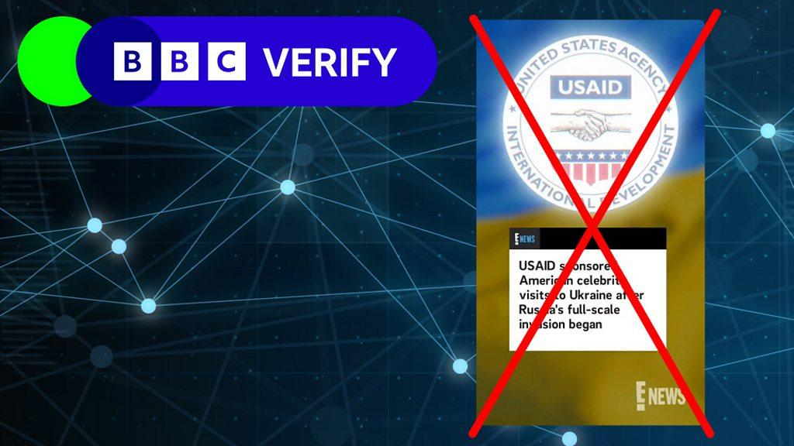
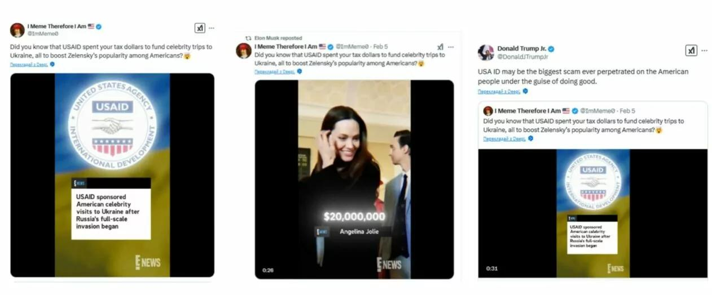
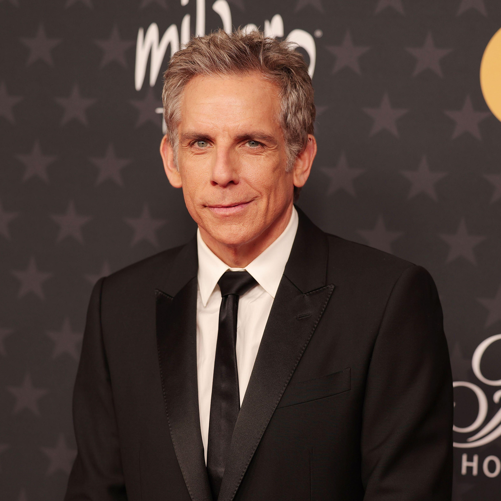

## Claim
Claim: "E! News reported that the United States Agency Aid and Development (USAID) paid millions for celebrities to visit Ukraine."

## Actions
```
image_search("E! News USAID Ukraine celebrities")
```

## Evidence
### Evidence from `image_search`
The BBC Verify image shows a graphic with the E! News logo and the USAID logo, stating that USAID sponsored American celebrity visits to Ukraine after Russia's full-scale invasion began (). Another source includes an image that appears to be a screenshot from E! News, which claims that USAID sponsored American celebrity visits to Ukraine ().

Vanity Fair discusses Elon Musk's retweet claiming USAID funded celebrities' trip to Ukraine ().
*   [https://www.bbc.com/news/articles/c0m12wl0jwpo](https://www.bbc.com/news/articles/c0m12wl0jwpo)
*   [https://gwaramedia.com/en/debunking-fakes-no-enews-didnt-release-video-about-hollywood-stars-receiving-usaid-money-for-visits-to-ukraine/](https://gwaramedia.com/en/debunking-fakes-no-enews-didnt-release-video-about-hollywood-stars-receiving-usaid-money-for-visits-to-ukraine/)
*   [https://www.vanityfair.com/hollywood/story/ben-stiller-denies-elon-musks-retweet-claiming-usaid-funded-the-stars-trip-to-ukraine?srsltid=AfmBOooAsZeSck6DPqhL6924C-EqdIYFa1PxKXVi0h3xmsYnnhLUGeC9](https://www.vanityfair.com/hollywood/story/ben-stiller-denies-elon-musks-retweet-claiming-usaid-funded-the-stars-trip-to-ukraine?srsltid=AfmBOooAsZeSck6DPqhL6924C-EqdIYFa1PxKXVi0h3xmsYnnhLUGeC9)


## Elaboration
The evidence suggests that the claim is likely false. While images with the E! News logo and USAID logo are circulating, the BBC Verify graphic indicates that the claim is false. Additionally, the Vanity Fair article discusses Elon Musk's retweet of the claim, but the article does not confirm the claim's veracity. The Gwara Media article also debunks the claim.


## Final Judgement
The claim that E! News reported USAID paid for celebrities to visit Ukraine is likely false. The BBC Verify graphic and the Gwara Media article debunk the claim.

`false`


### Verdict: FALSE

### Justification
The claim is likely false. While images with the E! News and USAID logos exist, the BBC Verify graphic indicates the claim is false. Furthermore, the claim was retweeted by Elon Musk, but the Vanity Fair article discussing the retweet does not confirm the claim's veracity, and the Gwara Media article debunks it.
