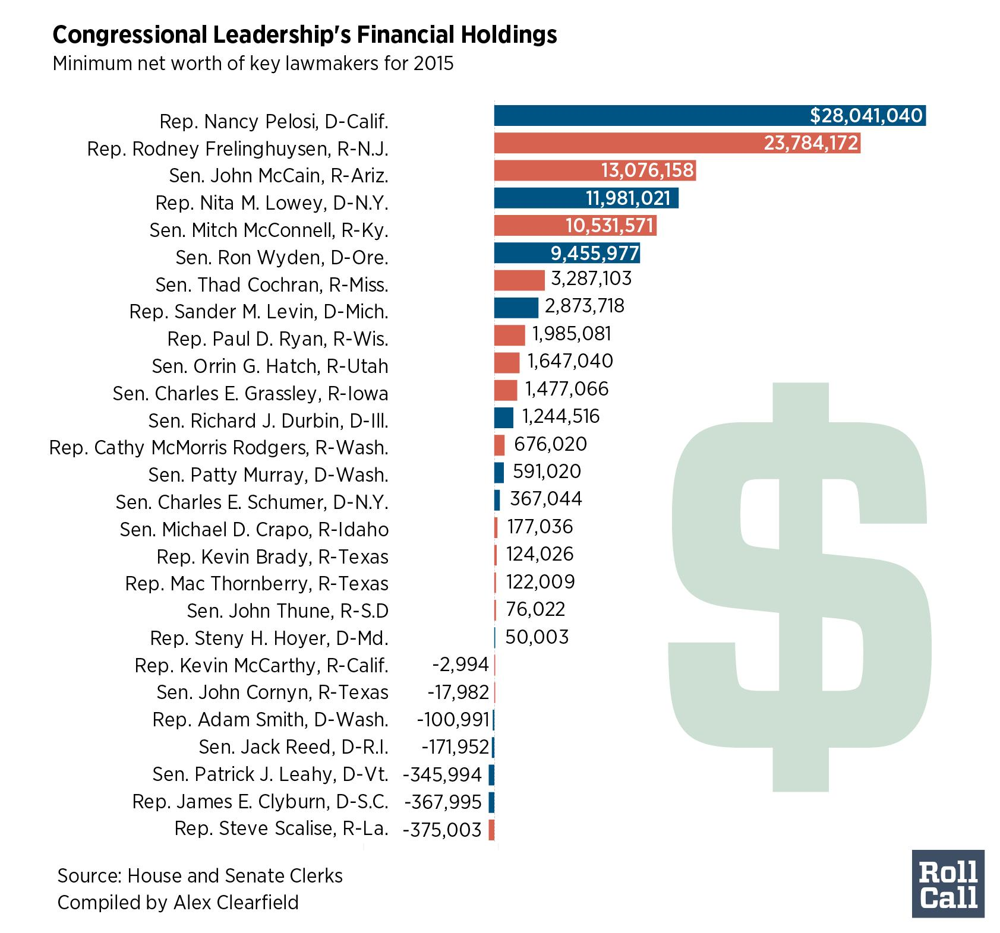
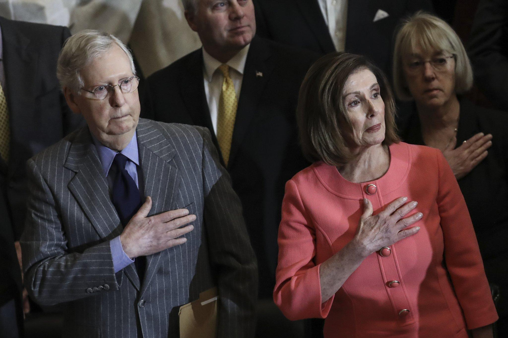
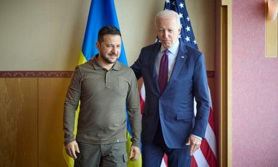
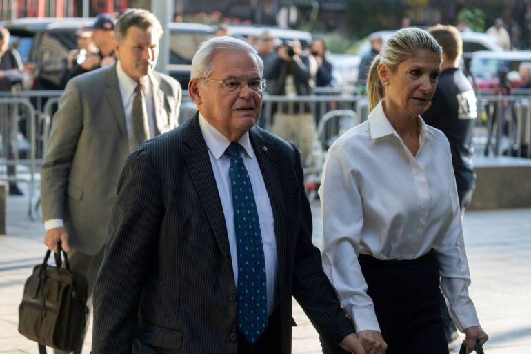

## Claim
Claim: " This image shows an authentic list realeased by Ukraine showing US politicians taking bribes from Ukraine. The highest bribe was 92 Million US-$ for Joe Biden."

## Actions
```
image_search("Joe Biden Mitch McConnell Nancy Pelosi net worth")
image_search("US politicians Ukraine bribes")
```

## Evidence
### Evidence from `image_search`
Roll Call published an article about the net worth of key lawmakers in 2015, including Nancy Pelosi, Mitch McConnell, and John Cornyn, with a graphic showing their minimum net worth (). The Wisconsin Examiner published an image of Mitch McConnell and Nancy Pelosi ().


### Evidence from `image_search`
The Guardian published an article on June 16, 2023, about Ukraine battling corruption, including a picture of Joe Biden and Volodymyr Zelensky (). Al Jazeera published an article about corruption in the US (). The Human Rights Watch published an article on July 24, 2025, about a new Ukrainian law that undermines the independence of anti-corruption bodies ().

The articles can be found here: [The Guardian](https://www.theguardian.com/world/2023/jun/16/as-well-as-fighting-russia-ukrainians-are-battling-corruption-at-home), [Al Jazeera](https://www.aljazeera.com/opinions/2023/9/28/corruption-is-as-american-as-apple-pie), and [Human Rights Watch](https://www.hrw.org/news/2025/07/24/ukraine-new-law-undercuts-independence-of-anti-corruption-bodies).


## Elaboration
The evidence includes articles about corruption in Ukraine and the US, as well as images of US politicians. However, there is no evidence to support the claim that the image shows an authentic list released by Ukraine detailing bribes taken by US politicians. The evidence does not mention any such list or provide any information about US politicians taking bribes from Ukraine.

The claim also states that the highest bribe was $92 million for Joe Biden. While the evidence includes images of Joe Biden, there is no information about his net worth or any alleged bribes.

Therefore, the claim cannot be verified based on the provided evidence.


## Final Judgement
The search results provide articles about corruption in Ukraine and the US, and images of US politicians, but there is no evidence to support the claim that the image shows an authentic list released by Ukraine detailing bribes taken by US politicians. The evidence does not mention any such list or provide any information about US politicians taking bribes from Ukraine.

The claim is not supported by the evidence. There is no information about the authenticity of the list or the alleged bribes. Therefore, the claim is `false`.

### Verdict: FALSE

### Justification
The claim is false. The provided evidence does not support the assertion that the image is an authentic list released by Ukraine detailing bribes taken by US politicians. While the search results include articles about corruption in Ukraine and the US, and images of US politicians, there is no mention of the list or any evidence of the alleged bribes.
