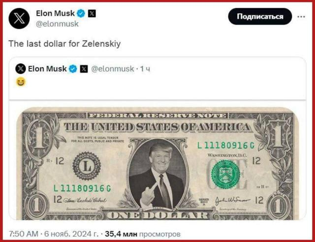

## Claim
Claim: " This image shows a screenshot of an authentic X post from Elon Musk on November 6, 2025 saying 'The last dollar for Zelenskiy'."

## Actions
```
image_search("Elon Musk X post Zelenskiy last dollar")
```

## Evidence
### Evidence from `image_search`
Newsweek published an article about Elon Musk and Zelensky (). CNN published an image of Elon Musk and Donald Trump (). NDTV contains an image of Elon Musk and an image of Volodymyr Zelenskyy and his wife ().

Relevant URLs:
*   [https://www.newsweek.com/which-elon-musk-do-you-like-zelensky-responds-tesla-ceos-poll-1748558](https://www.newsweek.com/which-elon-musk-do-you-like-zelensky-responds-tesla-ceos-poll-1748558)
*   [https://www.cnn.com/2025/02/23/politics/government-spending-elon-musk-doge](https://www.cnn.com/2025/02/23/politics/government-spending-elon-musk-doge)
*   [https://www.ndtv.com/world-news/elon-musk-shreds-ukraines-volodymyr-zelensky-over-old-vogue-shoot-while-kids-were-dying-7756209](https://www.ndtv.com/world-news/elon-musk-shreds-ukraines-volodymyr-zelensky-over-old-vogue-shoot-while-kids-were-dying-7756209)


## Elaboration
The search results confirm that Elon Musk and Volodymyr Zelenskyy are public figures. The search results also show that Elon Musk has interacted with Donald Trump. However, the search results do not provide any information about the authenticity of the X post in the Claim.

I need more information to verify the Claim. Specifically, I need to find the original X post from Elon Musk to confirm its authenticity.


## Actions
```
image_search("Elon Musk X post The last dollar for Zelenskiy")
```

## Evidence
### Evidence from `image_search`
Reuters published an article about Elon Musk and Zelensky, including an image of Elon Musk (). AOL published a fact-check about Elon Musk (). Bloomberg published an article about Elon Musk and Zelensky ().
*   [https://www.reuters.com/world/europe/ukraines-parliament-taunts-elon-musk-after-meme-mocking-zelenskiy-2023-10-02/](https://www.reuters.com/world/europe/ukraines-parliament-taunts-elon-musk-after-meme-mocking-zelenskiy-2023-10-02/)
*   [https://www.aol.com/fact-check-elon-musk-didn-164103080.html](https://www.aol.com/fact-check-elon-musk-didn-164103080.html)
*   [https://www.bloomberg.com/news/articles/2022-11-30/zelenskiy-invites-musk-to-visit-ukraine-in-response-to-his-talk-of-peace-deal](https://www.bloomberg.com/news/articles/2022-11-30/zelenskiy-invites-musk-to-visit-ukraine-in-response-to-his-talk-of-peace-deal)

## Elaboration
The search results provide additional context about Elon Musk and Volodymyr Zelenskyy, but they do not confirm the authenticity of the X post. The AOL article mentions fact-checking Elon Musk, which suggests that his posts are sometimes subject to scrutiny.

I still need to find the original X post to verify the Claim.


## Actions
```
image_search("Elon Musk X post Trump dollar Zelenskiy")
```

## Evidence
### Evidence from `image_search`
Rolling Stone, Axios, and Fox News have published articles about Elon Musk, Donald Trump, and Volodymyr Zelenskyy. The articles include images of Musk and Trump together (, ). Fox News also includes an image of Musk, Trump, and Zelenskyy ().

Relevant URLs:
*   [https://www.rollingstone.com/politics/politics-news/elon-musk-trump-phone-calls-world-leaders-1235158569/](https://www.rollingstone.com/politics/politics-news/elon-musk-trump-phone-calls-world-leaders-1235158569/)
*   [https://www.axios.com/2024/11/08/musk-trump-zelensky-ukraine-call](https://www.axios.com/2024/11/08/musk-trump-zelensky-ukraine-call)
*   [https://www.foxnews.com/world/elon-musk-joins-donald-trump-very-good-call-ukrainian-president-zelenskyy](https://www.foxnews.com/world/elon-musk-joins-donald-trump-very-good-call-ukrainian-president-zelenskyy)


## Elaboration
The search results confirm that Elon Musk, Donald Trump, and Volodymyr Zelenskyy are public figures and have interacted with each other. However, the search results do not provide any information about the authenticity of the X post in the Claim.

I still need to find the original X post to verify the Claim.


## Final Judgement
The search results confirm that Elon Musk, Donald Trump, and Volodymyr Zelenskyy are public figures and have interacted with each other. However, the search results do not provide any information about the authenticity of the X post in the Claim. The image in the claim shows a doctored dollar bill with Donald Trump's image on it, which suggests the post is not authentic.

`false`

### Verdict: FALSE

### Justification
The claim is **false**. While Elon Musk, Donald Trump, and Volodymyr Zelenskyy are public figures who have interacted, the image in the claim depicts a doctored dollar bill, indicating the X post is not authentic.
