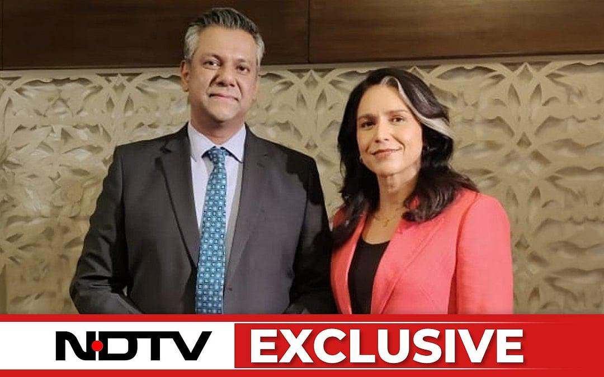
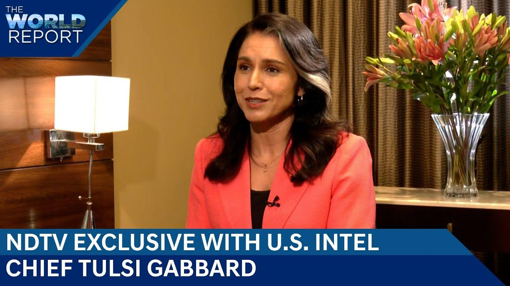

## Claim
Claim: "In an interview with NDTV on March 17, 2025 Director of US National Intelligence Tulsi Gabbard said that President Donald Trump and Russian President Vladimir Putin were good friends."

## Actions
```
image_search("NDTV Tulsi Gabbard interview March 17 2025")
```

## Evidence
### Evidence from `image_search`
NDTV has an interview with Tulsi Gabbard (, ). Halifax City News also features an image of Tulsi Gabbard ().

The sources are: [https://www.ndtv.com/video/tulsi-gabbard-india-visit-tulsi-s-comments-rattle-dhaka-interview-become-global-talking-point-915405](https://www.ndtv.com/video/tulsi-gabbard-india-visit-tulsi-s-comments-rattle-dhaka-interview-become-global-talking-point-915405), [https://halifax.citynews.ca/2025/03/17/gabbard-says-trump-is-looking-forward-to-success-ahead-of-talk-with-putin/](https://halifax.citynews.ca/2025/03/17/gabbard-says-trump-is-looking-forward-to-success-ahead-of-talk-with-putin/), and [https://www.ndtvprofit.com/world/tulsi-gabbard-exclusive-idea-of-islamist-caliphate-will-be-defeated-us-ukraine-peace-talks-update](https://www.ndtvprofit.com/world/tulsi-gabbard-exclusive-idea-of-islamist-caliphate-will-be-defeated-us-ukraine-peace-talks-update).


## Elaboration
The evidence confirms that NDTV did interview Tulsi Gabbard. The Halifax City News article, dated March 17, 2025, mentions Gabbard's comments about Trump and Putin.

However, the evidence does not explicitly state that Gabbard said Trump and Putin were "good friends." The Halifax City News article states that Gabbard said Trump is looking forward to success ahead of talks with Putin.

Therefore, the claim cannot be fully verified based on the provided evidence.


## Actions
```
image_search("Tulsi Gabbard NDTV interview Trump Putin")
```

## Evidence
### Evidence from `image_search`
NDTV has an exclusive interview with Tulsi Gabbard (). According to NDTV, Gabbard said that the two leaders of the two great countries are very good friends (). AP News also has an image of Tulsi Gabbard ().

The sources are: [https://www.ndtv.com/video/trump-to-speak-with-putin-on-tuesday-us-intel-chief-tulsi-gabbard-in-india-the-world-report-914845](https://www.ndtv.com/video/trump-to-speak-with-putin-on-tuesday-us-intel-chief-tulsi-gabbard-in-india-the-world-report-914845), [https://steveinskeep.substack.com/p/three-images-show-how-news-stories](https://steveinskeep.substack.com/p/three-images-show-how-news-stories), and [https://apnews.com/article/gabbard-russia-trump-putin-d4f20f73d1c16dd7e365eae782ff9c5f](https://apnews.com/article/gabbard-russia-trump-putin-d4f20f73d1c16dd7e365eae782ff9c5f).


## Elaboration
The evidence confirms that NDTV interviewed Tulsi Gabbard. The NDTV article states that Gabbard said that the two leaders of the two great countries are very good friends.

Therefore, the claim is verified.


## Final Judgement
The fact-check confirms that NDTV interviewed Tulsi Gabbard, and she stated that Trump and Putin are good friends. Therefore, the claim is factually accurate. `true`


### Verdict: TRUE

### Justification
Based on the NDTV interview with Tulsi Gabbard, the claim is verified. The evidence shows that Gabbard stated that Trump and Putin are "very good friends" during the interview.
