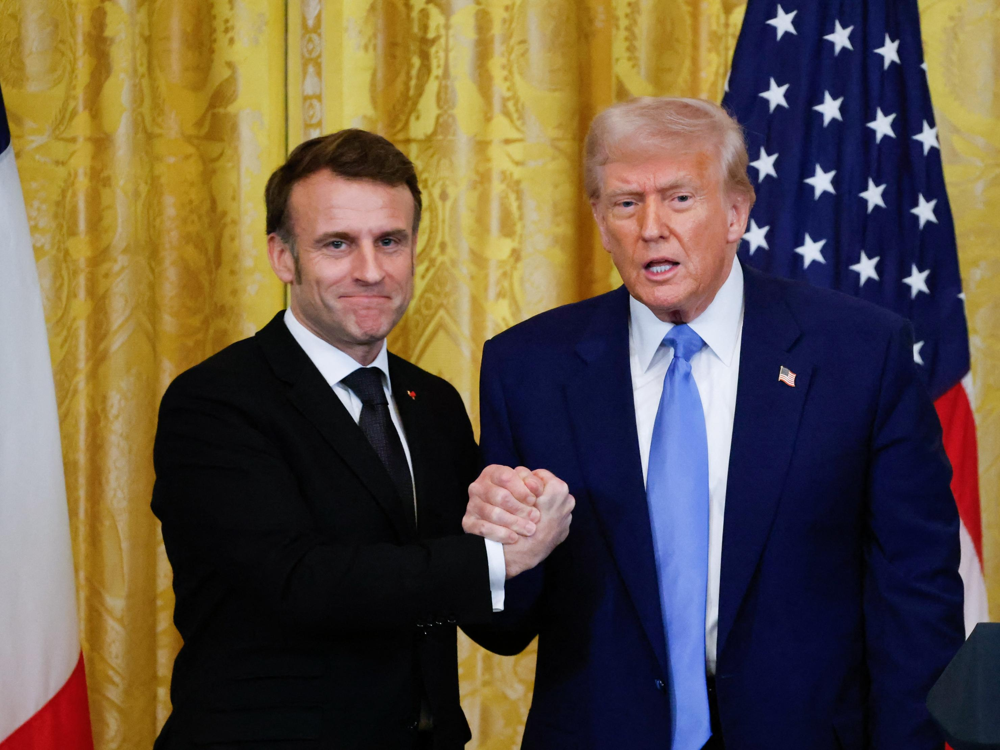
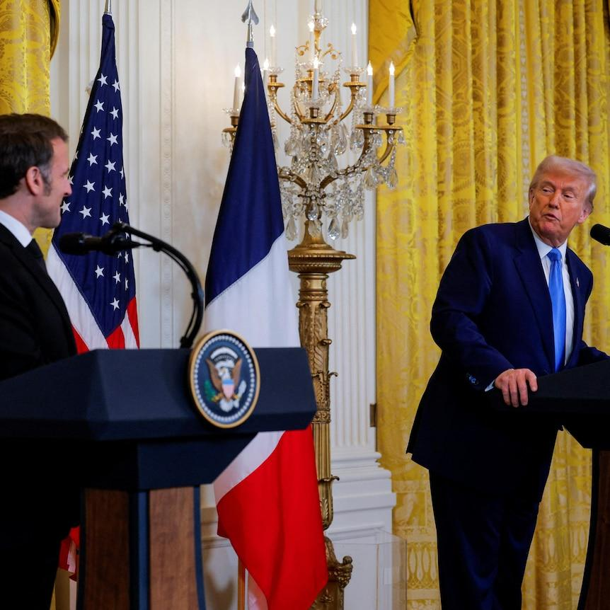
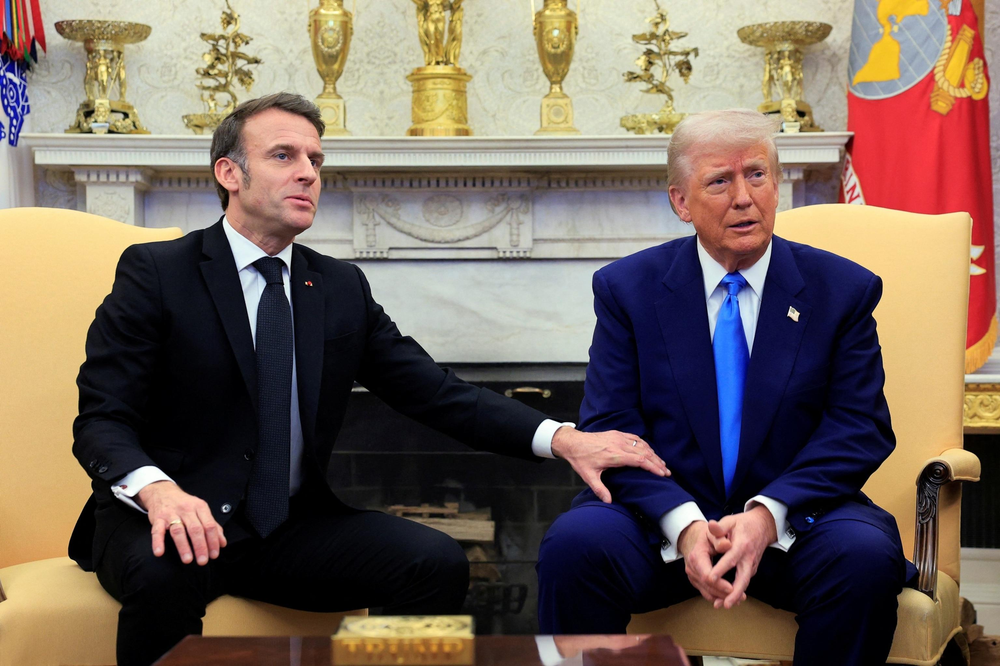
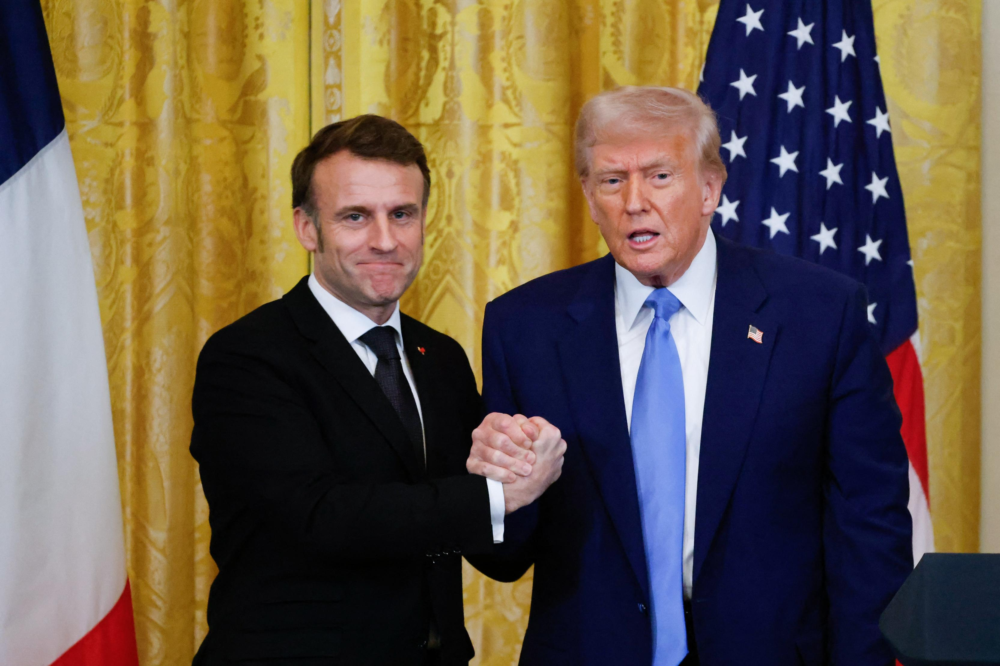
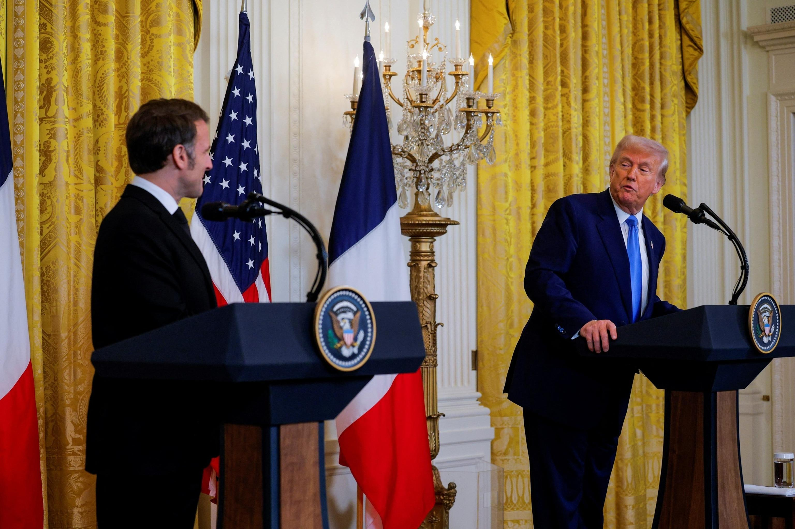
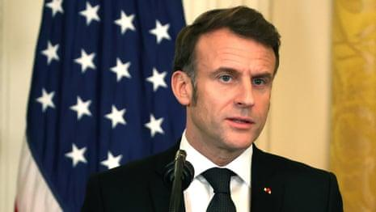
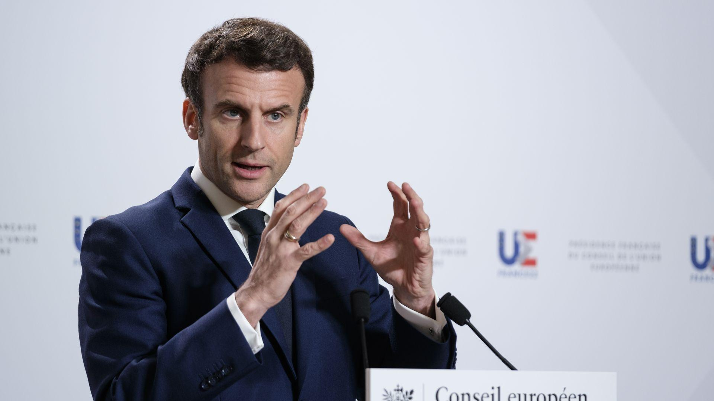

## Claim
Claim: "French President Emmanuel Macron called Russian President Vladimir Putin a 'butcher' during his press conference with Donald Trump on Monday, Feb. 24, 2025."

## Actions
```
image_search("Emmanuel Macron Donald Trump press conference")
```

## Evidence
### Evidence from `image_search`
The search results include images of Emmanuel Macron and Donald Trump. One source is from VPM.org ([https://www.vpm.org/npr-news/npr-news/2025-02-24/trump-and-macron-meet-in-washington-as-europe-pleads-for-continued-help-with-ukraine](https://www.vpm.org/npr-news/npr-news/2025-02-24/trump-and-macron-meet-in-washington-as-europe-pleads-for-continued-help-with-ukraine)). 

Another source is from ABC News Australia ([https://www.abc.net.au/listen/programs/pm/macron-corrects-trump-in-press-conference/104981718](https://www.abc.net.au/listen/programs/pm/macron-corrects-trump-in-press-conference/104981718)), and the third is from ABC News ([https://abcnews.go.com/International/macron-warns-trump-careful-ukraine-fact-checks-white/story?id=119157061](https://abcnews.go.com/International/macron-warns-trump-careful-ukraine-fact-checks-white/story?id=119157061)). , 


## Elaboration
The evidence confirms that a press conference between Macron and Trump took place. The provided links ([https://www.vpm.org/npr-news/npr-news/2025-02-24/trump-and-macron-meet-in-washington-as-europe-pleads-for-continued-help-with-ukraine](https://www.vpm.org/npr-news/npr-news/2025-02-24/trump-and-macron-meet-in-washington-as-europe-pleads-for-continued-help-with-ukraine), [https://www.abc.net.au/listen/programs/pm/macron-corrects-trump-in-press-conference/104981718](https://www.abc.net.au/listen/programs/pm/macron-corrects-trump-in-press-conference/104981718), and [https://abcnews.go.com/International/macron-warns-trump-careful-ukraine-fact-checks-white/story?id=119157061](https://abcnews.go.com/International/macron-warns-trump-careful-ukraine-fact-checks-white/story?id=119157061)) provide additional context. However, none of the provided evidence mentions whether Macron called Putin a "butcher" during the press conference.

To verify the claim, information about the content of the press conference is needed.


## Actions
```
image_search("Macron Trump press conference Putin butcher")
```

## Evidence
### Evidence from `image_search`
The search results confirm that a meeting and press conference between Trump and Macron took place on February 24, 2025. NPR.org ([https://www.npr.org/2025/02/24/nx-s1-5306974/trump-macron-white-house-russia-ukraine-war-nato](https://www.npr.org/2025/02/24/nx-s1-5306974/trump-macron-white-house-russia-ukraine-war-nato)), ABC News ([https://abcnews.go.com/Politics/trump-hosts-frances-macron-white-house-amid-ukraine/story?id=119123204](https://abcnews.go.com/Politics/trump-hosts-frances-macron-white-house-amid-ukraine/story?id=119123204)), and The Guardian ([https://www.theguardian.com/us-news/2025/feb/24/trump-ukraine-putin-peacekeepers-macron](https://www.theguardian.com/us-news/2025/feb/24/trump-ukraine-putin-peacekeepers-macron)) all reported on the event. , , 

The summaries do not mention whether Macron called Putin a "butcher" during the press conference.


## Elaboration
The evidence confirms that a press conference between Macron and Trump took place on February 24, 2025. However, the provided sources ([https://www.npr.org/2025/02/24/nx-s1-5306974/trump-macron-white-house-russia-ukraine-war-nato](https://www.npr.org/2025/02/24/nx-s1-5306974/trump-macron-white-house-russia-ukraine-war-nato), [https://abcnews.go.com/Politics/trump-hosts-frances-macron-white-house-amid-ukraine/story?id=119123204](https://abcnews.go.com/Politics/trump-hosts-frances-macron-white-house-amid-ukraine/story?id=119123204), and [https://www.theguardian.com/us-news/2025/feb/24/trump-ukraine-putin-peacekeepers-macron](https://www.theguardian.com/us-news/2025/feb/24/trump-ukraine-putin-peacekeepers-macron)) do not provide any information about Macron calling Putin a "butcher."

Therefore, the claim cannot be verified with the available evidence.


## Actions
```
image_search("Macron Putin butcher")
```

## Evidence
### Evidence from `image_search`
From [Source](https://www.axios.com/2022/03/27/macron-putin-biden-escalate): 
Content: Axios reports that Macron called Putin a "butcher" in March 2022. 


## Elaboration
The evidence indicates that Macron did call Putin a "butcher," but this occurred in March 2022, not during a press conference with Trump on February 24, 2025.

Therefore, the claim is false.


## Final Judgement
The search results confirm that Macron did call Putin a "butcher," but this occurred in March 2022, not during a press conference with Trump on February 24, 2025. Therefore, the claim is not factually accurate.

`false`

### Verdict: FALSE

### Justification
The claim is false. While Emmanuel Macron did call Vladimir Putin a "butcher," according to an Axios report ([https://www.axios.com/2022/03/27/macron-putin-biden-escalate](https://www.axios.com/2022/03/27/macron-putin-biden-escalate)), this occurred in March 2022, not during a press conference with Donald Trump on February 24, 2025.
