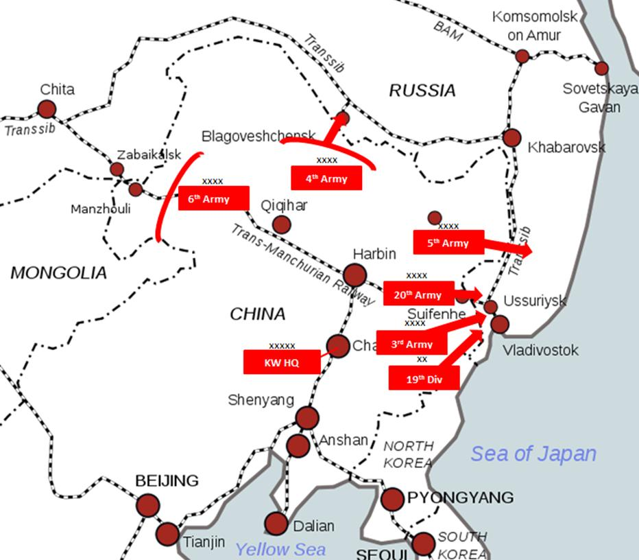
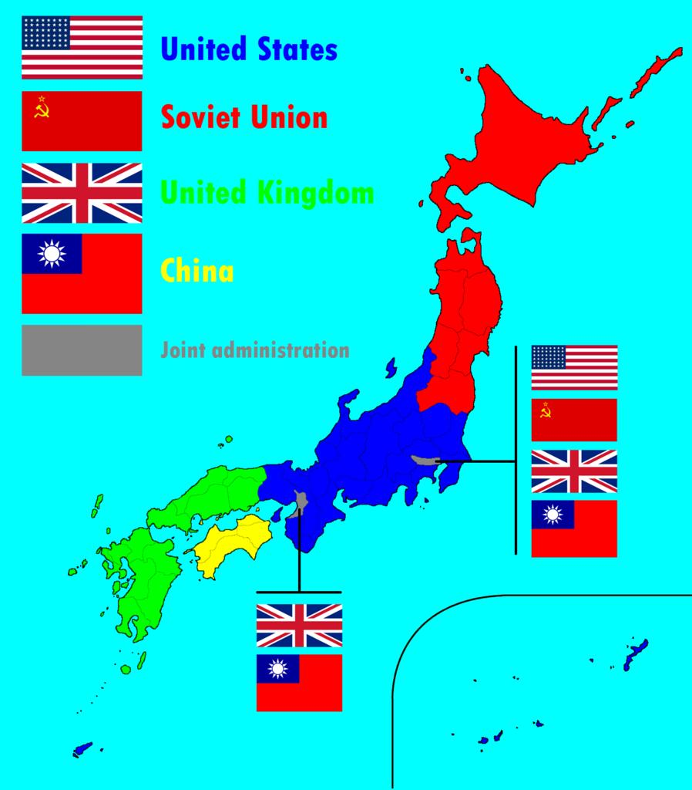

## Claim
Claim: "China and Japan plan to invade the Russian Federation."

## Actions
```
image_search("China Japan Russia invasion plan")
```

## Evidence
### Evidence from `image_search`
One web source contains a map showing a plan of invasion from China into Russia (). Another web source contains an image showing a plan for the occupation of Japan, with China being one of the occupying forces ().

*   [Source](https://en.wikipedia.org/wiki/Soviet_invasion_of_Manchuria)
*   [Source](https://www.pacificatrocities.org/plan-kantokuen-and-bacteriological-warfare.html)
*   [Source](https://brilliantmaps.com/occupation-plan-for-japan/)


## Elaboration
The evidence suggests that there are plans involving China and Japan in relation to Russia. One image depicts a potential invasion plan from China into Russia. Another image shows a plan for the occupation of Japan, with China as one of the occupying forces.

Based on the provided evidence, it is not possible to verify the claim that China and Japan *plan to invade* the Russian Federation. The evidence shows a plan of invasion from China into Russia, but it does not mention Japan.


## Final Judgement
The evidence includes a map showing a plan of invasion from China into Russia and an image showing a plan for the occupation of Japan, with China being one of the occupying forces. However, the evidence does not support the claim that China and Japan are planning to invade Russia.

`false`

### Verdict: FALSE

### Justification
The claim is not supported by the evidence. While one source depicts a potential invasion plan from China into Russia, and another shows a plan for the occupation of Japan with China as one of the occupying forces, there is no evidence of a joint invasion plan involving both China and Japan against Russia.
