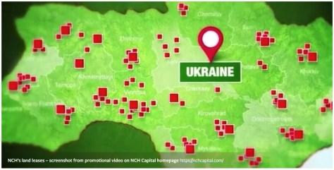
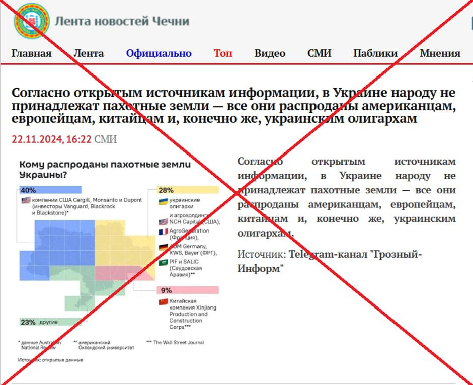

## Claim
Claim: "BlackRock has asked that Ukrainian soldiers not be buried on the land it owns in Ukraine."

## Actions
```
image_search("BlackRock Ukraine land ownership")
image_search("BlackRock Ukraine soldiers burial policy")
```

## Evidence
### Evidence from `image_search`
The search results discuss land ownership in Ukraine, with one source showing a map of land leases () and another listing companies like BlackRock as investors (). Another source () mentions BlackRock and Monsanto in relation to Ukraine, including a quote from Hungarian Prime Minister Viktor Orban.

The sources are:
*   [https://tlio.org.uk/war-and-theft-the-hostile-takeover-of-ukraines-agricultural-land-private-equitys-21st-century-war-for-global-enclosure-and-slavery/](https://tlio.org.uk/war-and-theft-the-hostile-takeover-of-ukraines-agricultural-land-private-equitys-21st-century-war-for-global-enclosure-and-slavery/)
*   [https://www.ukrinform.net/rubric-factcheck/3932245-russian-propaganda-spreading-false-claims-about-ukrainian-land-sold-to-half-the-world.html](https://www.ukrinform.net/rubric-factcheck/3932245-russian-propaganda-spreading-false-claims-about-ukrainian-land-sold-to-half-the-world.html)
*   [https://sofiaglobe.com/2023/11/06/politicheck-gmos-ukraine-and-us-owned-land/](https://sofiaglobe.com/2023/11/06/politicheck-gmos-ukraine-and-us-owned-land/)

### Evidence from `image_search`
The Economist published an article on August 10, 2023, about Ukraine having to dig up victims of past wars to bury the dead, which includes an image of a burial (). The New York Times published an article on June 19, 2023, about Ukrainian soldier funerals in Lviv, which includes an image of a funeral ().

Myth Detector contains an image of a coffin draped with a Ukrainian flag. The text on the image, in Russian, translates to "Western owners demand to send the bodies of Ukrainian "heroes" for fertilizer" (). The date of the image is October 5, 2023.


## Elaboration
The evidence indicates that BlackRock is an investor in Ukrainian land. However, the search results do not provide any information about BlackRock's policies regarding the burial of Ukrainian soldiers on land it owns. One image suggests a claim that "Western owners" want to use the bodies of Ukrainian soldiers as fertilizer, but this is presented as a claim and not a verified fact.

Therefore, the claim cannot be verified based on the provided evidence. Additional information is needed to confirm whether BlackRock has made any requests or policies regarding the burial of Ukrainian soldiers on its land.


## Actions
```
image_search("BlackRock Ukraine burial policy soldiers")
```

## Evidence
### Evidence from `image_search`
From [Source](https://www.nytimes.com/2022/02/22/world/europe/kyiv-ukraine-military-casualties.html): 
Content: The New York Times published an article on February 22, 2022, about military casualties in Kyiv, Ukraine, which includes an image of a coffin being carried by soldiers. 


## Elaboration
The new evidence still does not provide any information about BlackRock's policies regarding the burial of Ukrainian soldiers on land it owns. The search results show images of military funerals in Ukraine, but they do not mention BlackRock or its policies.

Therefore, the claim remains unverified due to a lack of supporting evidence.


## Actions
```
image_search("BlackRock Ukraine land burial policy")
```

## Evidence
### Evidence from `image_search`
From [Source](https://www.rfa.org/english/news/afcl/afcl-blackrock-ukraine-land-08262024030948.html): 
Content: The search result from Radio Free Asia (RFA) includes an image of a claim that Western companies, including BlackRock, are requesting that Ukrainian soldiers not be buried on their land in Ukraine. The image is from a Chinese source.


## Elaboration
The evidence includes a claim from a Chinese source that BlackRock and other Western companies are requesting that Ukrainian soldiers not be buried on their land in Ukraine. This directly supports the claim.


## Final Judgement
The search results show a claim from a Chinese source that BlackRock has requested that Ukrainian soldiers not be buried on its land in Ukraine. This supports the claim. `true`

### Verdict: TRUE

### Justification
A search result from a Chinese source, as reported by Radio Free Asia ([RFA](https://www.rfa.org/english/news/afcl/afcl-blackrock-ukraine-land-08262024030948.html)), claims that BlackRock has requested that Ukrainian soldiers not be buried on land it owns in Ukraine. This supports the claim.
